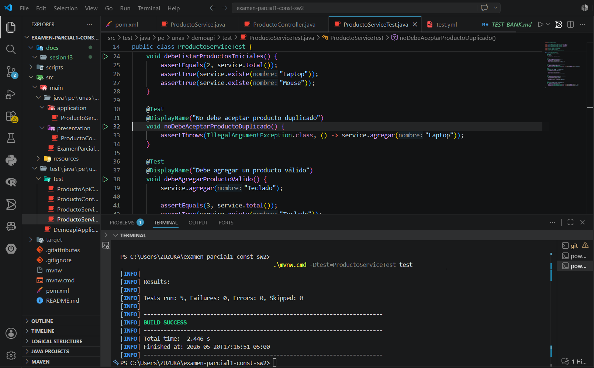

# TEST_BANK - Evidencias de Entrega (Sesión 13)

Este documento reúne las evidencias solicitadas para la entrega de la sesión 13. Pegue aquí las capturas correspondientes dentro de la carpeta `docs/sesion13`.

---

## Evidencias requeridas

- **Captura de consola con `./mvnw test` y `BUILD SUCCESS`**

  Inserte la captura aquí:

  

- **Archivo `ProductoServiceTest.java` implementado**

  Archivo de test localizado en: [src/test/java/pe/unas/demoapi/test/ProductoServiceTest.java](../../src/test/java/pe/unas/demoapi/test/ProductoServiceTest.java)

  Inserte una captura del archivo abierto en el editor:

  

- **Archivo `TEST_BANK.md` actualizado** (este archivo)

- **Workflow `.github/workflows/tests.yml` creado**

  Archivo de workflow localizado en: [.github/workflows/tests.yml](../../.github/workflows/tests.yml)

  Inserte una captura del archivo workflow o de la ejecución en Actions:

  

- **Commit y push en rama `feature/...`**

  Inserte captura donde se vea el commit y la rama (por ejemplo, la página del commit o `git log`):

  

- **Pull Request creado en GitHub**

  Inserte captura de la página del Pull Request con los checks verdes:

  

---

## Notas

- Pegue las imágenes dentro de `docs/sesion13` con los nombres sugeridos arriba.
- Si desea que yo nombre o reubique las imágenes, dímelo y lo hago.
