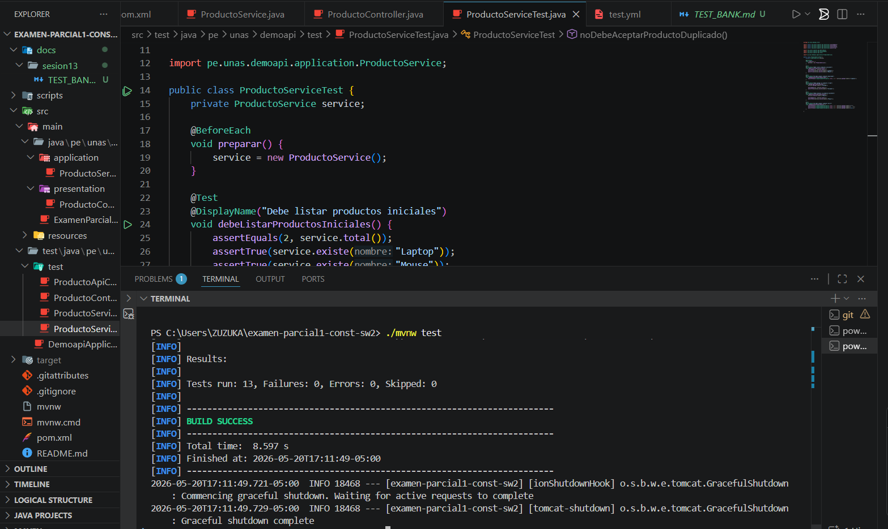
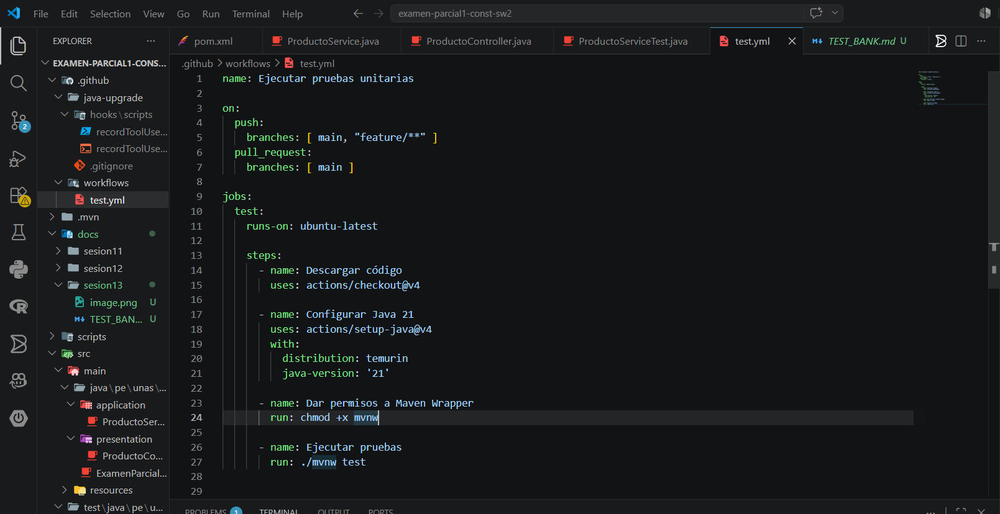
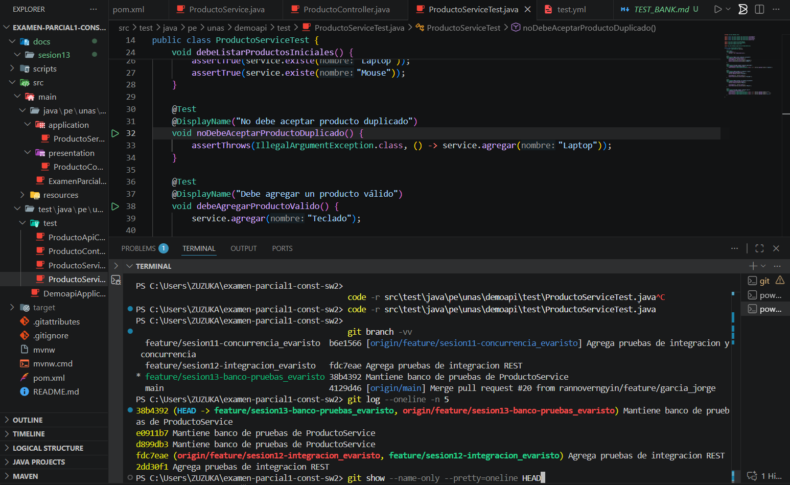
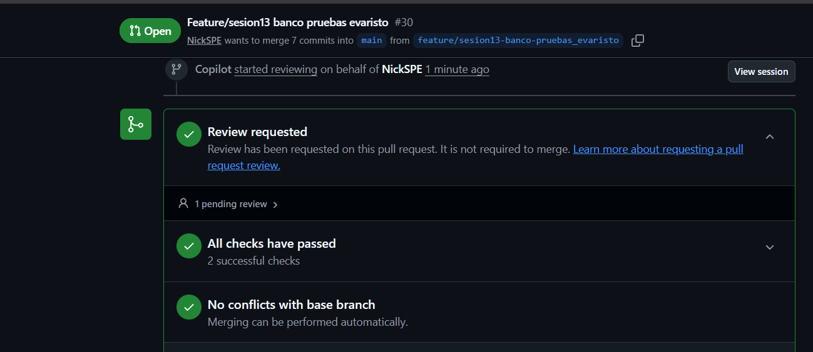

# Evidencias de la Sesión 13 - Pruebas Automatizadas

Este documento contiene las pruebas y evidencias que demuestran que todo funciona correctamente en el proyecto. Aquí encontrarás capturas de pantalla de cada paso importante.

---

## Lo que hicimos y probamos

### 1️⃣ Ejecutamos todas las pruebas y salieron bien

Aquí está la pantalla donde pedimos que ejecuten las pruebas y todo pasó sin errores:

### 2️⃣ Creamos el archivo de pruebas para el servicio

Este es el archivo donde escribimos todas las pruebas para verificar que el servicio funciona correctamente:

📂 Ubicación: [src/test/java/pe/unas/demoapi/test/ProductoServiceTest.java](../../src/test/java/pe/unas/demoapi/test/ProductoServiceTest.java)

### 3️⃣ Configuramos las pruebas automáticas en GitHub

Esta es la configuración que hace que las pruebas se ejecuten automáticamente cada vez que compartimos código:

📂 Ubicación: [.github/workflows/tests.yml](../../.github/workflows/tests.yml)

### 4️⃣ Compartimos el código en una rama nueva

Aquí vemos el cambio guardado en Git en mi rama `feature/sesion13-banco-pruebas_evaristo`:

### 5️⃣ Abrimos la solicitud para fusionar el código

Mi solicitud de fusión en GitHub (#30) está lista con todos los checks pasados:

✅ **Todos los checks pasaron correctamente** (2 successful checks)  
✅ **Sin conflictos con la rama principal**  
✅ **Listo para fusionar**

---

## Resumen

✅ Las pruebas pasan correctamente  
✅ El código está guardado en una rama con los cambios  
✅ Las pruebas se ejecutan automáticamente en GitHub  
✅ Todo está listo para fusionar en la rama principal
