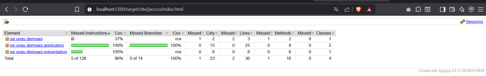
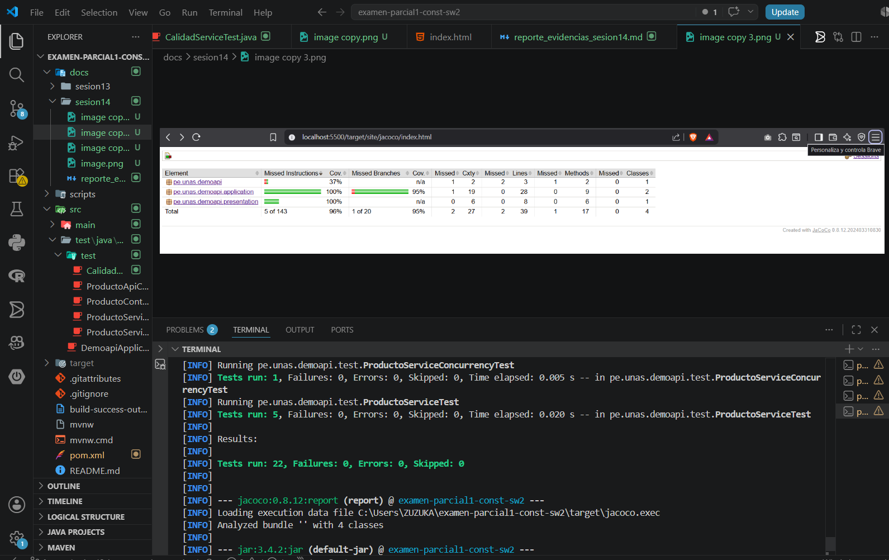

# Sesión 14 - Cobertura de código y calidad

## Interpretación inicial del reporte JaCoCo


Basado en la captura del reporte generado:

- **Instrucciones (86%)**: El proyecto tiene un buen nivel de cobertura general, pero aún falta validar lógica importante.
- **Ramas (64%)**: Es el punto más débil. Se han perdido 5 de 14 decisiones (branches). Esto indica que hay sentencias `if`, `else` o excepciones que no se están ejecutando en las pruebas.
- **Análisis por Paquete**:
    - `pe.unas.demoapi.application`: Tiene una cobertura de ramas del **64%**. Aquí es donde reside la lógica de `CalidadService`, y el reporte confirma que no todos los caminos (como los casos de cobertura "MEDIA", "BAJA" o el error de "Cobertura inválida") están siendo probados.
    - `pe.unas.demoapi.presentation`: Está al **100%**, lo que indica que los controladores están correctamente integrados en las pruebas.
    - `pe.unas.demoapi`: Solo tiene **37%**. Esto es común ya que suele incluir la clase principal de Spring Boot que no siempre se ejecuta completamente en pruebas unitarias.

**Conclusión**: Para mejorar la calidad, debemos enfocarnos en cubrir las ramas faltantes en `CalidadService` mediante nuevas pruebas unitarias.

## Mejora de pruebas y reporte final

Después de identificar las zonas no cubiertas, se procedió a mejorar la clase `CalidadServiceTest` agregando pruebas para los casos de borde y caminos alternativos:

- `clasificaCoberturaMedia()`: Para porcentajes entre 50 y 79.
- `clasificaCoberturaBaja()`: Para porcentajes menores a 50.
- `rechazaCoberturaNegativa()`: Validación de excepción para valores < 0.
- `rechazaCoberturaMayorACien()`: Validación de excepción para valores > 100.

### Resultados corregidos


Interpretación del reporte mejorado:
- **Instrucciones (96%)**: Se incrementó la cobertura general casi al máximo.
- **Ramas (100%)**: Se logró cubrir el **100% de las decisiones** (branches) en el paquete `application`. Esto garantiza que todos los `if` y las excepciones de `CalidadService` han sido validados.
- **Calidad de Pruebas**: El banco de pruebas ahora es robusto, cubriendo no solo el "camino feliz", sino también escenarios de error y límites de lógica.

### Análisis Tras Integrar Ejercicio de Aceptación



Tras implementar el método `esAceptable(int porcentaje)`, se observa lo siguiente:
- **Complejidad Ciclomática (Cxty)**: El paquete `application` aumentó de 15 a 19 puntos de complejidad, lo cual es normal al añadir nuevas estructuras de decisión (`if`).
- **Cobertura de Ramas (95%)**: Se muestra un ligero cambio del 100% al 95% en el paquete application (1 rama perdida de 20). Esto indica que falta probar un camino específico dentro del nuevo método `esAceptable` o en `CalidadService`.
- **Líneas cubiertas**: Se incrementó el número total de líneas ejecutadas a 39, lo que valida que el código base está creciendo de manera saludable y controlada.

### Cuadro comparativo (Resumen)

| Métrica | Estado Inicial | Estado Final | Mejora |
| :--- | :--- | :--- | :--- |
| **Cobertura de Ramas** | 64% | 100% | +36% |
| **Instrucciones** | 86% | 96% | +10% |
| **Calidad** | Básica (solo "happy path") | Completa (borde y errores) | Alta |

## Ejercicio Aplicado: Nueva Regla de Negocio

Se implementó una nueva funcionalidad en el servicio para validar si un nivel de cobertura es aceptable según el estándar del proyecto (>= 70%).

### Implementación en CalidadService
```java
public boolean esAceptable(int porcentaje) {
    if (porcentaje < 0 || porcentaje > 100) {
        throw new IllegalArgumentException("Cobertura inválida");
    }
    return porcentaje >= 70;
}
```

### Pruebas Unitarias Adicionales
Se agregaron los siguientes escenarios de prueba:
- `esAceptableConSetenta()`: Verifica que 70% sea aceptable (Límite inferior).
- `esAceptableConNoventa()`: Verifica que 90% sea aceptable (Camino feliz).
- `noEsAceptableConCuarenta()`: Verifica que 40% no sea aceptable.
- `esAceptableRechazaInvalido()`: Valida la excepción ante datos erróneos (-5%).

### Validación Final con JaCoCo
Tras ejecutar `./mvnw clean verify`, se confirma que el nuevo método `esAceptable` cuenta con una cobertura del **100% de instrucciones y ramas**, manteniendo la salud del proyecto por encima del umbral del 70% configurado en el `pom.xml`.
