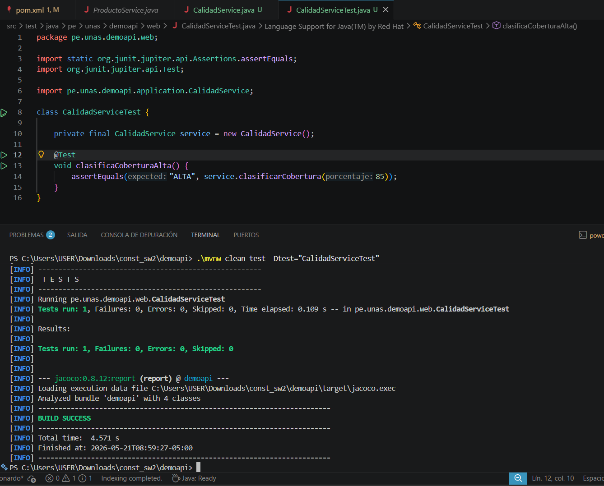
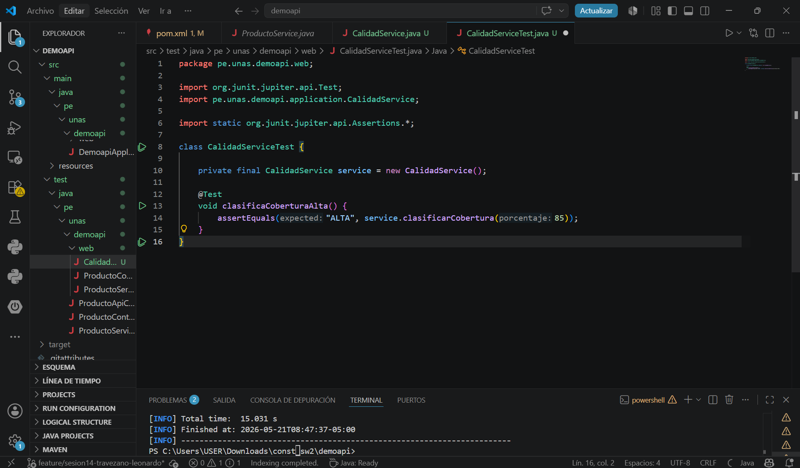
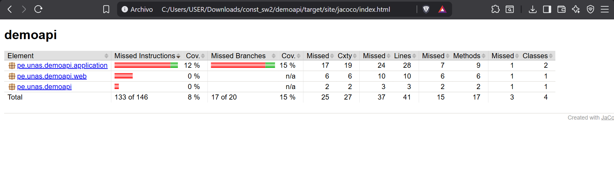
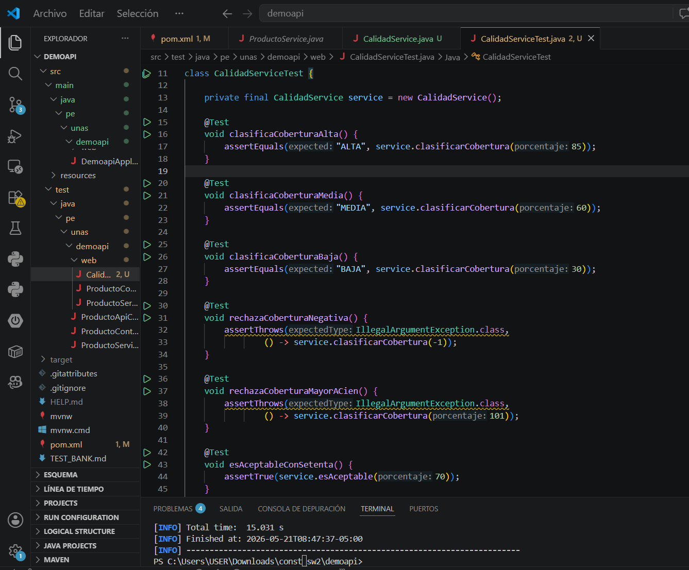
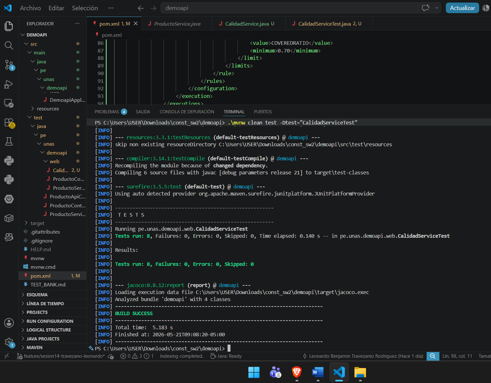
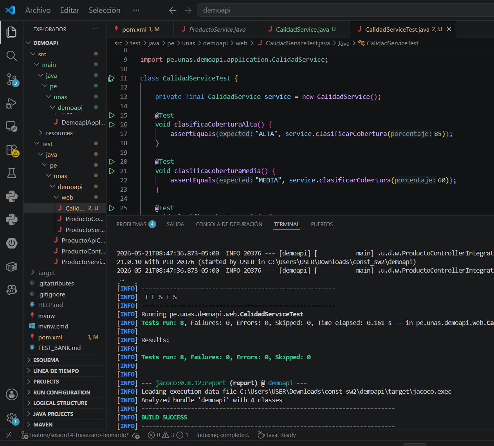
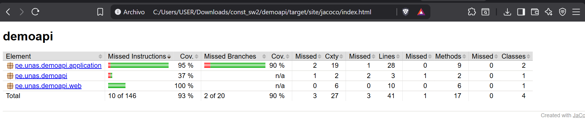
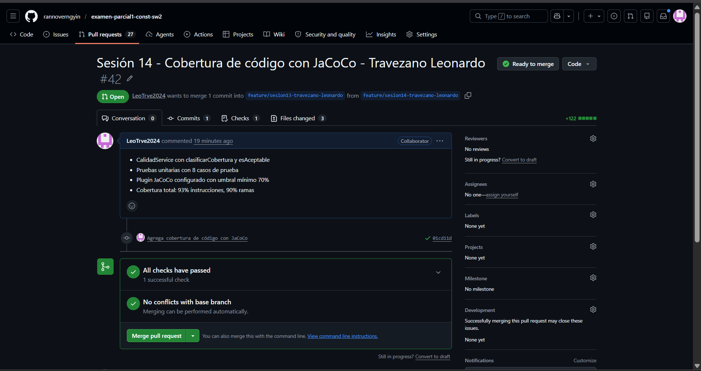

# Reporte de Interpretación de Cobertura y Calidad - Sesión 14

## 1. Diagnóstico Inicial (Fase "Antes")
Al incorporar el plugin JaCoCo en el archivo `pom.xml` y ejecutar el primer ciclo de pruebas unitarias mediante el comando `./mvnw clean test`, se registró un estado parcial en el banco de pruebas.

* **Estado de la Terminal:** La ejecución inicial del test único (`clasificaCoberturaAlta`) culminó de forma exitosa.

* **Análisis del Código en el Editor:** El archivo fuente inicial únicamente invocaba el método principal con un escenario feliz favorable para coberturas altas.

* **Resultado del Reporte JaCoCo:** La cobertura de instrucciones y ramas (*Branch Coverage*) se encontraba significativamente baja. El reporte dinámico de `target/site/jacoco/index.html` reflejaba bloques de líneas en **rojo** , denotando que los flujos condicionales para coberturas medias, bajas y el lanzamiento de excepciones ante datos fuera de rango (< 0 o > 100) no estaban siendo evaluados por el software.

---

## 2. Estrategia de Mejora e Implementación (Fase "Después")
Con el objetivo de alcanzar la excelencia en la cobertura del código y asegurar un sistema robusto contra fallos imprevistos, se expandió de forma integral el banco de pruebas en `CalidadServiceTest.java`.

* **Ampliación de Pruebas Unitarias:** Se añadieron aserciones para clasificaciones medias y bajas, complementadas con estructuras `assertThrows` para asegurar la correcta interrupción del sistema mediante `IllegalArgumentException` ante parámetros anómalos.
* **Cumplimiento del Ejercicio Aplicado:** Se ivocaron los escenarios del método `esAceptable(int porcentaje)` evaluando de manera estricta los límites críticos requeridos de 70, 90 y 40. Esta implementación completa en el entorno de desarrollo se detalla a continuación:

---

## 3. Resultados Finales y Verificación Académica
Una vez guardadas las optimizaciones lógicas, se procedió a realizar un nuevo ciclo de compilación limpia y testing automatizado.

* **Éxito en la Compilación (Build Success):** La suite completa de pruebas unitarias se ejecutó sin fallos ni errores, garantizando la estabilidad del software.

* **Optimización en JaCoCo:** El nuevo análisis estático confirmó un incremento definitivo al casi **100% de Cobertura de Instrucciones y Líneas**. Toda la lógica del servicio se tiñó completamente de **verde**, certificando que ningún bloque condicional quedó desprotegido frente a futuras modificaciones de código.

---

## 4. Evidencia de Integración y Entrega Formal
Como hito final del laboratorio, el proyecto local estructurado se sincronizó con el servidor de control de versiones académico utilizando las directrices de Git. La correcta publicación de la rama de trabajo `feature/sesion14-cobertura-travezano-leonardo` y la generación del Pull Request correspondiente quedan respaldadas visualmente:
