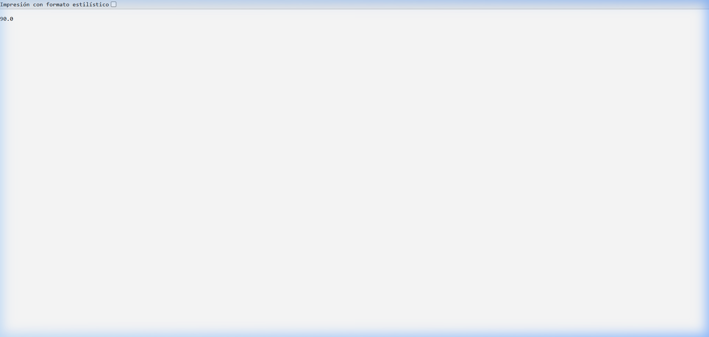
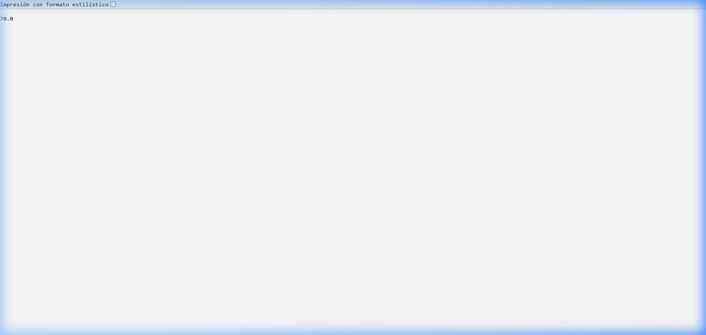

# Análisis de variabilidad – Sesión 17

## Punto de variación
Cálculo de precio final según tipo de cliente.

## Variantes implementadas

| Variante    | Regla               | Fórmula                      | Precio (100) |
|-------------|---------------------|------------------------------|--------------|
| BASICO      | Sin descuento       | precioFinal = precio         | 100.0        |
| PREMIUM     | 10% de descuento    | precioFinal = precio * 0.90  | 90.0         |
| VIP         | 20% de descuento    | precioFinal = precio * 0.80  | 80.0         |
| ESTUDIANTE  | 30% de descuento    | precioFinal = precio * 0.70  | 70.0         |

## Mecanismo usado
Configuración externa mediante `application.properties`.

## Propiedad
```properties
app.variante-cliente=PREMIUM
```

## Endpoints
- `GET /variante-activa` → Devuelve la variante configurada actualmente.
- `GET /precio-final?precio=100` → Calcula el precio final aplicando el descuento según la variante activa.

## Estructura del código

### Servicio de variabilidad
**Archivo:** `src/main/java/pe/unas/demoapi/application/PrecioService.java`

- Usa `@Value("${app.variante-cliente:BASICO}")` para inyectar la configuración.
- Método `calcularPorVariante(double precio, String variante)` contiene la lógica del switch.
- Método `calcularPrecioFinal(double precio)` delega al método anterior usando la variante configurada.

### Controller REST
**Archivo:** `src/main/java/pe/unas/demoapi/presentation/PrecioController.java`

- Endpoint `/precio-final` → invoca `calcularPrecioFinal`.
- Endpoint `/variante-activa` → invoca `obtenerVarianteActiva`.

### Pruebas unitarias
**Archivo:** `src/test/java/pe/unas/demoapi/PrecioServiceTest.java`

- `debeAplicarDescuentoPremium()` → verifica que 100 * 0.90 = 90.0
- `debeAplicarDescuentoVip()` → verifica que 100 * 0.80 = 80.0
- `debeMantenerPrecioBasico()` → verifica que 100 = 100.0
- `debeAplicarDescuentoEstudiante()` → verifica que 100 * 0.70 = 70.0

## Evidencias de ejecución

### Variante PREMIUM
#### /variante-activa → PREMIUM


#### /precio-final?precio=100 → 90.0


### Variante VIP
#### /variante-activa → VIP


#### /precio-final?precio=100 → 80.0


### Variante ESTUDIANTE
#### /variante-activa → ESTUDIANTE


#### /precio-final?precio=100 → 70.0


### Ejecución de pruebas unitarias
```
Tests run: 26, Failures: 0, Errors: 0, Skipped: 0
BUILD SUCCESS
```

## Conclusión
La variabilidad permite que un mismo sistema se adapte a diferentes clientes, entornos o reglas de negocio sin duplicar proyectos. En esta práctica, el comportamiento del cálculo de precio cambia mediante configuración externa (`application.properties`), manteniendo una arquitectura limpia y verificable con pruebas automatizadas.
