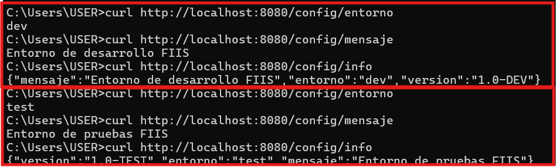
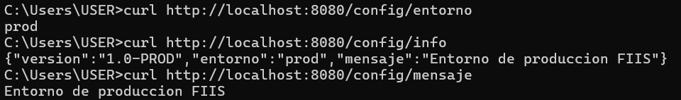
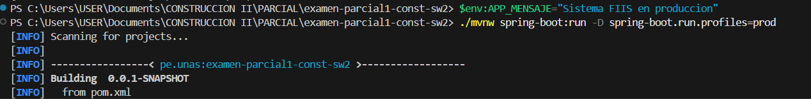
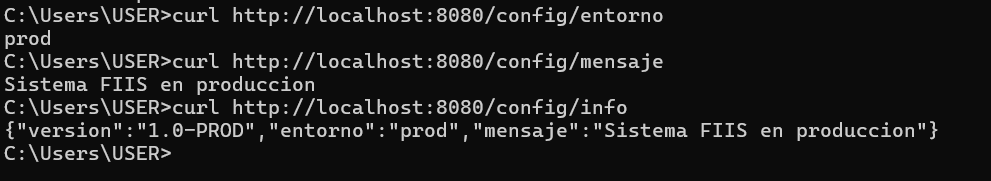
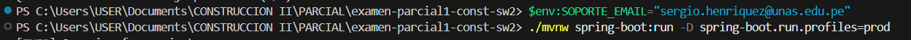
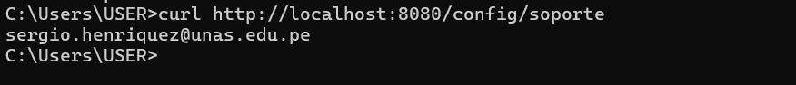
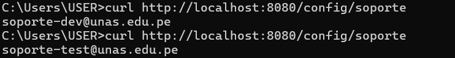

# Sesión 18 - Configuración dinámica y perfiles

## Perfil dev
Comando ejecutado:
./mvnw spring-boot:run -D spring-boot.run.profiles=dev

Resultado:
/config/info -> entorno dev

## Perfil test
Comando ejecutado:
./mvnw spring-boot:run -D spring-boot.run.profiles=test

Resultado:
/config/info -> entorno test

## Perfil prod
Variable usada:
APP_MENSAJE=Sistema FIIS en produccion

Resultado:
/config/info -> entorno prod

## Conclusión
La configuración cambia por entorno sin modificar el código fuente.

## Evidencias
 
 Comando ejecutado: .\mvnw spring-boot:run -D spring-boot.run.profiles=(prod,dev,test)    ## Variar entre prod,dev y test

Pruebas con las configuraciones dev y test

Pruebas con la configuracion prod 

Prueba con la configuracion prod modificando el mensaje mediante la variable de entorno

Pruebas con parametro "soporte":

Prueba con la configuracion prod

Prueba con las configuraciones dev y test
