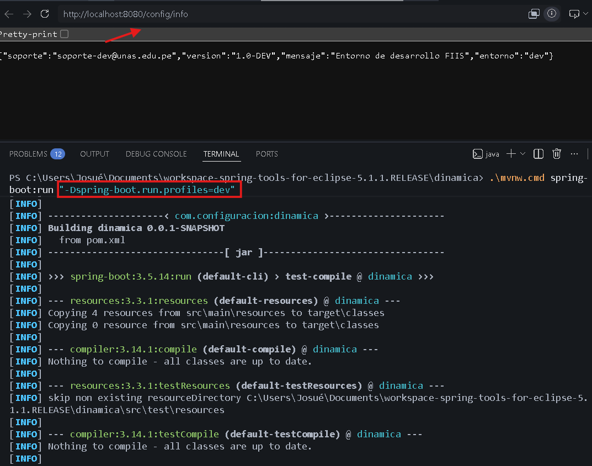
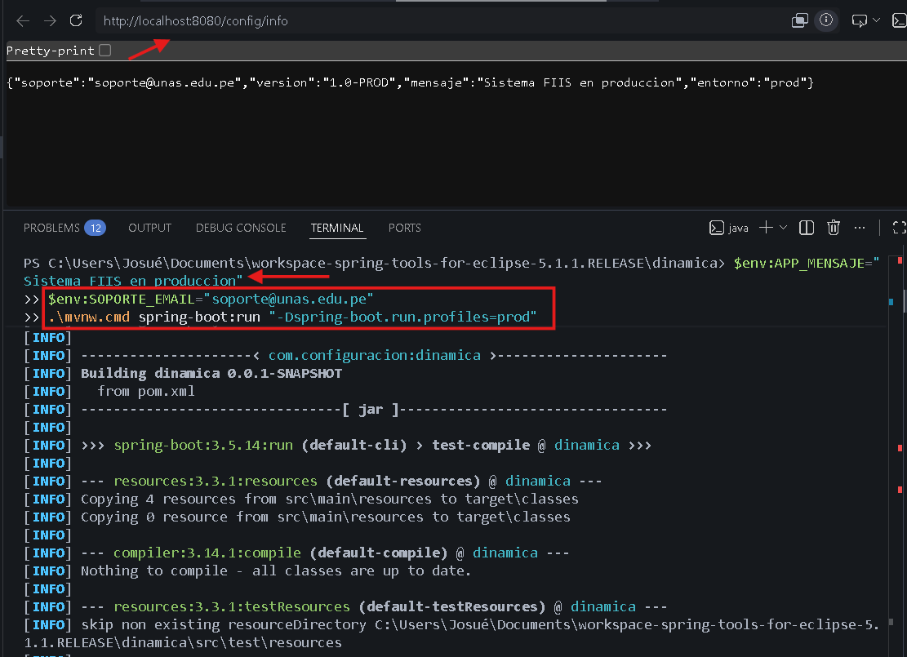

# Sesión 18 - Configuración dinámica y perfiles

## Perfil dev
Comando ejecutado:
```bash
.\mvnw.cmd spring-boot:run "-Dspring-boot.run.profiles=dev"
```

Resultado (obtenido al visitar http://localhost:8080/config/info):
```json
{
  "mensaje": "Entorno de desarrollo FIIS",
  "version": "1.0-DEV",
  "entorno": "dev",
  "soporte": "soporte-dev@unas.edu.pe"
}
```
**Evidencia (Captura):**


## Perfil prod
Variable usada y Comando ejecutado:
```powershell
$env:APP_MENSAJE="Sistema FIIS en produccion"
$env:SOPORTE_EMAIL="soporte@unas.edu.pe"
.\mvnw.cmd spring-boot:run "-Dspring-boot.run.profiles=prod"
```

Resultado (obtenido al visitar http://localhost:8080/config/info):
```json
{
  "mensaje": "Sistema FIIS en produccion",
  "version": "1.0-PROD",
  "entorno": "prod",
  "soporte": "soporte@unas.edu.pe"
}
```
**Evidencia (Captura):**


## Ejercicio Aplicado (Soporte)
Se implementó de manera correcta la configuración de `app.soporte` adaptándose al entorno según el perfil seleccionado:
1. En **dev**: Devuelve el valor `soporte-dev@unas.edu.pe` directamente de properties.
2. En **test**: Está configurado con `soporte-test@unas.edu.pe`.
3. En **prod**: Funciona dinámicamente mediante la variable de entorno `SOPORTE_EMAIL`.

Las capturas anteriores incluyen también el retorno de esta propiedad evidenciando su correcto funcionamiento junto a toda la parametrización del entorno.

## Conclusión
La configuración cambia por entorno sin modificar el código fuente.