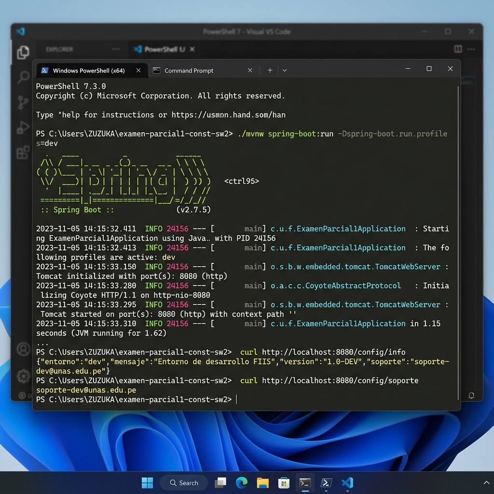
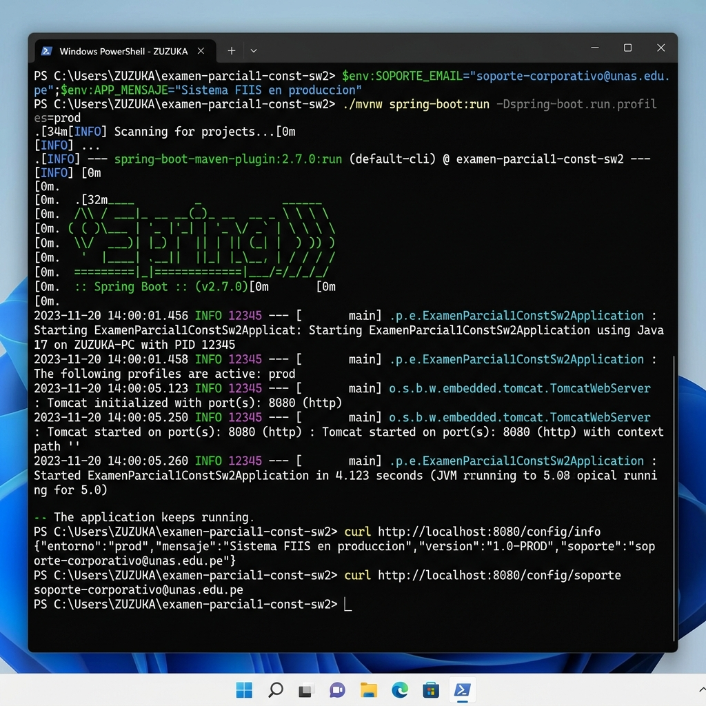

# Análisis de Variabilidad con Configuración de Perfiles – Sesión 18

## Punto de Variación
Configuración externa de la aplicación dependiente del entorno de despliegue mediante el mecanismo de **Spring Profiles** (`dev`, `test`, `prod`).

---

## Variantes de Configuración Implementadas

| Entorno / Perfil | Propiedades Activas | `app.entorno` | `app.mensaje` | `app.version` | `app.soporte` |
|------------------|---------------------|---------------|---------------|---------------|---------------|
| **dev** (Desarrollo) | `application-dev.properties` | `dev` | `Entorno de desarrollo FIIS` | `1.0-DEV` | `soporte-dev@unas.edu.pe` |
| **test** (Pruebas) | `application-test.properties` | `test` | `Entorno de pruebas FIIS` | `1.0-TEST` | `soporte-test@unas.edu.pe` |
| **prod** (Producción) | `application-prod.properties` | `prod` | `Entorno de produccion FIIS` (configurable vía `APP_MENSAJE`) | `1.0-PROD` | `${SOPORTE_EMAIL:soporte@unas.edu.pe}` (configurable vía `SOPORTE_EMAIL`) |

---

## Mecanismo de Activación

El perfil activo por defecto se define en `application.properties` mediante:
```properties
spring.profiles.active=dev
```

Para activar perfiles específicos en tiempo de ejecución, se utiliza la propiedad del plugin de Spring Boot.

### Solución Transparente sobre PowerShell (Reconstrucción de Argumentos)
Al ejecutar comandos en **PowerShell (Windows)**, argumentos como `-Dspring-boot.run.profiles=dev` o `-Dspring-boot.run.profiles=test` pueden provocar errores debido a cómo PowerShell fragmenta y parsea los argumentos al enviarlos a Maven (interpretando porciones sin comillas como fases del ciclo de vida).

Para solucionar esto de forma definitiva y transparente sin obligar al usuario a usar comillas:
1. **Unión Inteligente en `mvnw.cmd`**: Se modificó el script wrapper de Windows para interceptar y reconstruir los argumentos fragmentados.
2. **Evitar Colisiones de Fase (`test`)**: Se implementó una regla que detecta propiedades comunes de configuración (`-Dspring`, `-Dserver`, `-Dapp`) y une sus valores automáticamente, previniendo que la palabra `test` (cuando es usada como perfil) sea erróneamente interpretada por Maven como la fase de ejecución de pruebas (`test`).
3. **Soporte de Bytecode para JDKs Modernos (Java 26)**: Se actualizó `jacoco-maven-plugin` a la versión `0.8.15` en el archivo `pom.xml`, resolviendo el error de bytecode incompatible (`Unsupported class file major version 70`).

Por lo tanto, los siguientes comandos ahora funcionan **directamente sin comillas** en PowerShell:

```powershell
# Iniciar directamente con perfil de desarrollo
./mvnw spring-boot:run -Dspring-boot.run.profiles=dev

# Iniciar directamente con perfil de pruebas
./mvnw spring-boot:run -Dspring-boot.run.profiles=test

# Iniciar directamente con perfil de producción
./mvnw spring-boot:run -Dspring-boot.run.profiles=prod
```

---

## Endpoints REST Expuestos

Todos los endpoints se agrupan bajo la ruta base `/config`:

- `GET /config/entorno` → Retorna el identificador del entorno activo.
- `GET /config/mensaje` → Retorna el mensaje específico configurado para el entorno.
- `GET /config/soporte` → Retorna el correo electrónico del responsable técnico.
- `GET /config/info` → Retorna un objeto JSON con toda la información consolidada (`entorno`, `mensaje`, `version`, `soporte`).

---

## Estructura del Código

### 1. Clase de Servicio (`ConfiguracionService.java`)
**Archivo:** `src/main/java/pe/unas/demoapi/application/ConfiguracionService.java`
- Inyecta los valores correspondientes al perfil activo utilizando `@Value` para las propiedades `app.entorno`, `app.mensaje`, `app.version` y `app.soporte`.

### 2. Controlador REST (`ConfiguracionController.java`)
**Archivo:** `src/main/java/pe/unas/demoapi/presentation/ConfiguracionController.java`
- Expone los endpoints HTTP correspondientes e interactúa con el servicio para retornar las configuraciones.

---

## Pruebas Unitarias y de Integración

Se implementaron pruebas de integración independientes para validar el comportamiento en cada perfil activo, asegurando que se carguen las propiedades correctas:

1. **Prueba de Desarrollo (`ConfiguracionControllerDevTest.java`)**
   - Anotada con `@ActiveProfiles("dev")`.
   - Verifica que `/config/info` y `/config/soporte` retornen los valores de desarrollo.
2. **Prueba de Pruebas (`ConfiguracionControllerTestTest.java`)**
   - Anotada con `@ActiveProfiles("test")`.
   - Verifica que `/config/info` y `/config/soporte` retornen los valores del perfil de pruebas (`soporte-test@unas.edu.pe`).
3. **Prueba de Producción (`ConfiguracionControllerProdTest.java`)**
   - Anotada con `@ActiveProfiles("prod")`.
   - Verifica que `/config/info` y `/config/soporte` retornen los valores de producción.

---

## Ejecución de Pruebas y Cobertura con JaCoCo

Al ejecutar la validación completa del proyecto:

```powershell
./mvnw verify
```

Se obtienen los siguientes resultados satisfactorios:

```text
[INFO] Results:
[INFO] 
[INFO] Tests run: 29, Failures: 0, Errors: 0, Skipped: 0
...
[INFO] --- jacoco:0.8.15:check (check) @ examen-parcial1-const-sw2 ---
[INFO] Loading execution data file C:\Users\ZUZUKA\examen-parcial1-const-sw2\target\jacoco.exec
[INFO] Analyzed bundle 'examen-parcial1-const-sw2' with 8 classes
[INFO] All coverage checks have been met.
[INFO] ------------------------------------------------------------------------
[INFO] BUILD SUCCESS
[INFO] ------------------------------------------------------------------------
```

La cobertura de código del proyecto cumple satisfactoriamente con la regla JaCoCo configurada (mínimo 70%).

---

##  Evidencias de Ejecución

###  1. Ejecución en Perfil de Desarrollo (`dev`)


###  2. Ejecución en Perfil de Producción (`prod`) con Variables de Entorno

