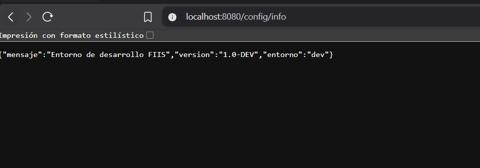
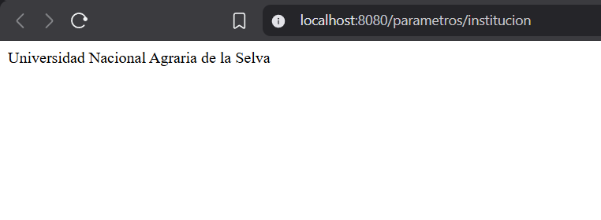
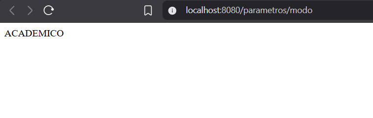
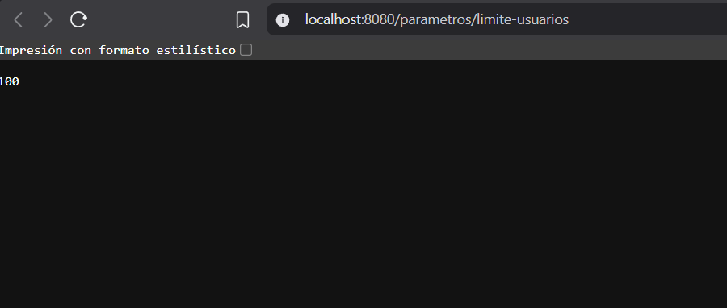
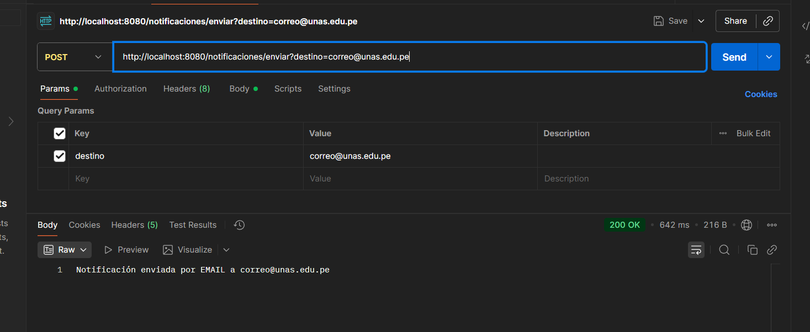
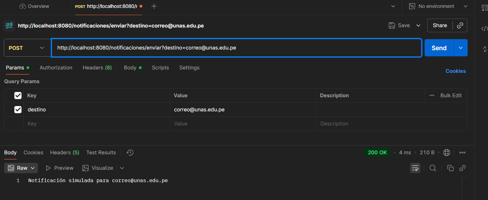
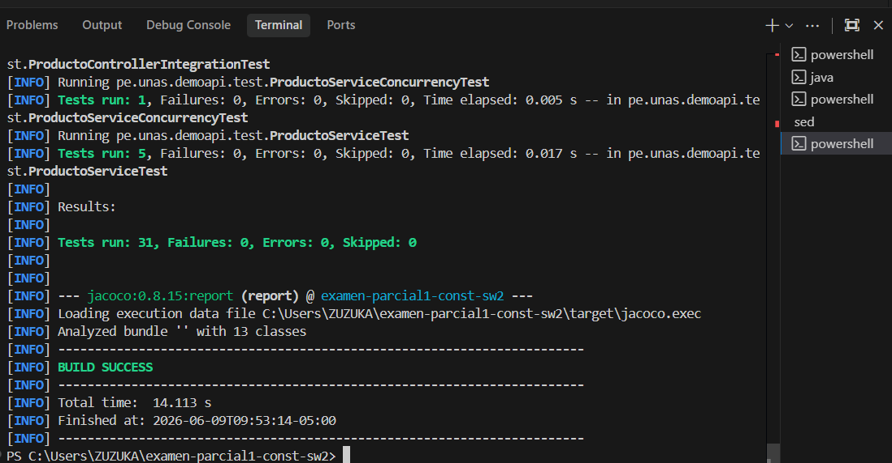

# Sesión 19 – Variabilidad del Software
---

## 1. Objetivo

Implementar **variabilidad del software** en una aplicación Spring Boot mediante:

- Configuración externa con `application.properties` y `@Value`
- Inyección condicional de beans con `@ConditionalOnProperty`
- Endpoints REST para exponer los valores configurados
- Pruebas unitarias y de integración

---

## 2. Configuración Externa con `@Value`

### 2.1 Archivo `application.properties`

Se definieron propiedades personalizadas en el archivo principal de configuración:

```properties
spring.application.name=examen-parcial1-const-sw2
server.port=8080
spring.profiles.active=dev

app.institucion=Universidad Nacional Agraria de la Selva
app.modo=ACADEMICO
app.limite-usuarios=100
app.entorno=default
app.notificacion.proveedor=mock
```

### 2.2 Perfil `application-dev.properties`

Se configuró un perfil de desarrollo que sobreescribe ciertas propiedades:

```properties
app.entorno=dev
app.mensaje=Entorno de desarrollo FIIS
app.version=1.0-DEV
app.soporte=soporte-dev@unas.edu.pe
```

### 2.3 Servicio `ParametroService.java`

Se creó un servicio que inyecta las propiedades usando `@Value`:

```java
@Service
public class ParametroService {

    @Value("${app.institucion}")
    private String institucion;

    @Value("${app.modo}")
    private String modo;

    @Value("${app.limite-usuarios}")
    private int limiteUsuarios;

    public String obtenerInstitucion() {
        return institucion;
    }

    public String obtenerModo() {
        return modo;
    }

    public int obtenerLimiteUsuarios() {
        return limiteUsuarios;
    }
}
```

### 2.4 Controlador `ParametroController.java`

Se expusieron los valores configurados mediante endpoints REST:

```java
@RestController
@RequestMapping("/parametros")
public class ParametroController {

    private final ParametroService service;

    public ParametroController(ParametroService service) {
        this.service = service;
    }

    @GetMapping("/institucion")
    public String institucion() {
        return service.obtenerInstitucion();
    }

    @GetMapping("/modo")
    public String modo() {
        return service.obtenerModo();
    }

    @GetMapping("/limite-usuarios")
    public int limiteUsuarios() {
        return service.obtenerLimiteUsuarios();
    }
}
```

### 2.5 Evidencia – Endpoints de Parámetros

**Endpoint `/config/info`** – Devuelve la información del entorno de desarrollo:



**Endpoint `/parametros/institucion`** – Devuelve el nombre de la institución configurada:



**Endpoint `/parametros/modo`** – Devuelve el modo de operación (ACADEMICO):



**Endpoint `/parametros/limite-usuarios`** – Devuelve el límite de usuarios configurado (100):



---

## 3. Inyección Condicional con `@ConditionalOnProperty`

### 3.1 Interfaz `NotificadorService.java`

Se definió una interfaz para el servicio de notificaciones:

```java
public interface NotificadorService {
    String enviar(String destino);
}
```

### 3.2 Implementación `EmailNotificadorService.java`

Se activa **solo cuando** `app.notificacion.proveedor=email`:

```java
@Service
@ConditionalOnProperty(name = "app.notificacion.proveedor", havingValue = "email")
public class EmailNotificadorService implements NotificadorService {

    @Override
    public String enviar(String destino) {
        return "Notificación enviada por EMAIL a " + destino;
    }
}
```

### 3.3 Implementación `MockNotificadorService.java`

Se activa **solo cuando** `app.notificacion.proveedor=mock`:

```java
@Service
@ConditionalOnProperty(name = "app.notificacion.proveedor", havingValue = "mock")
public class MockNotificadorService implements NotificadorService {

    @Override
    public String enviar(String destino) {
        return "Notificación simulada para " + destino;
    }
}
```

### 3.4 Controlador `NotificacionController.java`

```java
@RestController
@RequestMapping("/notificaciones")
public class NotificacionController {

    private final NotificadorService service;

    public NotificacionController(NotificadorService service) {
        this.service = service;
    }

    @PostMapping("/enviar")
    public String enviar(@RequestParam String destino) {
        return service.enviar(destino);
    }
}
```

### 3.5 Evidencia – Pruebas con Postman

**Con `app.notificacion.proveedor=email`** – Se inyecta `EmailNotificadorService`:



**Con `app.notificacion.proveedor=mock`** – Se inyecta `MockNotificadorService`:



---

## 4. Pruebas Unitarias y de Integración

### 4.1 Test unitario – `EmailNotificadorServiceTest.java`

Verifica que el servicio de email incluya la palabra "EMAIL" en la respuesta:

```java
class EmailNotificadorServiceTest {

    @Test
    void debeEnviarNotificacionPorEmail() {
        EmailNotificadorService service = new EmailNotificadorService();

        String resultado = service.enviar("correo@unas.edu.pe");

        assertTrue(resultado.contains("EMAIL"));
    }
}
```

### 4.2 Test de integración – `ParametroControllerTest.java`

Verifica que el endpoint `/parametros/institucion` devuelva un valor que contenga "Universidad":

```java
@SpringBootTest
@AutoConfigureMockMvc
class ParametroControllerTest {

    @Autowired
    private MockMvc mockMvc;

    @Test
    void debeMostrarInstitucionConfigurada() throws Exception {
        mockMvc.perform(get("/parametros/institucion"))
                .andExpect(status().isOk())
                .andExpect(content().string(containsString("Universidad")));
    }
}
```

### 4.3 Evidencia – Ejecución de Tests

Todos los tests pasaron exitosamente con `./mvnw test`:



**Resultado:** `Tests run: 31, Failures: 0, Errors: 0, Skipped: 0` → **BUILD SUCCESS**

---

## 5. Estructura de Archivos Creados/Modificados

```
src/
├── main/
│   ├── java/pe/unas/demoapi/
│   │   ├── application/
│   │   │   ├── ParametroService.java          ← Inyección con @Value
│   │   │   ├── NotificadorService.java        ← Interfaz
│   │   │   ├── EmailNotificadorService.java   ← @ConditionalOnProperty (email)
│   │   │   └── MockNotificadorService.java    ← @ConditionalOnProperty (mock)
│   │   └── presentation/
│   │       ├── ParametroController.java       ← REST endpoints /parametros
│   │       └── NotificacionController.java    ← REST endpoint /notificaciones
│   └── resources/
│       ├── application.properties             ← Configuración base
│       └── application-dev.properties         ← Perfil de desarrollo
└── test/
    └── java/pe/unas/demoapi/
        ├── EmailNotificadorServiceTest.java    ← Test unitario
        └── ParametroControllerTest.java        ← Test de integración
```

---

## 6. Conclusiones

| Concepto | Mecanismo Usado | Resultado |
|---|---|---|
| Configuración externa | `@Value` + `application.properties` | Los valores se leen dinámicamente desde el archivo de configuración |
| Perfiles de entorno | `spring.profiles.active` + `application-{profile}.properties` | Se pueden tener configuraciones distintas por entorno (dev, prod, test) |
| Inyección condicional | `@ConditionalOnProperty` | El bean inyectado cambia según la propiedad `app.notificacion.proveedor` |
| Pruebas automatizadas | JUnit 5 + MockMvc | Se validó el comportamiento tanto unitario como de integración |
