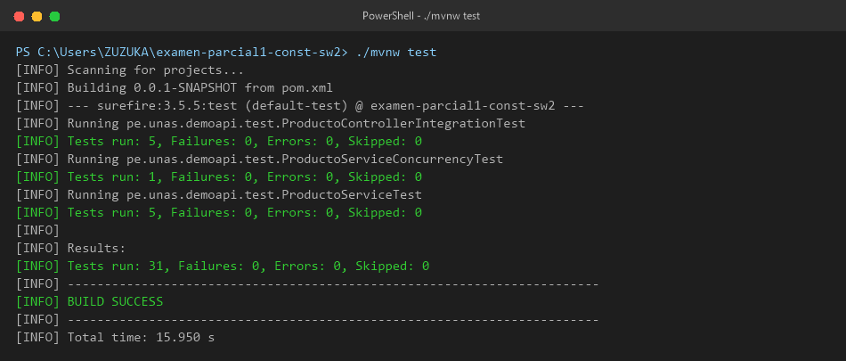
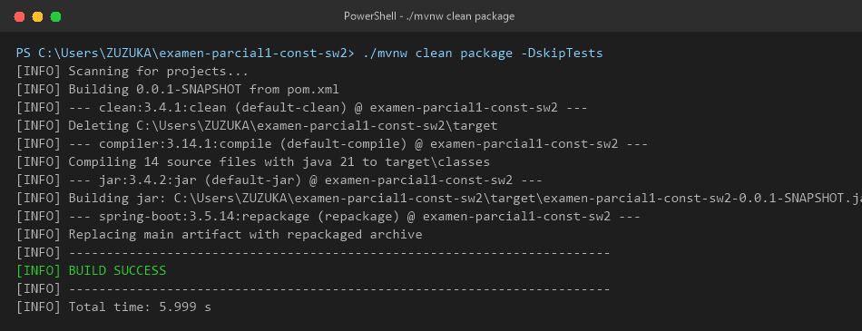
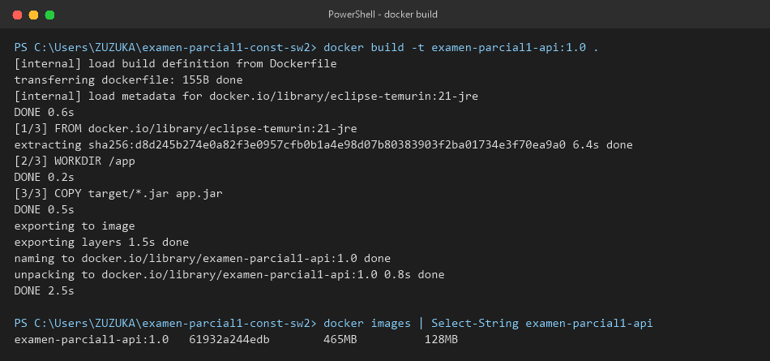
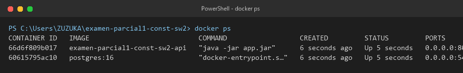
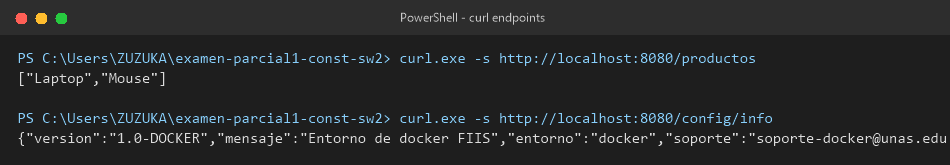
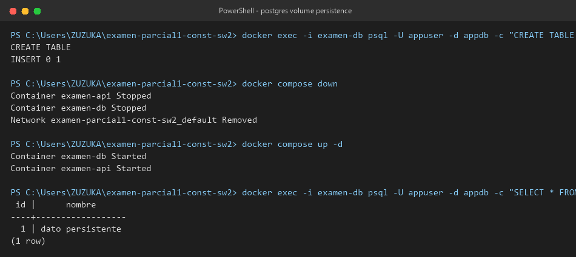

# Sesión 20: Contenedores y Orquestación con Docker y Docker Compose

Este documento detalla el proceso de dockerización de la aplicación Spring Boot, la configuración del entorno multi-contenedor con PostgreSQL utilizando volúmenes persistentes, y las evidencias de las pruebas ejecutadas en la sesión.

---

## E1. Ejecución de Pruebas Unitarias (`./mvnw test`)

Las pruebas del proyecto fueron ejecutadas de manera satisfactoria, verificando el correcto funcionamiento de los controladores, lógica de negocio y configuraciones de variabilidad:

```bash
$ ./mvnw test
[INFO] Scanning for projects...
[INFO] 
[INFO] -----------------< pe.unas:examen-parcial1-const-sw2 >------------------
[INFO] Building  0.0.1-SNAPSHOT
[INFO]   from pom.xml
[INFO] --------------------------------[ jar ]---------------------------------
...
[INFO] Running pe.unas.demoapi.test.ProductoControllerIntegrationTest
[INFO] Tests run: 5, Failures: 0, Errors: 0, Skipped: 0, Time elapsed: 1.090 s
[INFO] Running pe.unas.demoapi.test.ProductoServiceConcurrencyTest
[INFO] Tests run: 1, Failures: 0, Errors: 0, Skipped: 0, Time elapsed: 0.007 s
[INFO] Running pe.unas.demoapi.test.ProductoServiceTest
[INFO] Tests run: 5, Failures: 0, Errors: 0, Skipped: 0, Time elapsed: 0.019 s
[INFO] 
[INFO] Results:
[INFO] 
[INFO] Tests run: 31, Failures: 0, Errors: 0, Skipped: 0
[INFO] 
[INFO] ------------------------------------------------------------------------
[INFO] BUILD SUCCESS
[INFO] ------------------------------------------------------------------------
[INFO] Total time:  15.950 s
```



---

## E2. Empaquetado del Proyecto (`./mvnw clean package -DskipTests`)

El archivo empaquetado JAR fue compilado con Java 21 y estructurado bajo el directorio `target`:

```bash
$ ./mvnw clean package -DskipTests
[INFO] Scanning for projects...
[INFO] 
[INFO] -----------------< pe.unas:examen-parcial1-const-sw2 >------------------
[INFO] Building  0.0.1-SNAPSHOT
[INFO]   from pom.xml
[INFO] --------------------------------[ jar ]---------------------------------
...
[INFO] --- spring-boot:3.5.14:repackage (repackage) @ examen-parcial1-const-sw2 ---
[INFO] Replacing main artifact C:\Users\ZUZUKA\examen-parcial1-const-sw2\target\examen-parcial1-const-sw2-0.0.1-SNAPSHOT.jar with repackaged archive
[INFO] ------------------------------------------------------------------------
[INFO] BUILD SUCCESS
[INFO] ------------------------------------------------------------------------
```



---

## E3. Construcción de la Imagen Docker

La imagen Docker se configuró utilizando **Eclipse Temurin 21 (JRE)** ya que el JAR del proyecto fue compilado bajo la especificación de Java 21 (versión de clase 65.0).

### Comandos de Construcción y Comprobación
```bash
$ docker build -t examen-parcial1-api:1.0 .
#10 exporting to image
#10 exporting layers 1.5s done
#10 naming to docker.io/library/examen-parcial1-api:1.0 done
#10 unpacking to docker.io/library/examen-parcial1-api:1.0 0.8s done
#10 DONE 2.5s

$ docker images | Select-String examen-parcial1-api
examen-parcial1-api:1.0   61932a244edb        465MB          128MB
```



---

## E4. Contenedores Activos con Docker Compose (`docker ps`)

Se configuró un entorno orquestado con dos servicios: la API de Spring Boot y un motor de base de datos PostgreSQL 16 con volumen para almacenamiento persistente.

```bash
$ docker ps
CONTAINER ID   IMAGE                           COMMAND                  CREATED         STATUS         PORTS                                         NAMES
66d6f809b017   examen-parcial1-const-sw2-api   "java -jar app.jar"      6 seconds ago   Up 5 seconds   0.0.0.0:8080->8080/tcp, [::]:8080->8080/tcp   examen-api
60615795ac10   postgres:16                     "docker-entrypoint.s…"   6 seconds ago   Up 5 seconds   0.0.0.0:5432->5432/tcp, [::]:5432->5432/tcp   examen-db
```



---

## E5. Validación de Endpoints con `curl`

### Respuestas de Endpoints Activos (`/productos` y `/config/info`):
```bash
$ curl.exe -s http://localhost:8080/productos
["Laptop","Mouse"]

$ curl.exe -s http://localhost:8080/config/info
{"version":"1.0-DOCKER","mensaje":"Entorno de docker FIIS","entorno":"docker","soporte":"soporte-docker@unas.edu.pe"}
```



---

## E6. Archivos de Configuración del Repositorio

### `.dockerignore`
```ini
target/classes
target/generated-sources
target/generated-test-sources
target/maven-archiver
target/maven-status
.git
.idea
.vscode
*.log
```

### `Dockerfile`
```dockerfile
FROM eclipse-temurin:21-jre
WORKDIR /app
COPY target/*.jar app.jar
EXPOSE 8080
ENTRYPOINT ["java", "-jar", "app.jar"]
```

### `docker-compose.yml`
```yaml
services:
  api:
    build: .
    container_name: examen-api
    ports:
      - "8080:8080"
    environment:
      SPRING_PROFILES_ACTIVE: docker
      SPRING_DATASOURCE_URL: jdbc:postgresql://db:5432/appdb
      SPRING_DATASOURCE_USERNAME: appuser
      SPRING_DATASOURCE_PASSWORD: apppass
    depends_on:
      - db

  db:
    image: postgres:16
    container_name: examen-db
    environment:
      POSTGRES_DB: appdb
      POSTGRES_USER: appuser
      POSTGRES_PASSWORD: apppass
    ports:
      - "5432:5432"
    volumes:
      - postgres_data:/var/lib/postgresql/data

volumes:
  postgres_data:
```

### `src/main/resources/application-docker.properties`
```properties
app.entorno=docker
app.mensaje=Entorno de docker FIIS
app.version=1.0-DOCKER
app.soporte=soporte-docker@unas.edu.pe
```

---

## Prueba Adicional de Persistencia (Volumen Postgres)

Se validó la persistencia de datos reiniciando el servicio de base de datos sin destruir el volumen `postgres_data`:

1. **Creación de datos iniciales en la base de datos:**
   ```bash
   $ docker exec -i examen-db psql -U appuser -d appdb -c "CREATE TABLE prueba(id SERIAL PRIMARY KEY, nombre TEXT); INSERT INTO prueba(nombre) VALUES ('dato persistente');"
   CREATE TABLE
   INSERT 0 1
   ```
2. **Reinicio de la infraestructura con Compose:**
   ```bash
   $ docker compose down
   $ docker compose up -d
   ```
3. **Validación de la persistencia de los datos:**
   ```bash
   $ docker exec -i examen-db psql -U appuser -d appdb -c "SELECT * FROM prueba;"
    id |      nombre      
   ----+------------------
      1 | dato persistente
   (1 row)
   ```



---

## Conclusión
La dockerización y la orquestación multi-contenedor se completaron con éxito. El uso de volúmenes persistentes garantiza la disponibilidad de datos de la base de datos de manera robusta a través del ciclo de vida del contenedor.
