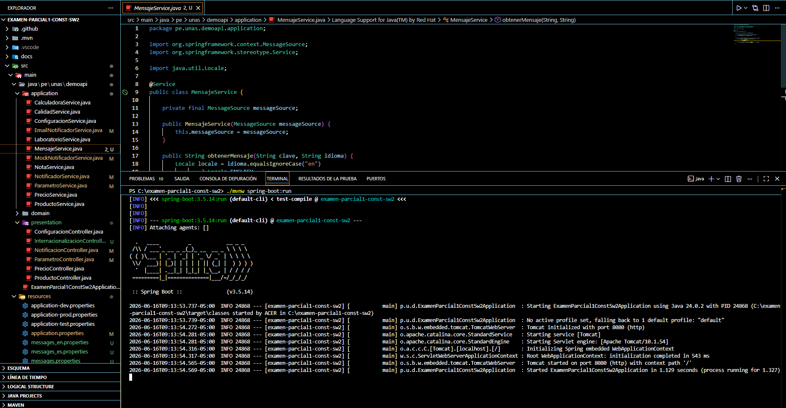
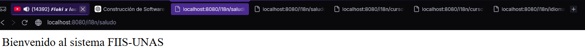
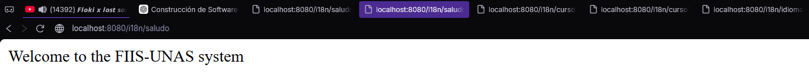
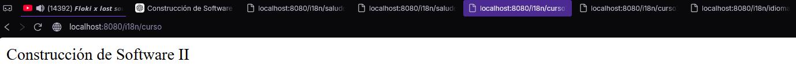
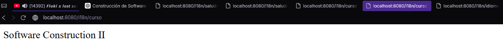
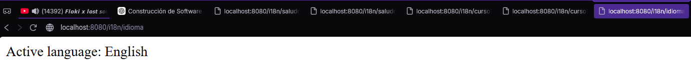
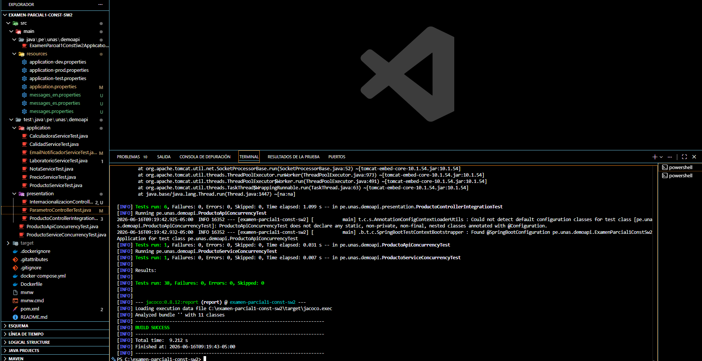
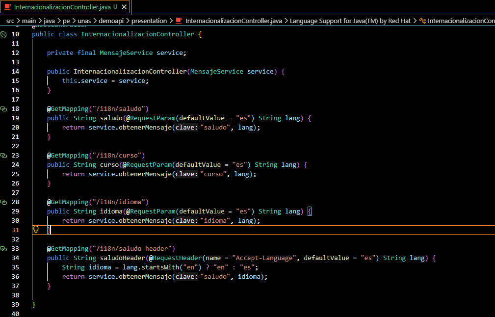
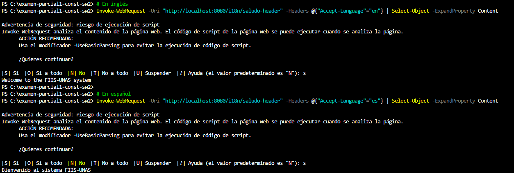

# Sesión 21 - Internacionalización en Spring Boot

## Paso 1 - Aplicación corriendo
Comando ejecutado:
./mvnw spring-boot:run

Resultado: Tomcat started on port 8080

## Paso 2 - Endpoints en español e inglés

### /i18n/saludo?lang=es

### /i18n/saludo?lang=en

### /i18n/curso?lang=es

### /i18n/curso?lang=en

### /i18n/idioma?lang=en

## Paso 3 - Pruebas de integración con MockMvc
Comando ejecutado:
./mvnw test

Resultado: BUILD SUCCESS — Tests run: 38, Failures: 0, Errors: 0

## Paso 4 - Controlador con Accept-Language (reto opcional)
Endpoint: GET /i18n/saludo-header
Implementado en InternacionalizacionController.java usando @RequestHeader

## Paso 5 - Prueba con cabecera Accept-Language
Comando ejecutado:
Invoke-WebRequest -Uri "http://localhost:8080/i18n/saludo-header" -Headers @{"Accept-Language"="en"} | Select-Object -ExpandProperty Content
Invoke-WebRequest -Uri "http://localhost:8080/i18n/saludo-header" -Headers @{"Accept-Language"="es"} | Select-Object -ExpandProperty Content

Resultado en inglés: Welcome to the FIIS-UNAS system
Resultado en español: Bienvenido al sistema FIIS-UNAS

## Conclusión
Los mensajes del sistema se externalizan en archivos .properties y se
seleccionan dinámicamente según el idioma solicitado, sin modificar el código fuente.