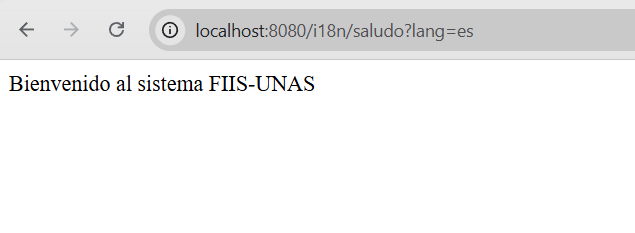
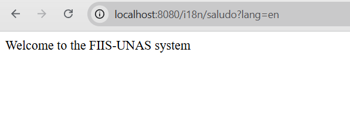
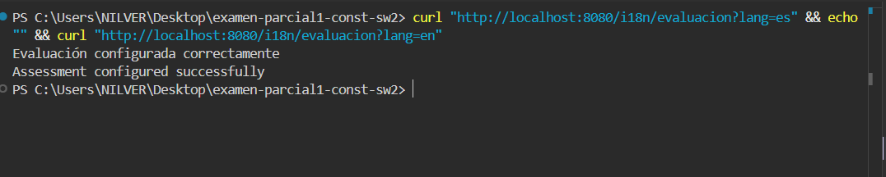
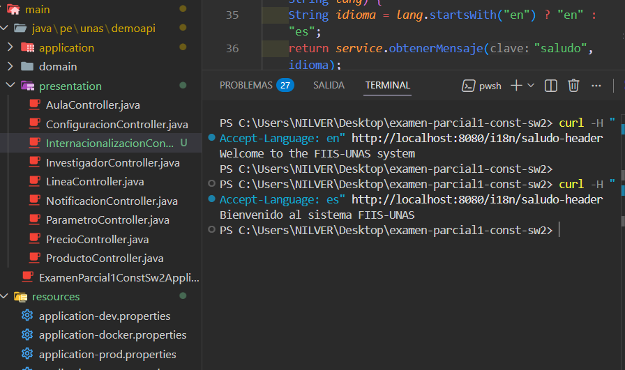
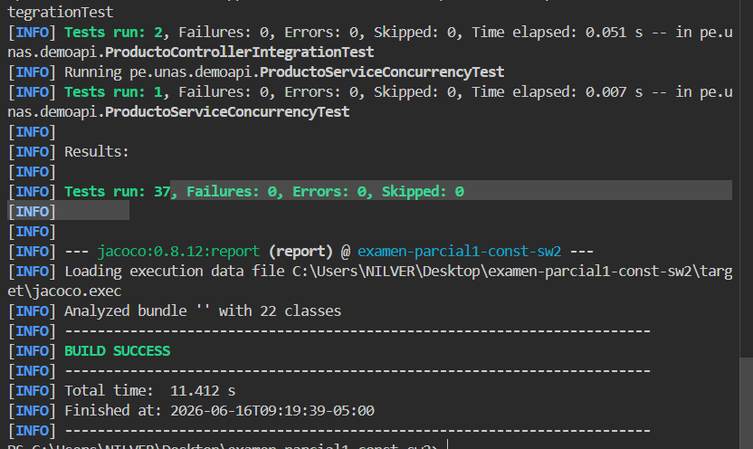

# Internacionalización (i18n)

## Objetivo
Permitir que la API responda con mensajes adaptados a múltiples idiomas (internacionalización/i18n), facilitando que clientes de diferentes regiones consuman los servicios web en su propio idioma.

## Idiomas Soportados
Actualmente la aplicación soporta los siguientes idiomas a través de archivos de recursos (`.properties`):
- **Español (es)**: Idioma por defecto.
- **Inglés (en)**: Configurado bajo el localizador de inglés.

---

## Estructura del Incremento

### 1. Archivos de Traducción (Messages)
Los mensajes están definidos en la carpeta `src/main/resources` con claves unificadas para facilitar su mantenimiento:

- [messages.properties](file:///c:/Users/NILVER/Desktop/examen-parcial1-const-sw2/src/main/resources/messages.properties) / [messages_es.properties](file:///c:/Users/NILVER/Desktop/examen-parcial1-const-sw2/src/main/resources/messages_es.properties):
  ```properties
  saludo=Bienvenido al sistema FIIS-UNAS
  curso=Construcción de Software II
  idioma=Idioma activo: español
  evaluacion=Evaluación configurada correctamente
  ```

- [messages_en.properties](file:///c:/Users/NILVER/Desktop/examen-parcial1-const-sw2/src/main/resources/messages_en.properties):
  ```properties
  saludo=Welcome to the FIIS-UNAS system
  curso=Software Construction II
  idioma=Active language: English
  evaluacion=Assessment configured successfully
  ```

### 2. Servicio de Mensajes
Se implementó el servicio [MensajeService.java](file:///c:/Users/NILVER/Desktop/examen-parcial1-const-sw2/src/main/java/pe/unas/demoapi/application/MensajeService.java) que encapsula el uso del `MessageSource` de Spring para resolver las traducciones basándose en el parámetro de idioma recibido:
```java
public String obtenerMensaje(String clave, String idioma) {
    Locale locale = idioma.equalsIgnoreCase("en")
            ? Locale.ENGLISH
            : new Locale("es");

    return messageSource.getMessage(clave, null, locale);
}
```

### 3. Controlador REST
El controlador [InternacionalizacionController.java](file:///c:/Users/NILVER/Desktop/examen-parcial1-const-sw2/src/main/java/pe/unas/demoapi/presentation/InternacionalizacionController.java) expone los endpoints que atienden las solicitudes de traducción, ya sea a través de un Query Parameter (`?lang=`) o mediante la cabecera estándar HTTP `Accept-Language`.

---

## Endpoints Disponibles y Uso

### GET `/i18n/saludo`
Devuelve un mensaje de saludo de bienvenida.
- **Parámetros**: `lang` (opcional, por defecto `es`)
- **Ejemplo en Español**: `GET /i18n/saludo?lang=es` -> `"Bienvenido al sistema FIIS-UNAS"`
- **Ejemplo en Inglés**: `GET /i18n/saludo?lang=en` -> `"Welcome to the FIIS-UNAS system"`

### GET `/i18n/curso`
Devuelve el nombre del curso.
- **Parámetros**: `lang` (opcional, por defecto `es`)
- **Ejemplo en Español**: `GET /i18n/curso?lang=es` -> `"Construcción de Software II"`
- **Ejemplo en Inglés**: `GET /i18n/curso?lang=en` -> `"Software Construction II"`

### GET `/i18n/idioma`
Informa el idioma que se encuentra activo en la respuesta.
- **Parámetros**: `lang` (opcional, por defecto `es`)
- **Ejemplo en Español**: `GET /i18n/idioma?lang=es` -> `"Idioma activo: español"`
- **Ejemplo en Inglés**: `GET /i18n/idioma?lang=en` -> `"Active language: English"`

### GET `/i18n/evaluacion`
Informa el estado de configuración de la evaluación.
- **Parámetros**: `lang` (opcional, por defecto `es`)
- **Ejemplo en Español**: `GET /i18n/evaluacion?lang=es` -> `"Evaluación configurada correctamente"`
- **Ejemplo en Inglés**: `GET /i18n/evaluacion?lang=en` -> `"Assessment configured successfully"`

### GET `/i18n/saludo-header`
Devuelve el mensaje de saludo utilizando la cabecera HTTP estándar.
- **Cabecera**: `Accept-Language` (ej. `en` o `es`)
- **Ejemplo**:
  ```bash
  curl -H "Accept-Language: en" http://localhost:8080/i18n/saludo-header
  ```
  Retorna: `"Welcome to the FIIS-UNAS system"`

---

## Evidencias de Funcionamiento

A continuación se presentan las capturas de pantalla que demuestran el correcto funcionamiento del incremento en diferentes escenarios:

### 1. Respuestas con Parámetro `lang=es` (Español)
Visualización del saludo y curso utilizando el parámetro `lang=es`:


### 2. Respuestas con Parámetro `lang=en` (Inglés)
Visualización del saludo y curso traducidos al inglés mediante `lang=en`:


### 3. Endpoint de Evaluación (`/i18n/evaluacion`)
Demostración de la respuesta i18n para la evaluación:


### 4. Uso de la Cabecera `Accept-Language` (`/i18n/saludo-header`)
Prueba de internacionalización utilizando headers HTTP en lugar de parámetros URL:


---

## Pruebas de Integración y Unitarias

Se cuenta con pruebas automatizadas en [InternacionalizacionControllerTest.java](file:///c:/Users/NILVER/Desktop/examen-parcial1-const-sw2/src/test/java/pe/unas/demoapi/InternacionalizacionControllerTest.java) que garantizan que el controlador responda correctamente en los idiomas solicitados.

### Ejecución de Pruebas
Los tests se ejecutan de manera satisfactoria sin errores:

