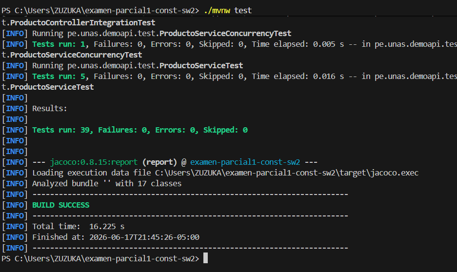
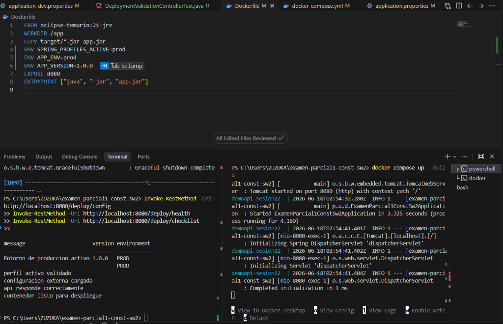
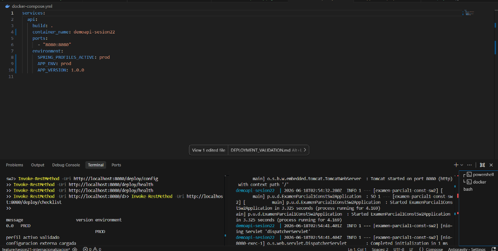
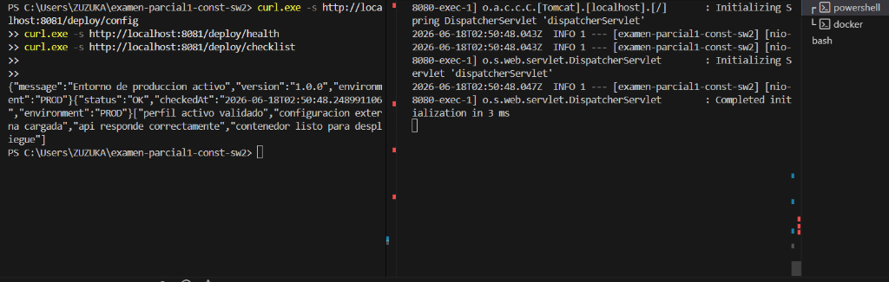
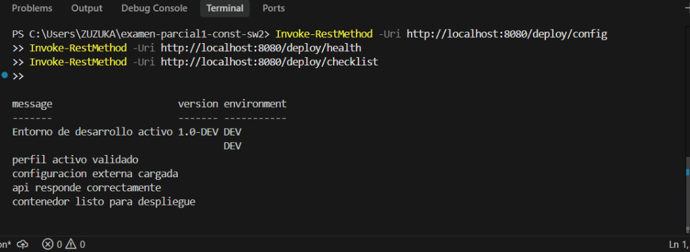
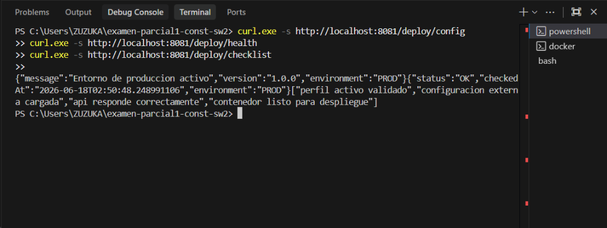

# Sesión 22 - Validación de Configuración y Despliegue

Este documento contiene la evidencia técnica y la documentación del proceso de validación y despliegue realizado para la **Sesión 22**. Se detallan los pasos de configuración por perfiles (archivos `properties`), la creación de endpoints de validación, la suite de pruebas unitarias/integración, el despliegue con Docker y Docker Compose, y la gestión de la versión de la aplicación.

---

## ⚙️ 1. Configuración por Perfiles (application.properties)

Para soportar el despliegue multidestino, la aplicación utiliza archivos de propiedades organizados por perfiles. Esto permite desacoplar los parámetros del entorno de desarrollo de los de pruebas y producción.

### 1.1 Configuración Base (`application.properties`)
Contiene los valores por defecto y habilita el perfil `dev` de manera predeterminada.
```properties
spring.application.name=examen-parcial1-const-sw2
server.port=${APP_PORT:8080}
spring.messages.basename=messages
spring.messages.encoding=UTF-8
spring.profiles.active=dev

app.institucion=Universidad Nacional Agraria de la Selva
app.modo=ACADEMICO
app.limite-usuarios=100
app.entorno=default
app.notificacion.proveedor=mock

app.version=${APP_VERSION:1.0.0}
app.environment=${APP_ENV:local}
app.message=Configuracion base activa
```

### 1.2 Perfil de Desarrollo (`application-dev.properties`)
Sobrescribe las propiedades para el desarrollo local.
```properties
app.entorno=dev
app.mensaje=Entorno de desarrollo FIIS
app.version=1.0-DEV
app.soporte=soporte-dev@unas.edu.pe

app.environment=DEV
app.message=Entorno de desarrollo activo
```

### 1.3 Perfil de Producción (`application-prod.properties`)
Configuración optimizada para producción con fallbacks y variables de entorno externas.
```properties
app.entorno=prod
app.mensaje=${APP_MENSAJE:Entorno de produccion FIIS}
app.version=1.0-PROD
app.soporte=${SOPORTE_EMAIL:soporte@unas.edu.pe}

app.environment=PROD
app.message=Entorno de produccion activo
```

### 1.4 Perfil de Pruebas (`application-test.properties`)
Perfil especializado utilizado por JUnit y MockMvc durante el ciclo de pruebas.
```properties
app.entorno=test
app.mensaje=Entorno de pruebas FIIS
app.version=1.0-TEST
app.soporte=soporte-test@unas.edu.pe

app.environment=TEST
app.message=Entorno de pruebas activo
```

### 1.5 Perfil Docker (`application-docker.properties`)
Adaptado específicamente para la ejecución en contenedores Docker.
```properties
app.entorno=docker
app.mensaje=Entorno de docker FIIS
app.version=1.0-DOCKER
app.soporte=soporte-docker@unas.edu.pe

app.environment=DOCKER
app.message=Entorno de docker activo
```

---

## 🔬 2. Ejercicio Aplicado: Endpoint de Versión

Se implementó el endpoint GET `/deploy/version` para exponer la versión actual de la aplicación.

### Componentes Modificados/Creados:

1. **Servicio (`DeploymentValidationService.java`)**:
   Método que devuelve la propiedad `app.version` configurada en el entorno actual.
   ```java
   @Value("${app.version}")
   private String version;

   public String obtenerVersion() {
       return version;
   }
   ```

2. **Controlador (`DeploymentValidationController.java`)**:
   Exposición del endpoint GET `/deploy/version` invocando el método correspondiente en el servicio.
   ```java
   @GetMapping("/version")
   public String version() {
       return service.obtenerVersion();
   }
   ```

3. **Prueba de Integración MockMvc (`DeploymentValidationControllerTest.java`)**:
   Validación automatizada que comprueba que la API responde HTTP 200 y que el cuerpo de la respuesta contiene `1.0.0` bajo el contexto de prueba.
   ```java
   @Test
   void debeResponderVersionOk() throws Exception {
       mockMvc.perform(get("/deploy/version"))
               .andExpect(status().isOk())
               .andExpect(content().string(containsString("1.0.0")));
   }
   ```

---

## 📸 3. Evidencias de Entrega

A continuación se presentan las evidencias visuales y técnicas del correcto funcionamiento del despliegue y las pruebas:

### 1. Pruebas Locales Exitosas (`./mvnw test`)
Ejecución de la suite completa de pruebas unitarias y de integración del proyecto, logrando un resultado exitoso de **BUILD SUCCESS**.
* **Comando:** `./mvnw test`
* **Resultado:** 40 pruebas ejecutadas, 0 fallos, 0 errores.


### 2. Configuración de la Imagen con Dockerfile
Definición del entorno del contenedor utilizando una imagen base de Eclipse Temurin JRE 21, copiando el empaquetado JAR, definiendo el puerto expuesto y configurando los valores por defecto del perfil `prod`.


### 3. Orquestación del Despliegue con Docker Compose
Archivo `docker-compose.yml` para orquestar la compilación, el nombre del contenedor y el mapeo de puertos al puerto local `8080`.


### 4. Contenedor Activo (`docker ps`)
Verificación de que el contenedor de Docker `demoapi-sesion22` está corriendo correctamente y mapeando el puerto `8080` de manera activa.
* **Comando:** `docker ps`
* **Resultado del terminal:**
```bash
CONTAINER ID   IMAGE                           COMMAND               CREATED          STATUS          PORTS                                         NAMES
57febd9da271   examen-parcial1-const-sw2-api   "java -jar app.jar"   12 minutes ago   Up 11 minutes   0.0.0.0:8080->8080/tcp, [::]:8080->8080/tcp   demoapi-sesion22
```

### 5. Logs de Arranque del Contenedor
Registro del inicio de la aplicación Spring Boot dentro del contenedor Docker bajo el perfil activo de producción (`prod`).


### 6. Validación de Endpoints en Perfil de Desarrollo (Local Dev)
Validación mediante `curl` de que el endpoint `/deploy/config` responde correctamente con el perfil de desarrollo activo (`dev`).
* **Comando:** `curl http://localhost:8080/deploy/config`


### 7. Validación de Endpoints en Perfil de Producción dentro del Contenedor (Docker Prod)
Verificación de los endpoints del controlador de despliegue en producción dentro de Docker.
* **Comando:** `curl.exe http://localhost:8080/deploy/config`
* **Respuesta Obtenida:**
```json
{
  "environment": "PROD",
  "version": "1.0.0",
  "message": "Entorno de produccion activo"
}
```
* **Endpoints Auxiliares (`/deploy/health`, `/deploy/checklist`, `/deploy/version`):**

