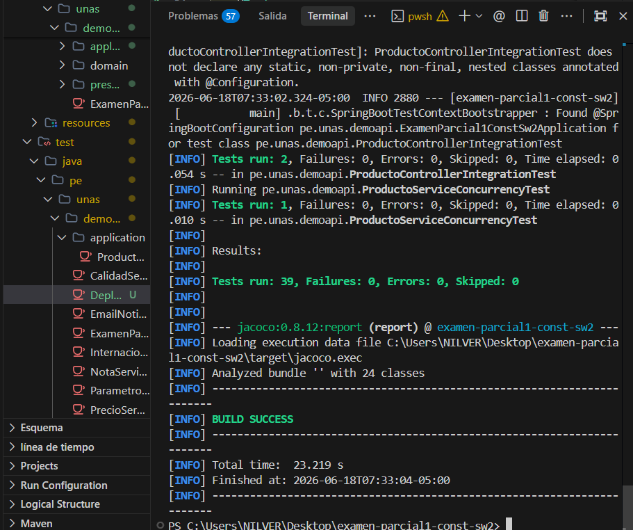
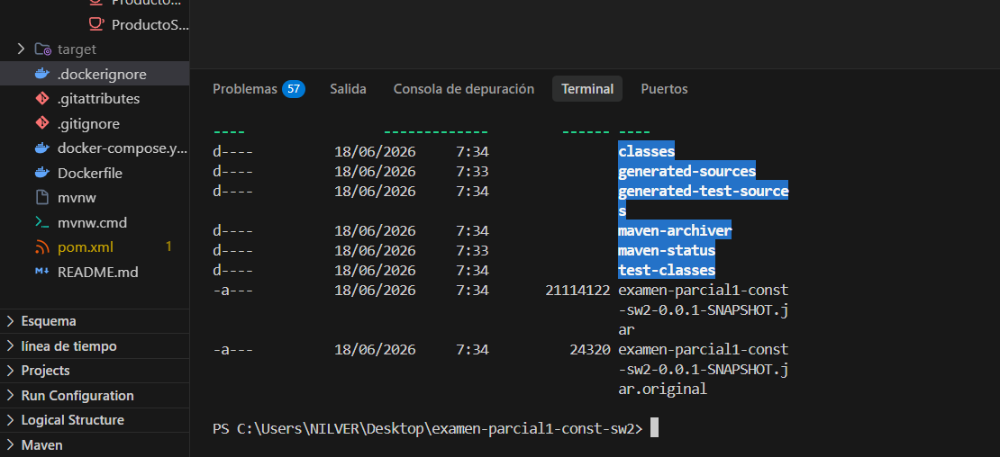
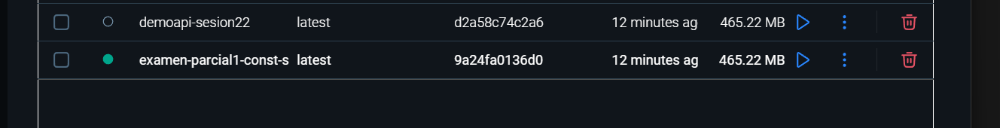
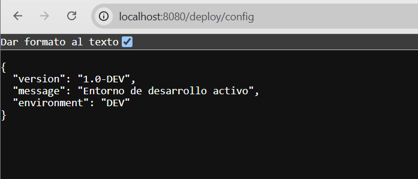
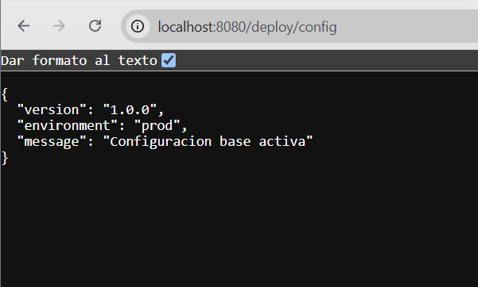
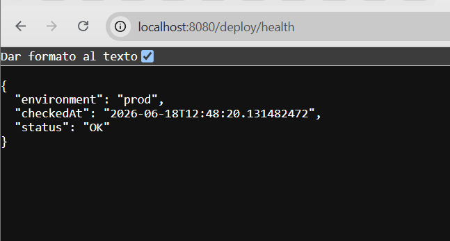
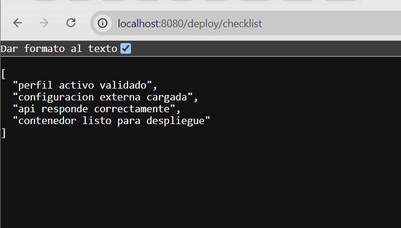

# Validación de Configuración y Despliegue

Este documento detalla el proceso de verificación y despliegue de la API en los entornos de desarrollo (local) y producción (contenedorizado en Docker), detallando el comportamiento de los endpoints de validación y presentando las evidencias correspondientes.

---

## Perfil Validado

- **dev**: Ejecutado de manera local en el entorno de desarrollo tradicional.
- **prod**: Ejecutado dentro de un contenedor Docker mediante Docker Compose.

---

## Componentes Principales

- Controlador de validación: [DeploymentValidationController.java](file:///c:/Users/NILVER/Desktop/examen-parcial1-const-sw2/src/main/java/pe/unas/demoapi/presentation/DeploymentValidationController.java)
- Servicio de validación: [DeploymentValidationService.java](file:///c:/Users/NILVER/Desktop/examen-parcial1-const-sw2/src/main/java/pe/unas/demoapi/application/DeploymentValidationService.java)
- Configuración de contenedores: [docker-compose.yml](file:///c:/Users/NILVER/Desktop/examen-parcial1-const-sw2/docker-compose.yml) y [Dockerfile](file:///c:/Users/NILVER/Desktop/examen-parcial1-const-sw2/Dockerfile)

---

## Endpoints Verificados

### 1. GET `/deploy/config`

Retorna un mapa con la configuración activa de la aplicación, incluyendo el entorno, la versión y un mensaje de estado.

- **Entorno Dev**: Retorna el perfil local configurado en [application-dev.properties](file:///c:/Users/NILVER/Desktop/examen-parcial1-const-sw2/src/main/resources/application-dev.properties).
- **Entorno Prod (Docker)**: Retorna el perfil de producción cargado en [application-prod.properties](file:///c:/Users/NILVER/Desktop/examen-parcial1-const-sw2/src/main/resources/application-prod.properties).

### 2. GET `/deploy/health`

Retorna el estado de salud de la aplicación (`status: OK`), el entorno activo y una marca de tiempo con la fecha/hora de la verificación.

### 3. GET `/deploy/checklist`

Retorna una lista de verificación con los ítems clave de salud y preparación del despliegue:

- Perfil activo validado.
- Configuración externa cargada.
- API responde correctamente.
- Contenedor listo para despliegue.

---

## Evidencias de Validación

### 1. Compilación y Ejecución de Pruebas Unitarias (`mvn test`)

Ejecución del comando de pruebas en Maven (`mvn clean test`) demostrando que todas las pruebas unitarias e de integración pasaron correctamente sin fallos:

Generación exitosa del archivo empaquetado `.jar` para su posterior despliegue:

---

### 2. Verificación de Contenedores (`docker ps`)

Estado de los contenedores Docker en funcionamiento (`demoapi-sesion22` y `examen-db`), demostrando un correcto levantamiento de los servicios:

---

### 3. Evidencias de los Endpoints

#### GET `/deploy/config` en Entorno de Desarrollo (Local)

Muestra la configuración del perfil activo local (`dev`):

#### GET `/deploy/config` en Entorno Docker (Producción)

Demuestra que en producción a través del contenedor se cargan las variables de entorno asociadas al perfil `prod`:

#### GET `/deploy/health`

Respuesta exitosa del estado de salud del sistema:

#### GET `/deploy/checklist`

Validación de los criterios previos al despliegue listados correctamente:

