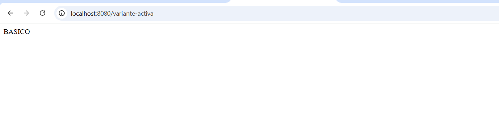
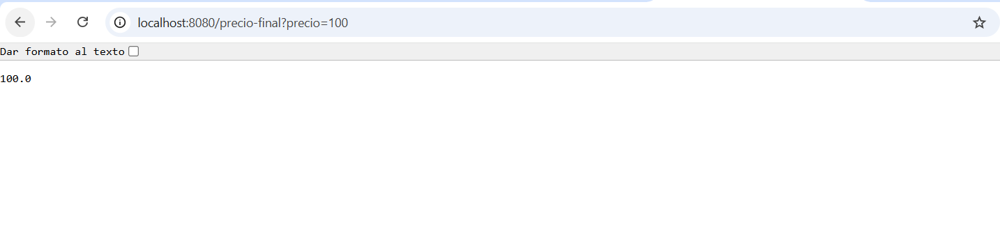
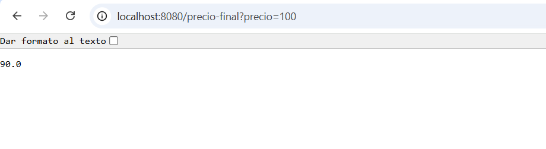
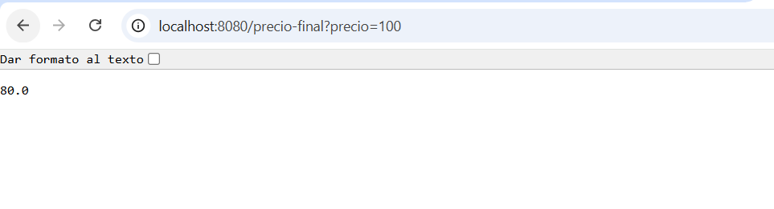
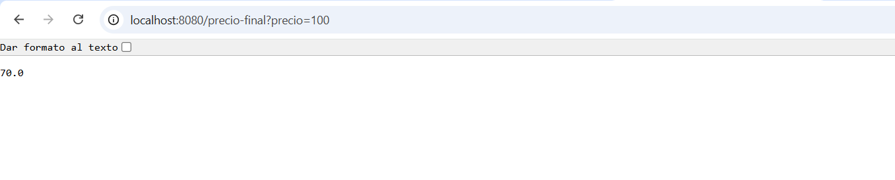
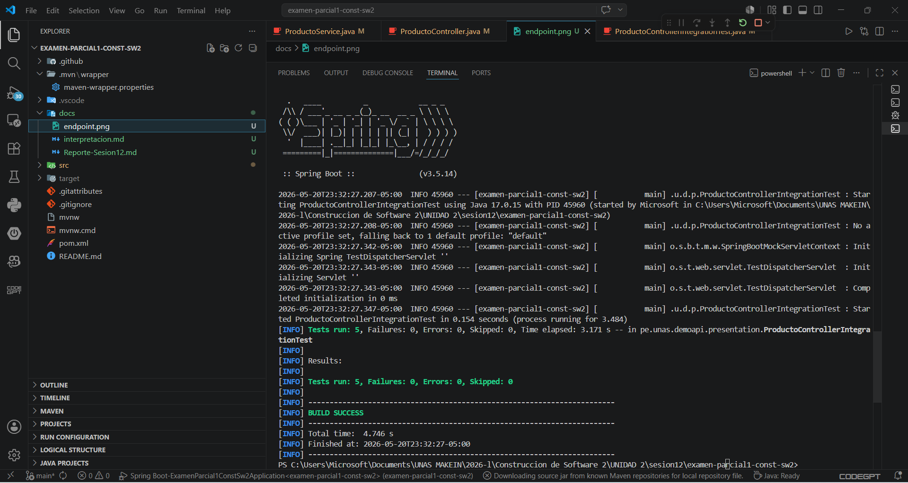

## 17. Evidencias de entrega

### 17.1. Captura de `/variante-activa` funcionando

Nombre de imagen: `variante_activa.png`

---

### 17.2. Capturas de `/precio-final?precio=100`

#### Variante BASICO

Nombre de imagen: `basico.png`

#### Variante PREMIUM

Nombre de imagen: `premium.png`

#### Variante VIP

Nombre de imagen: `vip.png`

#### Variante ESTUDIANTE

Nombre de imagen: `estudiante.png`

---

### 17.3. Captura de ejecución de pruebas con `BUILD SUCCESS`

Nombre de imagen: `build_success.png`

---

### 17.4. Archivo de documentación creado

Nombre del archivo: `variabilidad-sesion17.md`

El archivo fue creado dentro de la carpeta `docs`.
