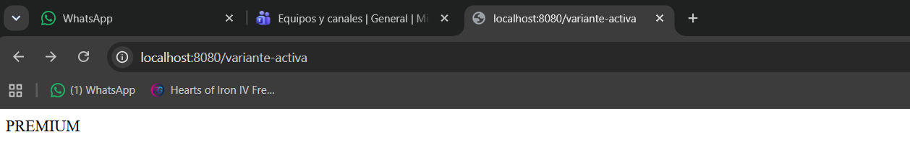
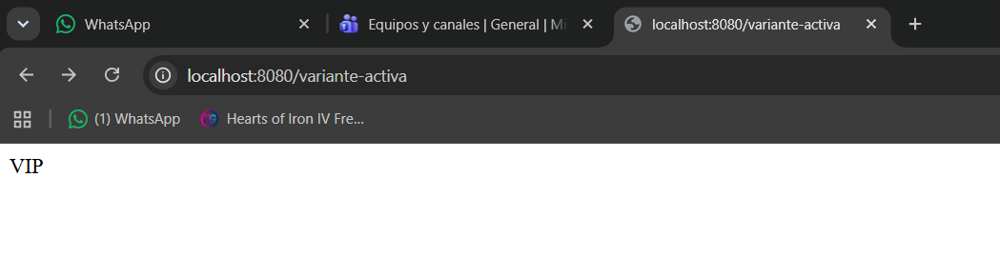
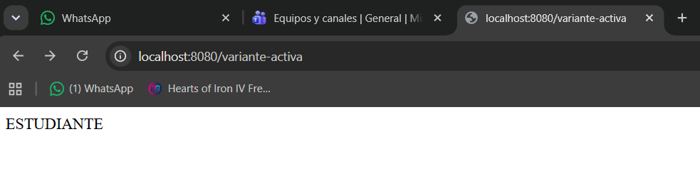
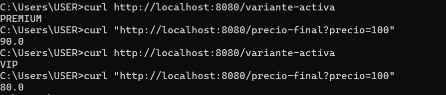
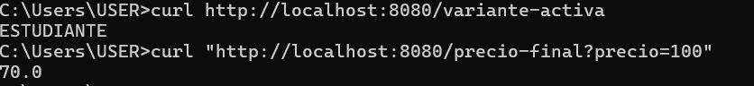
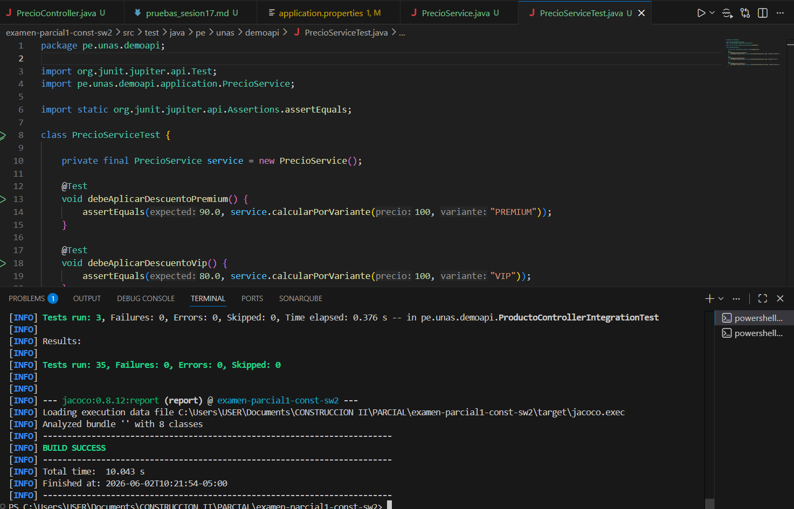
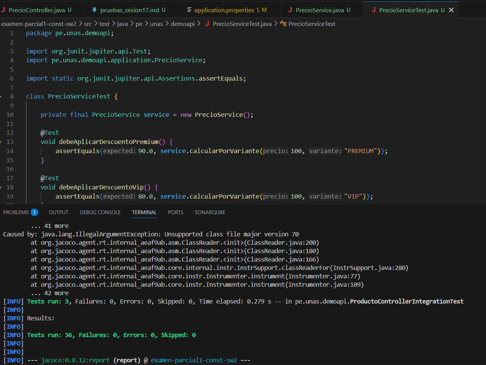

# Análisis de variabilidad – Sesión 17

## Punto de variación
Cálculo de precio final según tipo de cliente.

## Variantes
- BASICO: sin descuento.
- PREMIUM: 10% de descuento.
- VIP: 20% de descuento.
- ESTUDIANTE: 30% de descuento.

## Mecanismo usado
Configuración externa mediante application.properties.

## Propiedad
app.variante-cliente=PREMIUM

## Endpoints
- GET /variante-activa
- GET /precio-final?precio=100

## Evidencias
•	Captura de /variante-activa funcionando.
•	Captura de /precio-final?precio=100 con al menos dos variantes.
•	Captura de ejecución ./mvnw test con BUILD SUCCESS.

Variante-activa:

Precio-final con al menos dos variantes:

Test:

Implementando el switch de Estudiante

## Conclusión
La variabilidad permite que un mismo sistema se adapte a diferentes clientes, entornos o reglas de negocio sin duplicar proyectos. En esta práctica, el comportamiento del cálculo de precio cambia mediante configuración externa, manteniendo una arquitectura limpia y verificable con pruebas automatizadas.