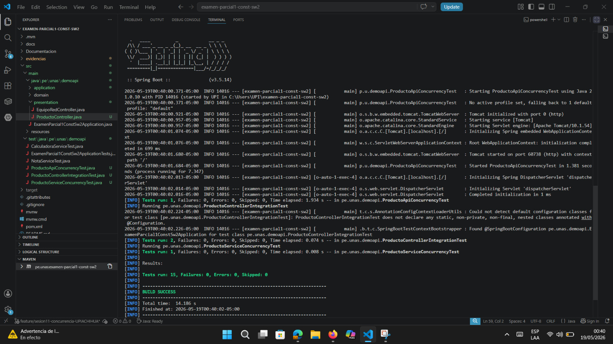
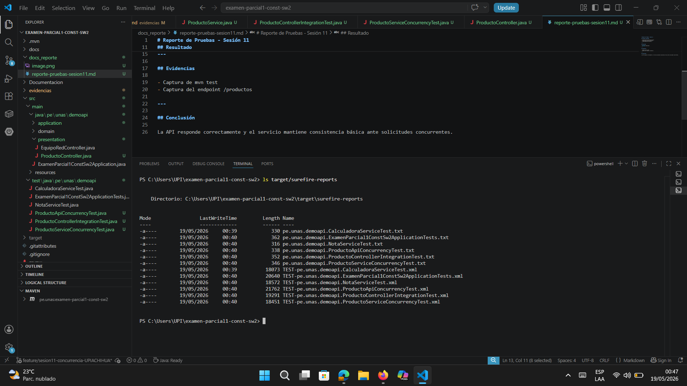
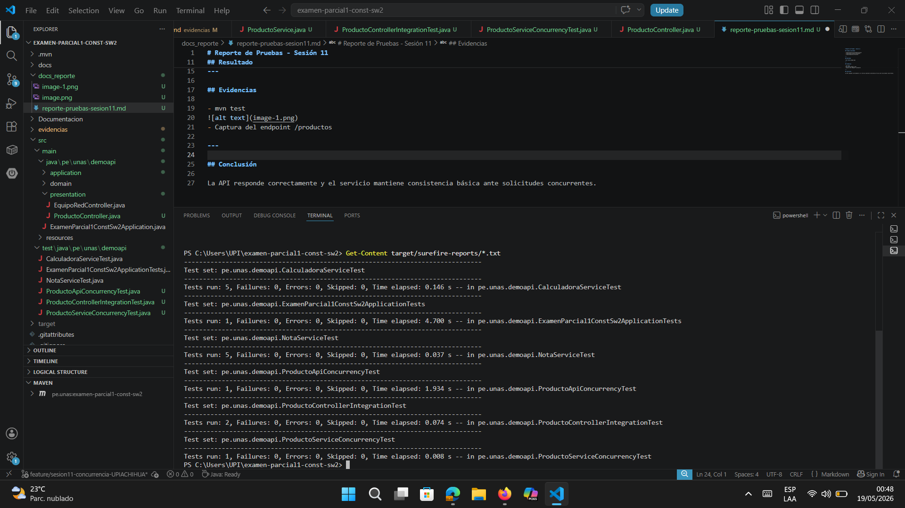
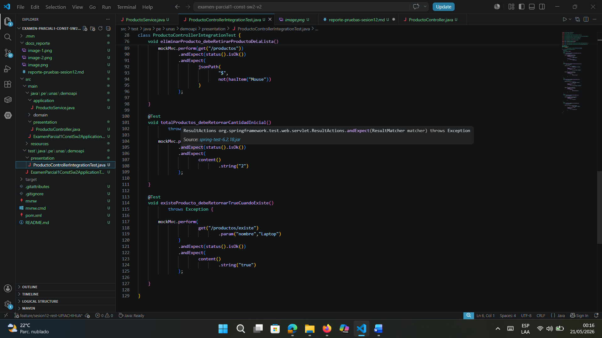
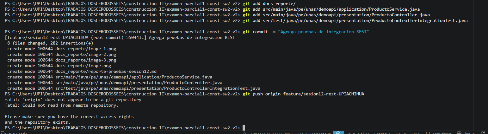

# Reporte de Pruebas - Sesión 12

## Pruebas ejecutadas

- listarProductos
- agregarProducto
- eliminarProducto
- totalProductos
- existeProducto

---

## Resultado

BUILD SUCCESS

---

## Evidencias

- Captura de mvn test

- Captura de ProductoControllerIntegrationTest.java

- Captura del commit en GitHub

---

## Flujo

MockMvc → Controller → Service

Las pruebas verifican el comportamiento integrado de la API REST y validan rutas, métodos HTTP y respuestas JSON.