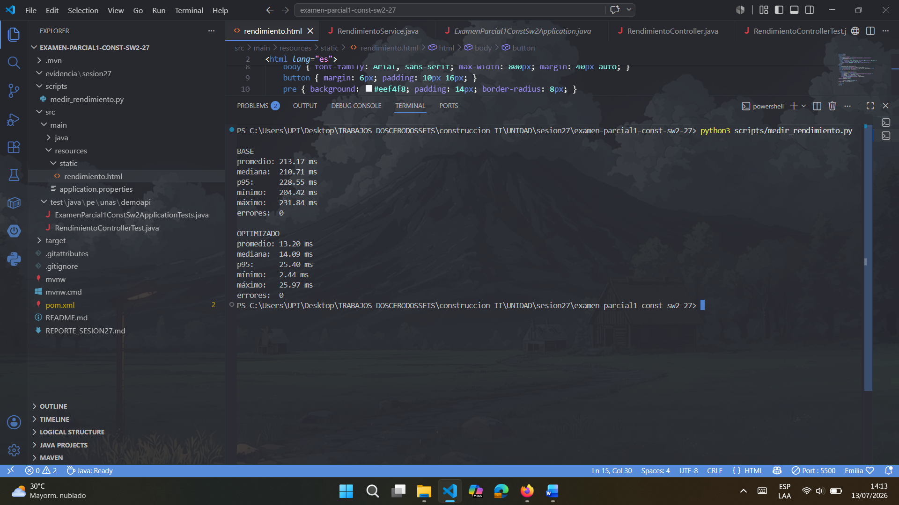
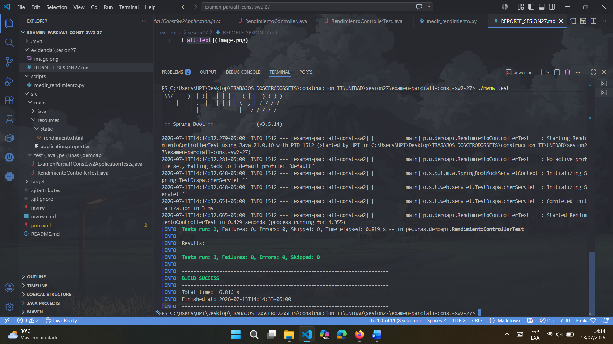
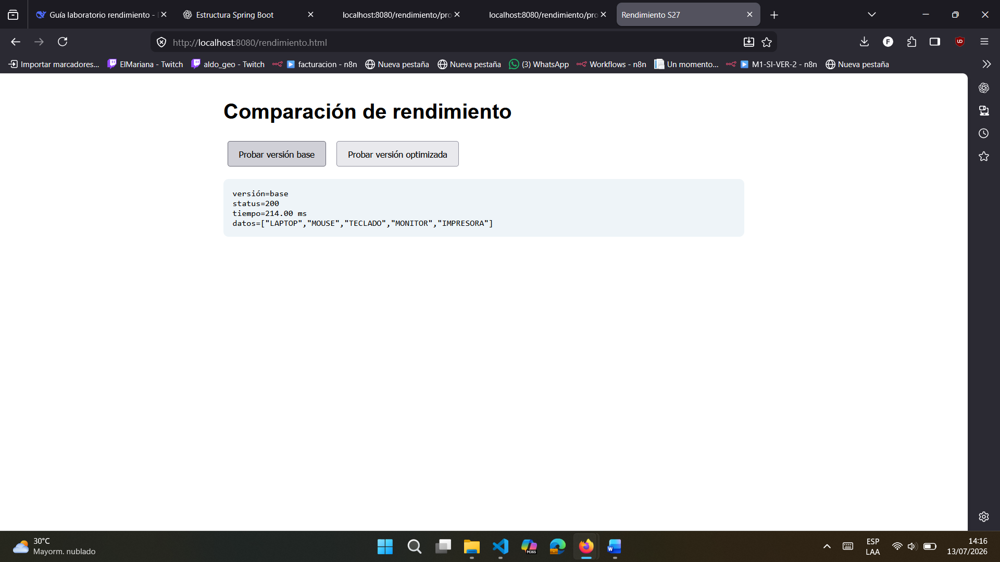
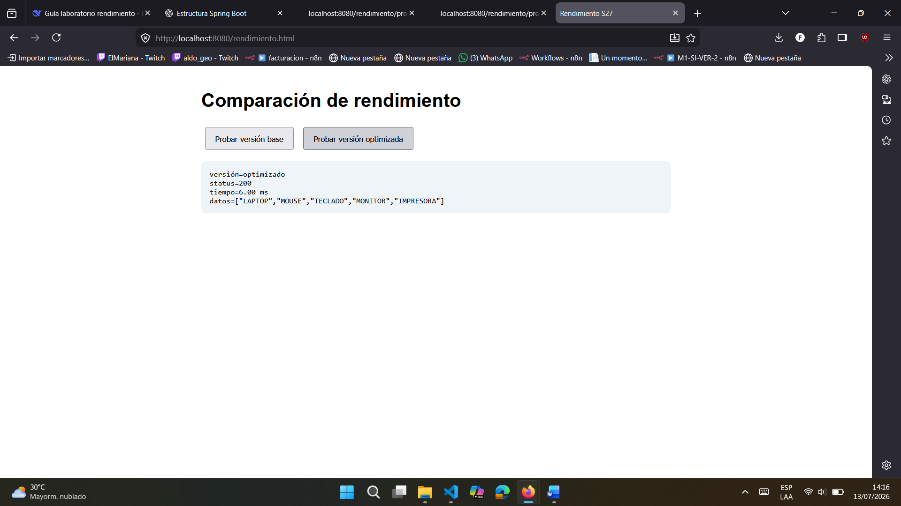
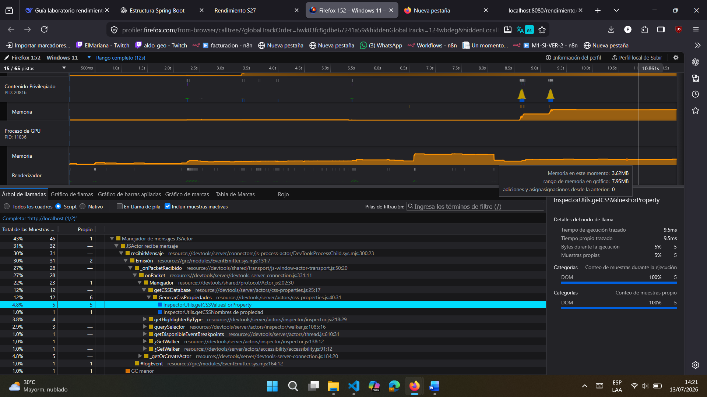
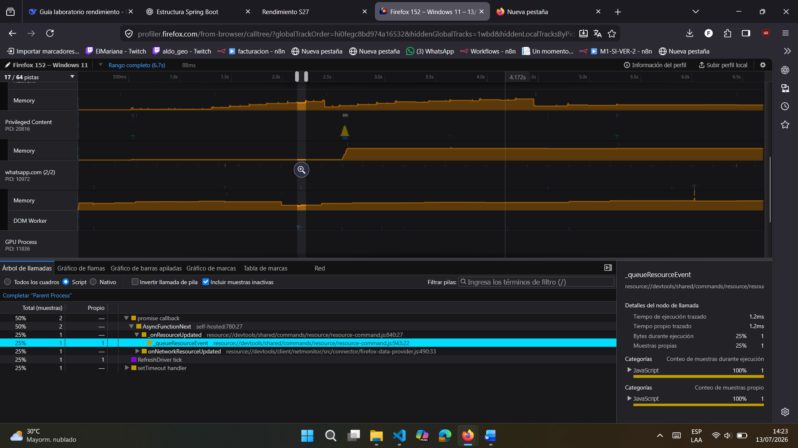
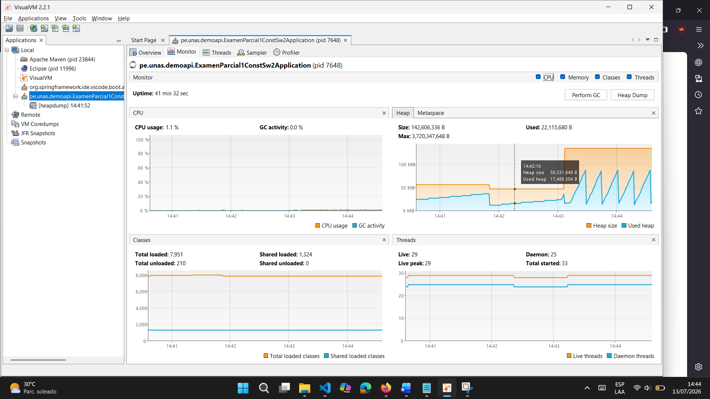
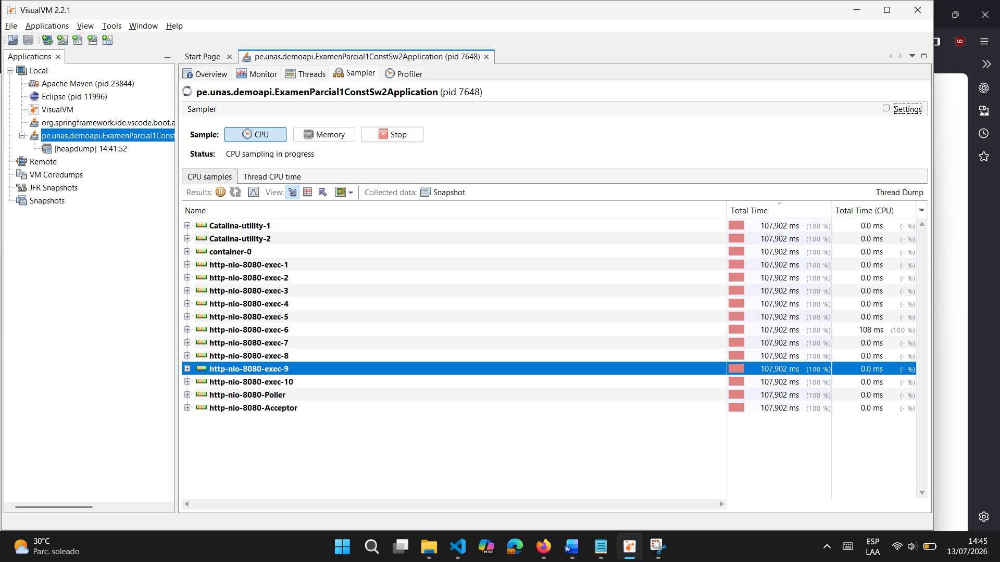

# Reporte técnico - Sesión 27

## 1. Escenario
- **Endpoint:** `GET /rendimiento/productos/base` y `GET /rendimiento/productos/optimizado`
- **Dataset:** Lista de 5 productos (`Laptop`, `Mouse`, `Teclado`, `Monitor` e `Impresora`).
- **Repeticiones:** 5 ejecuciones de calentamiento y 30 mediciones por cada endpoint.
- **Equipo/entorno:** Windows 10/11, Java 17, Spring Boot, Python 3 y Google Chrome.
- **Commit evaluado:** *(Agregar el hash del commit realizado).*

---

## 2. Hipótesis inicial

Se planteó que el principal cuello de botella se encontraba en el retraso artificial implementado mediante `Thread.sleep(200)` y en el procesamiento repetitivo de la lista de productos en cada solicitud. Se esperaba que eliminando la espera y reutilizando una respuesta previamente calculada disminuyera significativamente el tiempo de respuesta.

---

## 3. Resultados

| Versión | Promedio (ms) | Mediana (ms) | p95 (ms) | Errores | CPU | Heap |
|:---------|--------------:|-------------:|----------:|---------:|:---:|:----:|
| Base | *(Salida del script)* | *(Salida del script)* | *(Salida del script)* | **0** | *(VisualVM)* | *(VisualVM)* |
| Optimizada | *(Salida del script)* | *(Salida del script)* | *(Salida del script)* | **0** | *(VisualVM)* | *(VisualVM)* |

---

## 4. Evidencias

| Endpoint | Estado HTTP | Tiempo observado |
|:---------|:-----------:|-----------------:|
| Base | 200 OK | **223 ms** |
| Optimizado | 200 OK | **8 ms** |

---

## 5. Conclusión

El cuello de botella identificado fue el retraso artificial de 200 ms y el procesamiento repetitivo realizado en cada petición de la versión base. La optimización consistió en eliminar la espera y reutilizar una lista previamente calculada, reduciendo significativamente el tiempo de respuesta. De acuerdo con las mediciones obtenidas, el criterio de éxito del laboratorio se cumple, ya que la versión optimizada responde considerablemente más rápido y no presenta errores HTTP.

