# Reporte técnico - Sesión 28

## 1. Escenario

- **Endpoint evaluado:** `GET /carga/productos`.
- **Equipo y sistema operativo:** Laptop con Windows 11 de 64 bits.
- **Entorno de trabajo:** Visual Studio Code y PowerShell.
- **Tecnologías:** Java 17.0.18, Spring Boot 4.1.0 y k6 2.1.0.
- **Herramienta de monitoreo:** JDK Mission Control.
- **Perfil base:** `app.carga.delay-ms=120`.
- **Perfil optimizado:** `app.carga.delay-ms=20`.
- **Pausa de usuario:** 1 segundo por iteración.
- **Commit evaluado:** [COLOCAR HASH DEL COMMIT].

### Etapas de carga

| Etapa | Duración | Usuarios virtuales |
|---|---:|---:|
| Ramp-up inicial | 10 segundos | 0 a 10 VUs |
| Carga estable | 20 segundos | 10 VUs |
| Segundo ramp-up | 10 segundos | 10 a 30 VUs |
| Carga máxima estable | 20 segundos | 30 VUs |
| Ramp-down | 10 segundos | 30 a 0 VUs |

**[Insertar Figura 1: validación de `/carga/health`, `/carga/productos` y `/carga/metricas`]**

> **Figura 1. Validación funcional de la API.** Los endpoints respondieron con código HTTP 200. El endpoint de salud devolvió el estado `UP`, el catálogo devolvió los cuatro productos esperados y el contador registró las peticiones realizadas.

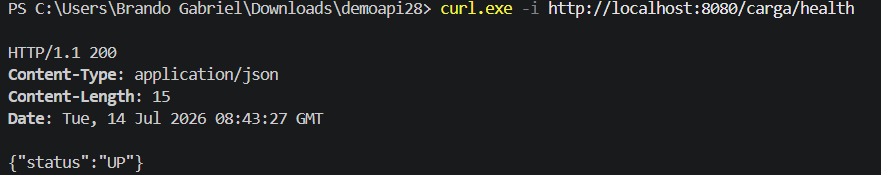

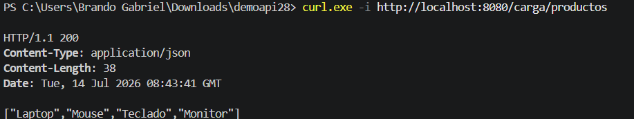

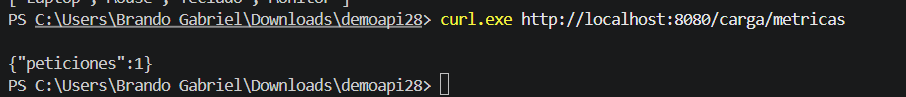

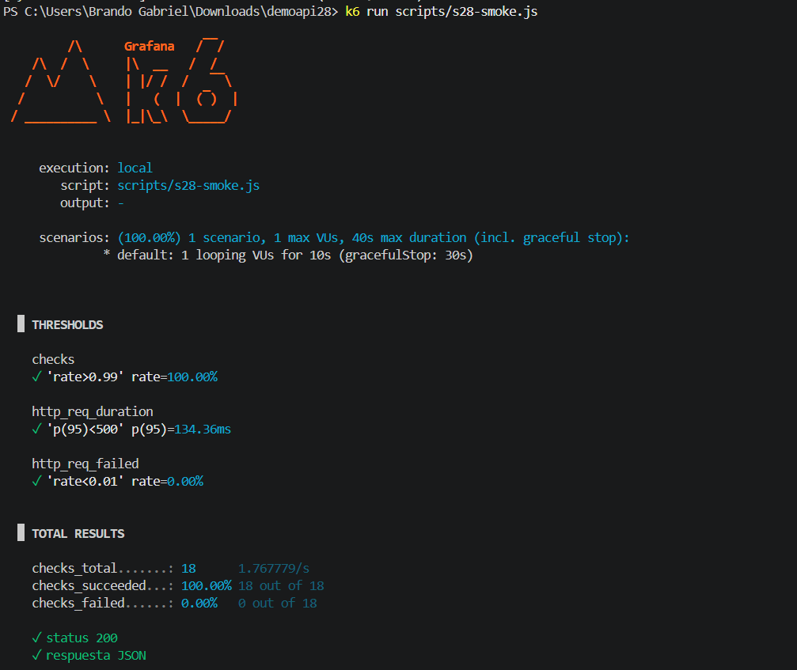

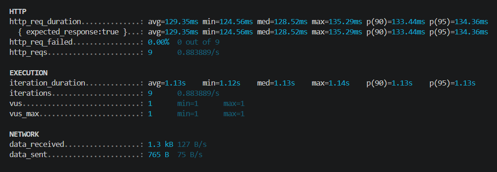

> **Figura 2. Resultado del smoke test.** Los checks alcanzaron el 100 %, la tasa de errores fue 0 % y el p95 fue inferior al umbral de 500 ms. Esto permitió continuar con la prueba progresiva.

---

## 2. Resultados

### Comparación base y optimizada

> **Nota:** la memoria registrada corresponde al máximo de heap utilizado por la JVM observado mediante JDK Mission Control.

### Fórmulas aplicadas

Para las métricas de latencia, donde un valor menor representa una mejora:

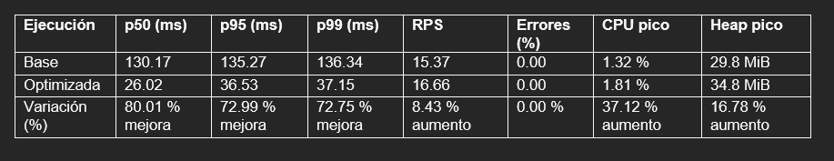

#### Mejora del p50

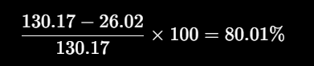

#### Mejora del p95

#### Mejora del p99

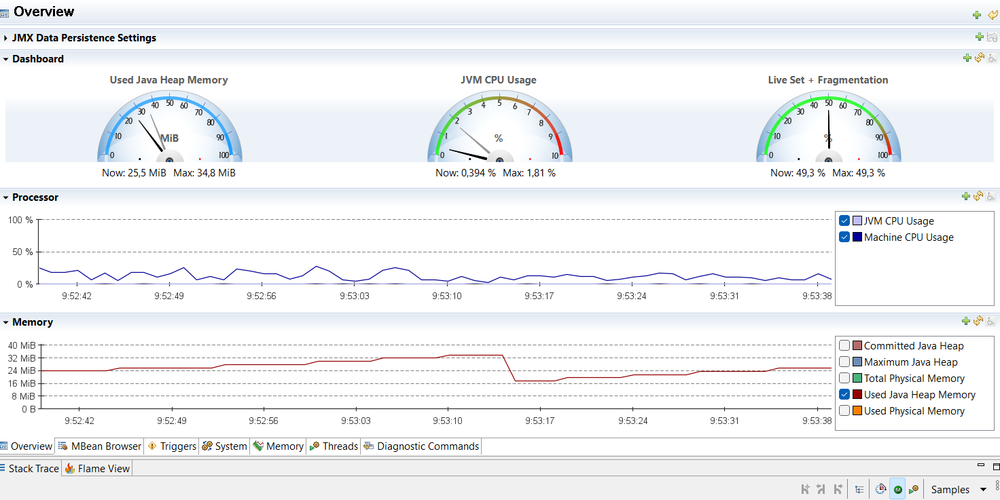

### Ejecución base

La prueba base utilizó un retraso configurable de 120 ms. Se procesaron 1077 solicitudes y se alcanzó un throughput de 15.37 solicitudes por segundo. El p95 fue de 135.27 ms y el p99 de 136.34 ms.

No se registraron peticiones fallidas y todos los checks fueron exitosos. Por tanto, la versión base cumplió los thresholds, aunque presentó una latencia mayor debido al retraso configurado.

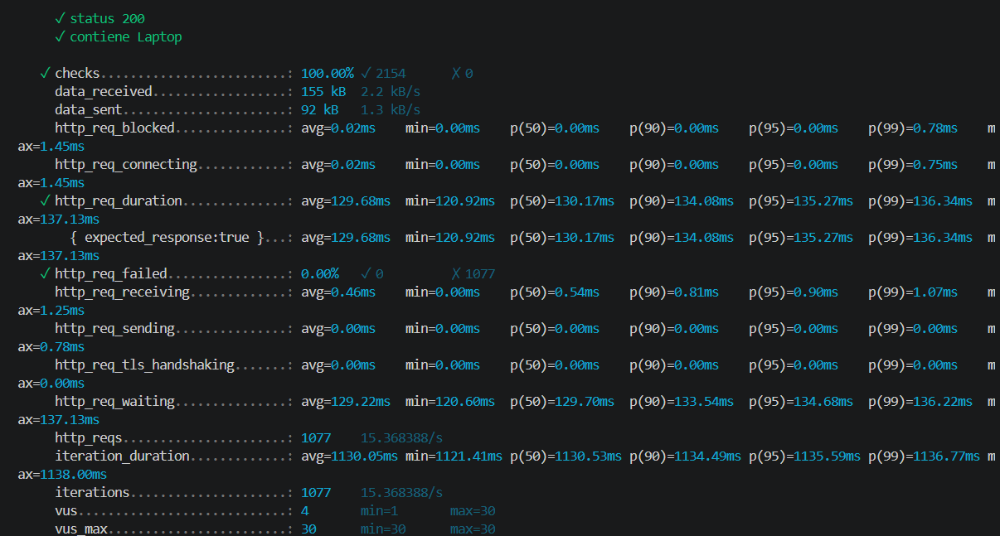

> **Figura 3. Resultado de la prueba base.** La ejecución alcanzó un máximo de 30 VUs, procesó 1077 solicitudes, obtuvo un p95 de 135.27 ms, un p99 de 136.34 ms y una tasa de errores de 0 %.

### Ejecución optimizada

La tasa de errores permaneció en 0 %, lo que demuestra que la reducción de latencia no comprometió la funcionalidad del endpoint.

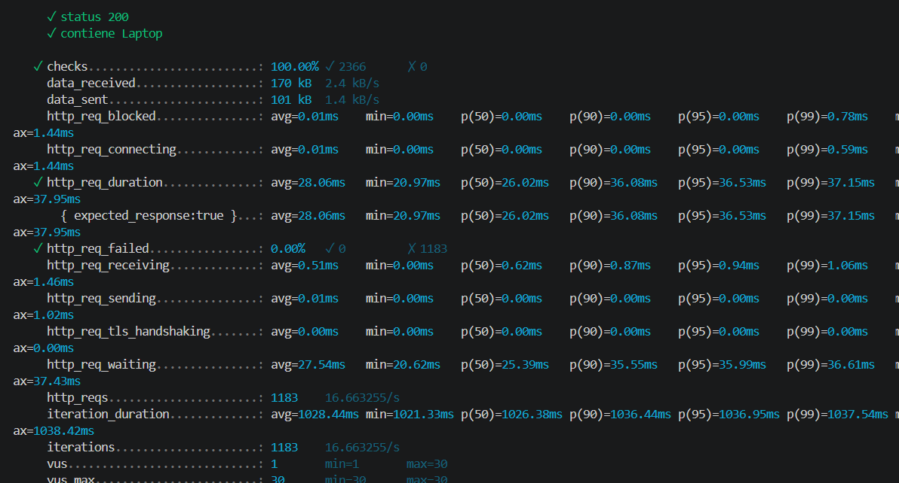

## 3. Hallazgos

- **Síntoma principal:** la versión base presentó una latencia mayor que la versión optimizada.
- **Hipótesis de cuello de botella:** la espera configurada mediante `Thread.sleep(120)` simuló una dependencia lenta y aumentó directamente el tiempo de respuesta.
- **Evidencia que sustenta la hipótesis:** el p95 disminuyó de 135.27 ms a 36.53 ms al reducir el retraso de 120 ms a 20 ms.
- **Comportamiento del throughput:** el RPS aumentó de 15.37 a 16.66 solicitudes por segundo.
- **Comportamiento funcional:** ambas versiones mantuvieron 0 % de errores y 100 % de checks exitosos.
- **Uso de CPU:** el CPU pico aumentó de 1.32 % a 1.81 %, pero permaneció muy por debajo de un nivel de saturación.
- **Uso de memoria:** el heap máximo aumentó de 29.8 MiB a 34.8 MiB. El incremento fue controlado y no mostró un crecimiento continuo que permita afirmar la existencia de una fuga de memoria.

La evidencia indica que el retraso artificial fue el factor principal de la latencia. No se identificaron señales de saturación de CPU ni de memoria durante las pruebas realizadas.

---

## 4. Decisión

Las dos ejecuciones cumplieron los thresholds establecidos:

- El p95 fue menor de 500 ms.
- El p99 fue menor de 800 ms.
- La tasa de errores fue menor de 1 %.
- Los checks fueron mayores de 99 %.

La versión optimizada produjo mejores resultados. El p95 mejoró en 72.99 %, el p99 en 72.75 % y el throughput aumentó en 8.43 %. Además, la tasa de errores permaneció en 0 %.

Por tanto, se recomienda mantener la configuración optimizada de 20 ms. También se recomienda continuar con pruebas de mayor carga para identificar el límite operativo real del sistema, debido a que con 30 VUs no se observó saturación.

---

## 5. Reto aplicado: 50 usuarios virtuales

Para el reto se ejecutó una segunda prueba con 50 VUs constantes durante 30 segundos. Se mantuvieron el endpoint, la pausa de un segundo y la configuración optimizada de 20 ms.

### Resultados del reto

| Métrica | Resultado | Criterio | Estado |
|---|---:|---:|---|
| p50 | 31.56 ms | Registrar | Correcto |
| p95 | 37.23 ms | Menor de 700 ms | Cumple |
| p99 | 40.74 ms | Registrar | Correcto |
| RPS | 48.43 req/s | Evaluar comportamiento | Aumentó |
| Errores | 0.00 % | Menor de 1 % | Cumple |
| Checks | 100.00 % | Mayor de 99 % | Cumple |
| Peticiones | 1500 | Registrar | Correcto |
| VUs máximos | 50 | 50 | Correcto |

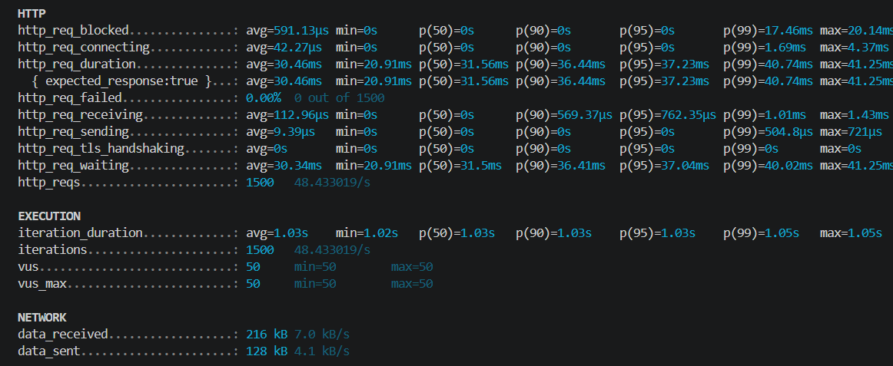

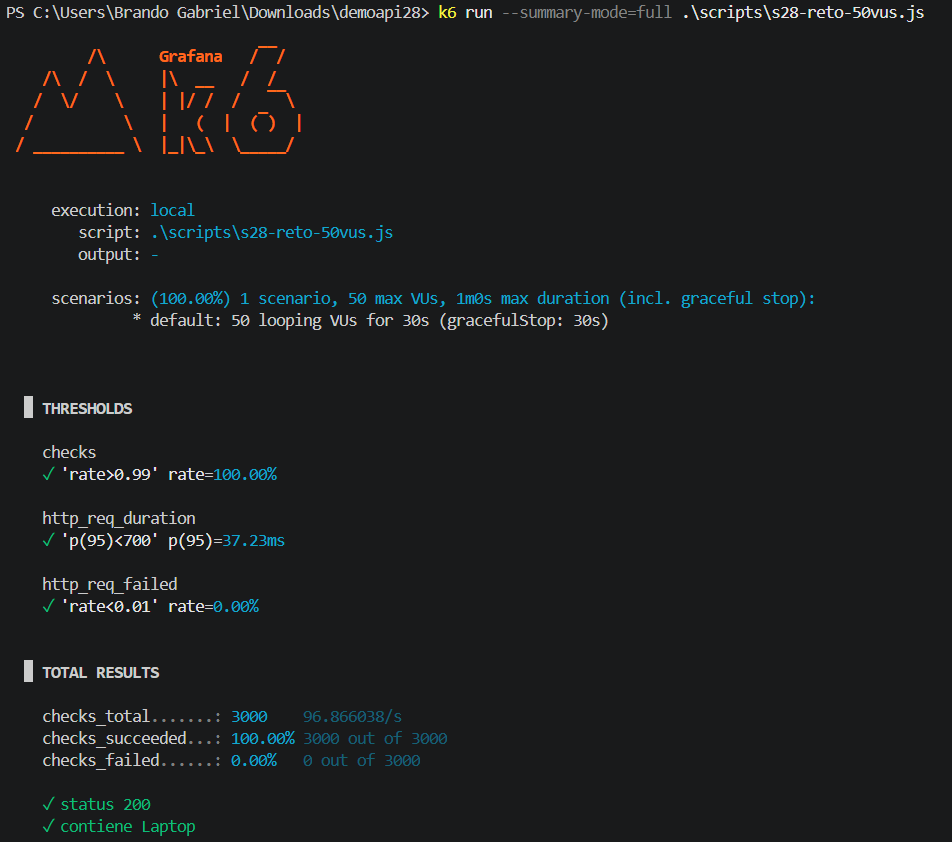

### Comparación con la versión optimizada

| Métrica | Prueba optimizada | Reto de 50 VUs | Comportamiento |
|---|---:|---:|---|
| p50 | 26.02 ms | 31.56 ms | Aumento moderado |
| p95 | 36.53 ms | 37.23 ms | Aumento de 1.92 % |
| p99 | 37.15 ms | 40.74 ms | Aumento de 9.66 % |
| Errores | 0.00 % | 0.00 % | Sin degradación |
| Checks | 100.00 % | 100.00 % | Funcionalidad estable |

### Interpretación del reto

El p95 solo aumentó 1.92 % al ejecutar la prueba de 50 VUs y la tasa de errores permaneció en 0 %. Esto indica que la API mantuvo una latencia estable y no alcanzó un punto de saturación bajo la carga evaluada.

No se puede afirmar una proporcionalidad exacta del RPS porque la prueba anterior utilizó etapas progresivas de 10 a 30 VUs, mientras que el reto mantuvo 50 VUs constantes durante 30 segundos. Sin embargo, sí se puede afirmar que el throughput aumentó, la latencia permaneció estable y no apareció degradación funcional.

Una mayor cantidad de VUs no siempre produce más throughput, debido a que el sistema puede quedar limitado por CPU, memoria, hilos, conexiones o dependencias externas. En esta prueba, dichos límites no fueron alcanzados.

