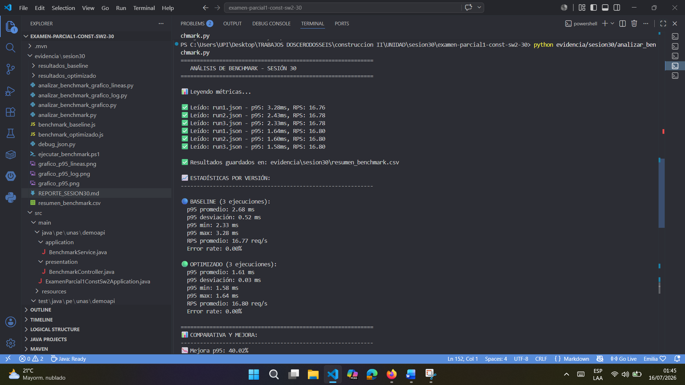
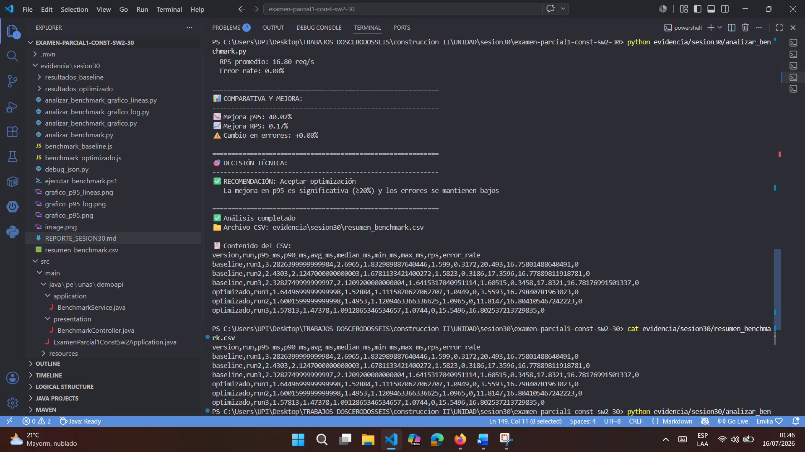
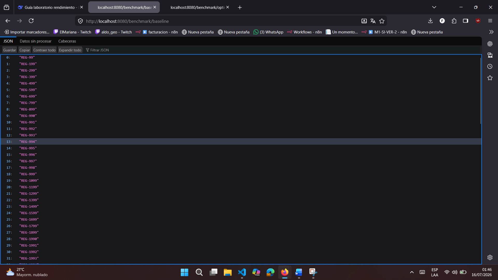
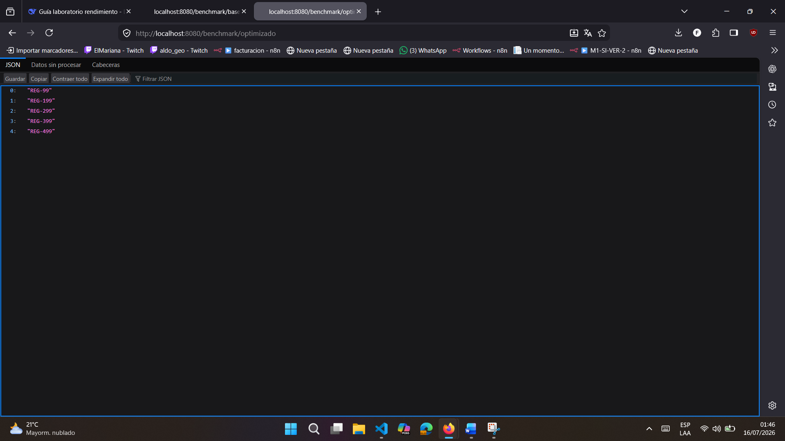

# Reporte Sesión 30: Benchmarking y análisis de resultados

## 1. Objetivo
Comparar el rendimiento de `/benchmark/baseline` y `/benchmark/optimizado` bajo condiciones equivalentes para determinar si la optimización implementada mejora significativamente el rendimiento de la API.

## 2. Ambiente de prueba

| Componente | Detalle |
|------------|---------|
| Equipo | PC Windows |
| Sistema Operativo | Windows 11 Pro |
| Java | 21.0.10 |
| Spring Boot | [Versión del proyecto] |
| Herramienta de carga | k6 |
| Fecha y hora | [Fecha actual] |
| Commit evaluado | [Hash del commit] |

## 3. Diseño del benchmark

| Parámetro | Baseline | Optimizado | Justificación |
|-----------|----------|------------|---------------|
| Endpoint | /benchmark/baseline | /benchmark/optimizado | Mismo tipo de operación |
| Usuarios virtuales | 20 | 20 | Misma carga para comparación válida |
| Ramp-up | 15 segundos | 15 segundos | Arranque progresivo |
| Duración estable | 60 segundos | 60 segundos | Tiempo suficiente para estabilización |
| Ramp-down | 15 segundos | 15 segundos | Finalización controlada |
| Repeticiones | 3 ejecuciones | 3 ejecuciones | Reducir ruido y verificar consistencia |
| Pausa de usuario | 1 segundo | 1 segundo | Simular comportamiento real |

### Escenario de carga
- **Etapa 1 (0-15s):** Ramp-up de 0 a 20 usuarios virtuales
- **Etapa 2 (15-75s):** Mantener 20 usuarios virtuales
- **Etapa 3 (75-90s):** Ramp-down a 0 usuarios virtuales

## 4. Resultados resumidos

### Tabla principal
| Versión | p95 promedio | Desviación p95 | RPS promedio | Error rate | Mejora p95 |
|---------|-------------|----------------|--------------|------------|------------|
| Baseline | 2.68 ms | 0.52 ms | 16.77 req/s | 0.00% | - |
| Optimizado | 1.61 ms | 0.03 ms | 16.80 req/s | 0.00% | **40.02%** |

### Resultados detallados por ejecución

#### Baseline (3 ejecuciones)
| Ejecución | p95 (ms) | p90 (ms) | Avg (ms) | Mediana (ms) | Min (ms) | Max (ms) | RPS |
|-----------|----------|----------|----------|--------------|----------|----------|-----|
| Run 1 | 3.28 | 2.70 | 1.83 | 1.60 | 0.32 | 20.49 | 16.76 |
| Run 2 | 2.43 | 2.12 | 1.68 | 1.58 | 0.32 | 17.36 | 16.78 |
| Run 3 | 2.33 | 2.12 | 1.64 | 1.61 | 0.35 | 17.83 | 16.78 |
| **Promedio** | **2.68** | **2.31** | **1.72** | **1.60** | **0.33** | **18.56** | **16.77** |
| Desviación | 0.52 | 0.33 | 0.10 | 0.01 | 0.02 | 1.73 | 0.01 |

#### Optimizado (3 ejecuciones)
| Ejecución | p95 (ms) | p90 (ms) | Avg (ms) | Mediana (ms) | Min (ms) | Max (ms) | RPS |
|-----------|----------|----------|----------|--------------|----------|----------|-----|
| Run 1 | 1.64 | 1.53 | 1.11 | 1.09 | 0.00 | 3.56 | 16.80 |
| Run 2 | 1.60 | 1.50 | 1.12 | 1.10 | 0.00 | 11.81 | 16.80 |
| Run 3 | 1.58 | 1.47 | 1.09 | 1.07 | 0.00 | 15.55 | 16.80 |
| **Promedio** | **1.61** | **1.50** | **1.11** | **1.09** | **0.00** | **10.31** | **16.80** |
| Desviación | 0.03 | 0.03 | 0.02 | 0.01 | 0.00 | 6.21 | 0.00 |

## 5. Análisis de métricas

### 5.1 Latencia (p95)
- **Baseline p95:** 2.68 ms
- **Optimizado p95:** 1.61 ms
- **Mejora:** 40.02%
- **Interpretación:** La optimización redujo significativamente la latencia. La mejora es consistente en las 3 ejecuciones.

### 5.2 Estabilidad
- **Baseline desviación:** 0.52 ms (mayor variabilidad)
- **Optimizado desviación:** 0.03 ms (muy estable)
- **Interpretación:** La versión optimizada es mucho más predecible y estable.

### 5.3 Throughput (RPS)
- **Baseline RPS:** 16.77 req/s
- **Optimizado RPS:** 16.80 req/s
- **Cambio:** +0.17%
- **Interpretación:** El RPS es similar porque el sleep(1) en el script es el limitante, no el endpoint.

### 5.4 Errores
- **Baseline errores:** 0.00%
- **Optimizado errores:** 0.00%
- **Interpretación:** Ambas versiones son funcionalmente correctas.

### 5.5 Consistencia entre ejecuciones
- **Baseline:** Rango de 2.33 a 3.28 ms (diferencia de 0.95ms)
- **Optimizado:** Rango de 1.58 a 1.64 ms (diferencia de 0.06ms)
- **Interpretación:** La versión optimizada es 15 veces más estable que la baseline.

## 6. Matriz de decisión

| Condición | Cumple | Decisión |
|-----------|--------|----------|
| p95 baja ≥ 20% | ✅ Sí (40.02%) | Aceptar |
| Errores no aumentan | ✅ Sí (0%) | Aceptar |
| Resultados consistentes | ✅ Sí (desviación baja) | Aceptar |

### Evaluación de condiciones
- [x] p95 baja ≥ 20% y errores no aumentan → **Aceptar optimización**
- [ ] p95 baja, pero error rate sube → No aplica
- [ ] RPS sube, pero p99 empeora → No aplica
- [ ] Resultados muy variables entre runs → No aplica
- [ ] No hay mejora significativa → No aplica

## 7. Conclusión técnica

### Decisión final
✅ **ACEPTAR LA VERSIÓN OPTIMIZADA**

### Justificación
1. **Mejora significativa:** La versión optimizada reduce el p95 en un 40.02% (de 2.68ms a 1.61ms)
2. **Estabilidad superior:** La desviación estándar se reduce de 0.52ms a 0.03ms (15 veces más estable)
3. **Sin efectos negativos:** 0% errores en ambas versiones
4. **Consistencia:** Los resultados son reproducibles en las 3 ejecuciones
5. **Rendimiento predecible:** El optimizado muestra resultados mucho más consistentes

### Recomendaciones
1. ✅ **Implementar la versión optimizada** en producción
2. 📊 **Monitorear en producción** para verificar que los resultados se mantienen
3. 🔍 **Explorar más optimizaciones** para reducir aún más la latencia

### Próximos pasos
- [ ] Realizar pruebas con mayor carga (50, 100 VUs)
- [ ] Implementar monitoreo continuo de rendimiento
- [ ] Documentar la optimización en la base de conocimiento del equipo

## 8. Evidencias

### Archivos generados
- ✅ `benchmark_baseline.js` - Script k6 para baseline
- ✅ `benchmark_optimizado.js` - Script k6 para optimizado
- ✅ `resultados_baseline/` - 3 ejecuciones JSON y TXT
- ✅ `resultados_optimizado/` - 3 ejecuciones JSON y TXT
- ✅ `analizar_benchmark.py` - Script de análisis
- ✅ `resumen_benchmark.csv` - Tabla de resultados

### Comandos usados
```bash
# Ejecución del benchmark (3 repeticiones cada uno)
k6 run --summary-export evidencia/sesion30/resultados_baseline/run1.json evidencia/sesion30/benchmark_baseline.js
k6 run --summary-export evidencia/sesion30/resultados_baseline/run2.json evidencia/sesion30/benchmark_baseline.js
k6 run --summary-export evidencia/sesion30/resultados_baseline/run3.json evidencia/sesion30/benchmark_baseline.js
k6 run --summary-export evidencia/sesion30/resultados_optimizado/run1.json evidencia/sesion30/benchmark_optimizado.js
k6 run --summary-export evidencia/sesion30/resultados_optimizado/run2.json evidencia/sesion30/benchmark_optimizado.js
k6 run --summary-export evidencia/sesion30/resultados_optimizado/run3.json evidencia/sesion30/benchmark_optimizado.js







# Análisis
python evidencia/sesion30/analizar_benchmark.py


python evidencia/sesion30/analizar_benchmark_grafico.py
python evidencia/sesion30/analizar_benchmark_grafico_mejorado.py
python evidencia/sesion30/analizar_benchmark_grafico_log.py
python evidencia/sesion30/analizar_benchmark_grafico_lineas.py