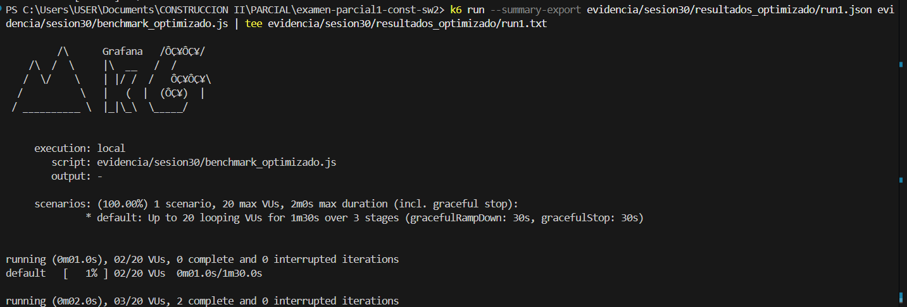
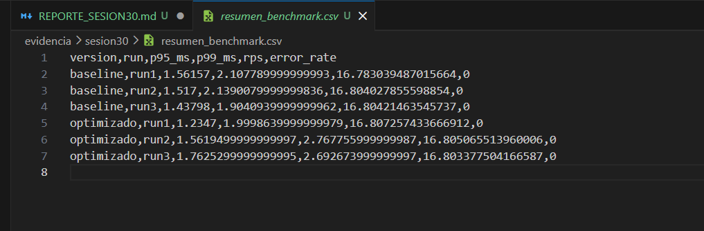

# Reporte Sesión 30: Benchmarking y análisis de resultados

## 1. Objetivo
Comparar el rendimiento de los endpoints /benchmark/baseline y /benchmark/optimizado bajo las mismas condiciones de carga para determinar si la versión optimizada ofrece una mejora medible en latencia, capacidad de procesamiento y estabilidad.

## 2. Ambiente de prueba
- Equipo: Laptop
- Sistema operativo: Windows 11
- Java: JDK 21.
- Spring Boot: 3.x.
- Herramienta de carga: k6
- Fecha y hora: 9:40

## 3. Diseño del benchmark
- Usuarios virtuales: 20
- Duración: 90 segundos (15 s de incremento, 60 s de carga constante y 15 s de descenso).
- Ramp-up: 15 segundos hasta alcanzar 20 usuarios virtuales.
- Número de repeticiones: 3 ejecuciones para cada versión.
- Endpoints evaluados: 
/benchmark/baseline 
/benchmark/optimizado

## 4. Resultados resumidos
| Versión | p95 promedio | p99 promedio | RPS promedio | Error rate |
|---|---:|---:|---:|---:|
| Baseline | 1.51 ms | 2.05 ms | 16.80 req/s | 0% |
| Optimizado | 1.52 ms | 2.49 ms | 16.81 req/s | 0% |

## 5. Análisis
- ¿Qué métrica cambió más?
La métrica que presentó el mayor cambio fue el P99, aumentando de 2.05 ms en la versión baseline a 2.49 ms en la versión optimizada, lo que representa un incremento aproximado del 21.6 %. Esto indica que las solicitudes más lentas tardaron más tiempo en completarse en la versión optimizada.

- ¿La mejora fue consistente en las 3 ejecuciones?
No. El P95 se mantuvo prácticamente igual entre ambas versiones y el P99 mostró un comportamiento más variable en las ejecuciones de la versión optimizada. Además, el RPS permaneció prácticamente constante, por lo que no se observa una mejora consistente del rendimiento.

- ¿Hubo errores?
No. En las seis ejecuciones realizadas el Error Rate fue de 0 %, lo que demuestra que ambas versiones procesaron correctamente todas las solicitudes durante la prueba.

- ¿Existe evidencia suficiente para recomendar el cambio?
No. Aunque la aplicación mantuvo un comportamiento estable y sin errores, las métricas de rendimiento no muestran una mejora significativa. El P95 prácticamente no cambió, el P99 aumentó y el RPS permaneció igual, por lo que no existe evidencia objetiva que justifique adoptar la versión optimizada únicamente por motivos de rendimiento.

## 6. Conclusión técnica
Con base en los resultados obtenidos, no se recomienda reemplazar la versión baseline por la versión optimizada desde el punto de vista del rendimiento, ya que no se observaron mejoras medibles en las métricas evaluadas. La estabilidad del sistema se mantuvo (0 % de errores), pero la latencia en el percentil 99 aumentó y el throughput permaneció prácticamente igual. Se recomienda identificar otros posibles cuellos de botella, aplicar nuevas optimizaciones y repetir las pruebas para verificar si se obtienen mejoras significativas.

## 7. Evidencias
- Capturas de ejecución k6 
- CSV generado 
- Comandos usados:
# Ejecutar benchmark de la versión baseline
k6 run --summary-export evidencia/sesion30/resultados_baseline/run1.json evidencia/sesion30/baseline.js

k6 run --summary-export evidencia/sesion30/resultados_baseline/run2.json evidencia/sesion30/baseline.js

k6 run --summary-export evidencia/sesion30/resultados_baseline/run3.json evidencia/sesion30/baseline.js

# Ejecutar benchmark de la versión optimizada
k6 run --summary-export evidencia/sesion30/resultados_optimizado/run1.json evidencia/sesion30/optimizado.js

k6 run --summary-export evidencia/sesion30/resultados_optimizado/run2.json evidencia/sesion30/optimizado.js

k6 run --summary-export evidencia/sesion30/resultados_optimizado/run3.json evidencia/sesion30/optimizado.js

# Analizar los resultados y generar el resumen
python evidencia/sesion30/analizar_benchmark.py 

- Commit y rama
