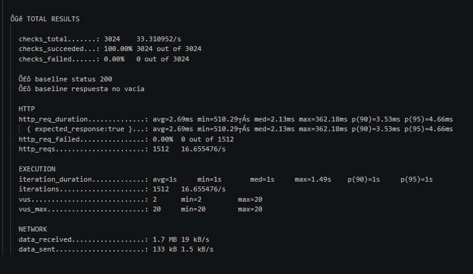
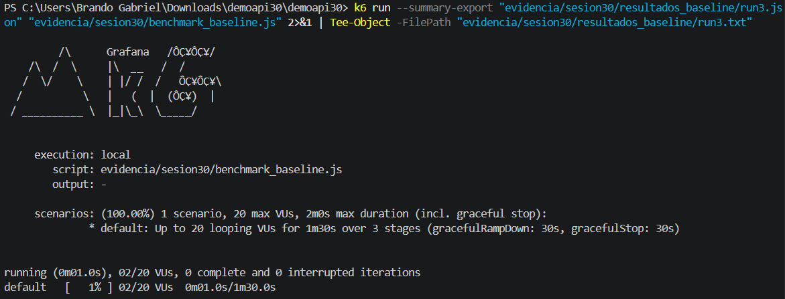
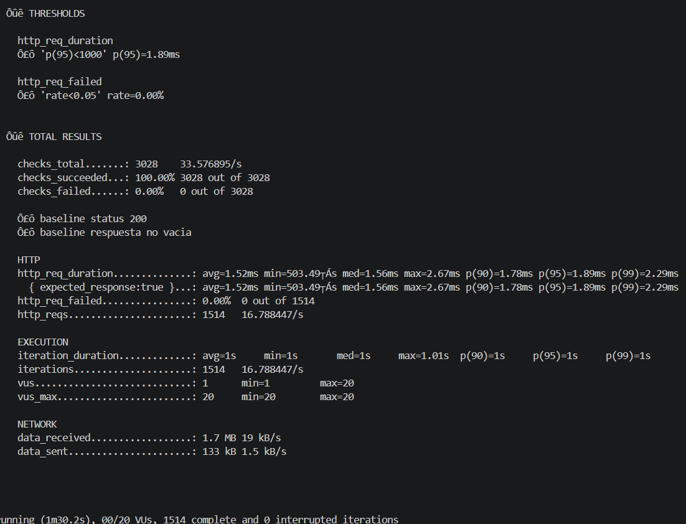
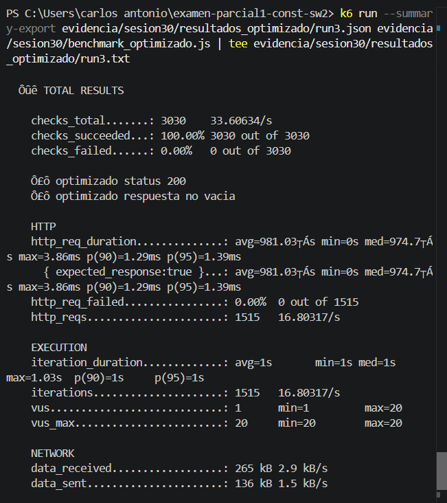

  
  # Reporte Sesión 30: Benchmarking y análisis de resultados

## 1. Objetivo

Comparar el rendimiento de `/benchmark/baseline` y `/benchmark/optimizado` bajo condiciones equivalentes.

## 2. Ambiente de prueba

- Equipo: Computadora personal de Carlos Rojas
- Sistema operativo: Windows
- Java: 21.0.10 LTS
- Spring Boot: 3.5.14
- Herramienta de carga: k6 2.1.0
- Fecha y hora: 16 de julio de 2026

## 3. Diseño del benchmark

- Usuarios virtuales: 20
- Duración: 1 minuto y 30 segundos por ejecución
- Ramp-up: 15 segundos para alcanzar 20 usuarios virtuales
- Ramp-down: 15 segundos para reducir la carga a 0 usuarios
- Número de repeticiones: 3 ejecuciones por cada versión
- Endpoints evaluados:
  - `/benchmark/baseline`
  - `/benchmark/optimizado`

Las dos versiones fueron evaluadas en la misma computadora, con la misma cantidad de usuarios virtuales, duración y configuración de carga.

## 4. Resultados resumidos

| Versión | p95 promedio | p99 promedio | RPS promedio | Error rate |
|---|---:|---:|---:|---:|
| Baseline | 3.41 ms | PENDIENTE | 16.75 req/s | 0 % |
| Optimizado | 3.03 ms | PENDIENTE | 16.75 req/s | 0 % |

La mejora porcentual obtenida en el p95 fue de 11.36 %.

## 5. Análisis

- ¿Qué métrica cambió más?  
  La métrica que presentó el cambio más importante fue el p95. Disminuyó de 3.41 ms en la versión baseline a 3.03 ms en la versión optimizada, lo que representa una mejora de 11.36 %.

- ¿La mejora fue consistente en las 3 ejecuciones?  
  La versión optimizada presentó resultados más estables. Su desviación del p95 fue de 0.17 ms, mientras que la versión baseline obtuvo una desviación de 0.88 ms.

- ¿Hubo errores?  
  No se registraron errores en ninguna de las dos versiones. El error rate promedio fue de 0 % tanto en baseline como en optimizado.

- ¿Existe evidencia suficiente para recomendar el cambio?  
  La versión optimizada presentó menor latencia y mayor estabilidad. Sin embargo, la mejora del p95 fue de 11.36 %, por debajo del 20 % establecido como referencia para considerar una mejora significativa. Por ello, todavía no existe evidencia suficiente para aceptar la optimización únicamente por la reducción del p95.

## 6. Conclusión técnica

La versión optimizada obtuvo un p95 menor y presentó resultados más estables, sin aumentar la tasa de errores. Sin embargo, la mejora del p95 fue de solamente 11.36 %, por debajo del criterio mínimo de 20 %.

Por esta razón, se recomienda repetir el benchmark o revisar otro posible cuello de botella antes de aceptar la optimización como una mejora significativa. Aunque la versión optimizada tiene un rendimiento ligeramente mejor, los resultados actuales no demuestran una mejora suficientemente grande.

## 7. Evidencias
  
  base

  

  optimizado 

  

 baseline

 run 1

 

 run 2

 

 run 3 

 

 optimizado 

 run 1

 

 run 2

 run 3 

 