# Reporte Sesión 30: Benchmarking y análisis de resultados

## 1. Objetivo
Comparar el rendimiento de /benchmark/baseline y /benchmark/optimizado bajo condiciones equivalentes.

## 2. Ambiente de prueba
- Equipo: k6, vs code, pyhton, git
- Sistema operativo: Windows, con ejecución de comandos mediante PowerShell
- Java: Java 17 configurado en el proyecto.
- Spring Boot: 4.1.0.
- Herramienta de carga: k6 v2.1.0.
- Fecha y hora: 14/07/2026 15:00

## 3. Diseño del benchmark
- Usuarios virtuales: 20.
- Duración: 90 segundos 
- Ramp-up: 15 segundos hasta alcanzar los 20 VUs
- Número de repeticiones: 3 ejecuciones por version
- Endpoints evaluados:
  - `/benchmark/baseline`
  - `/benchmark/optimizado`
- Thresholds:
  - `http_req_failed`: `rate<0.05`
  - `http_req_duration`: `p(95)<1000`

## capturas de los codigos de los archivos:

- benchmark baseline:

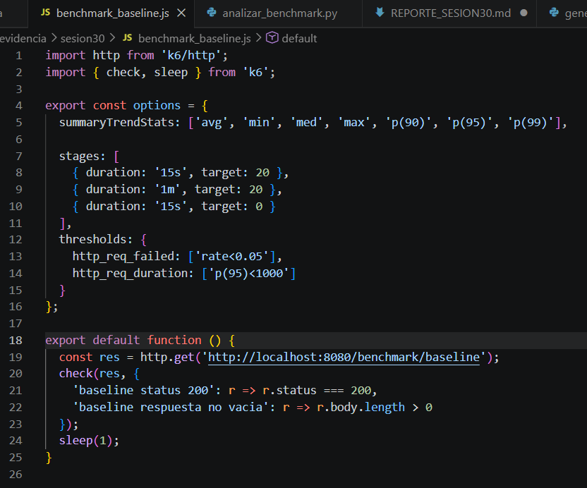

- benchmark optimizado:

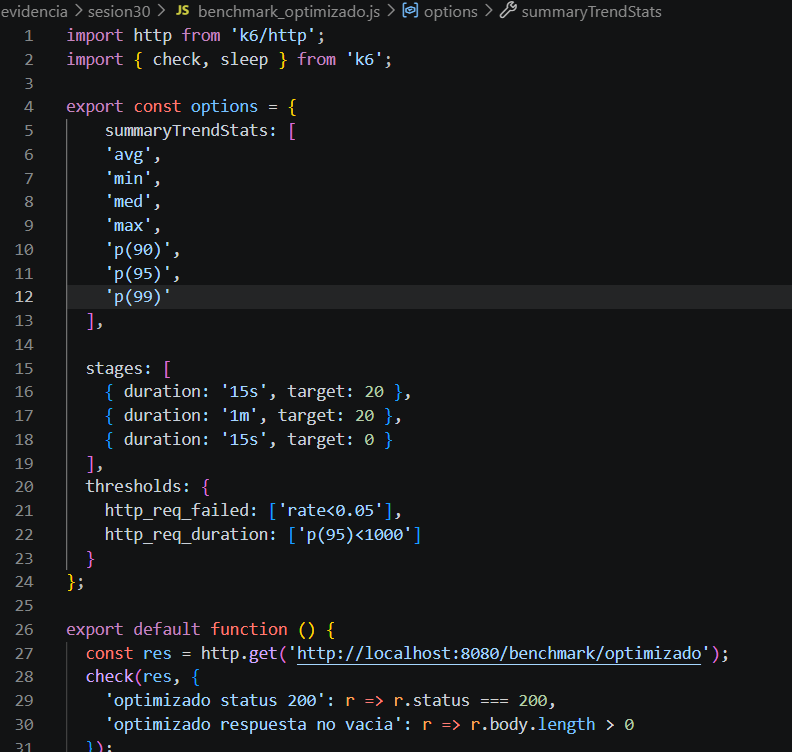

- runs txt y js generado:

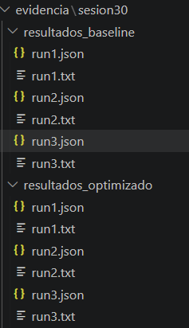

-  anlisis benchmark:

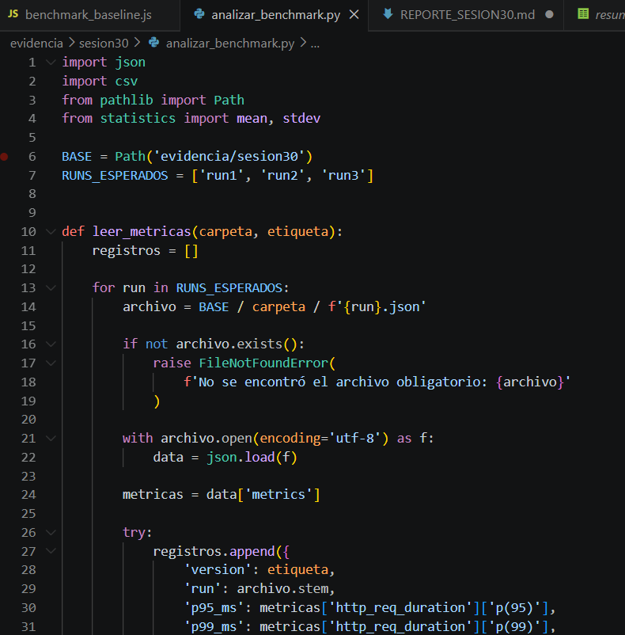

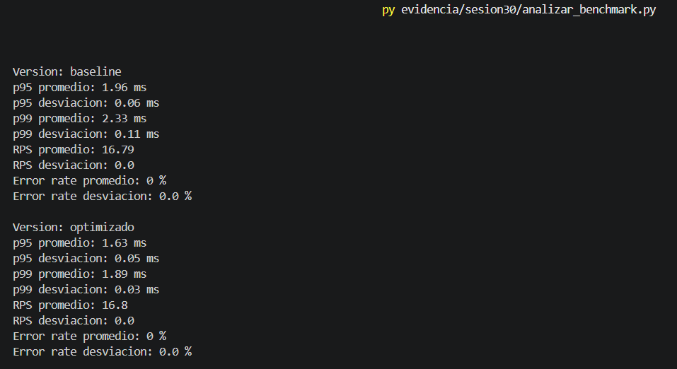

- CSV generado:

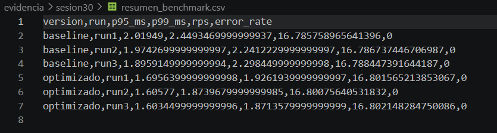

- reto grafico aplicado:

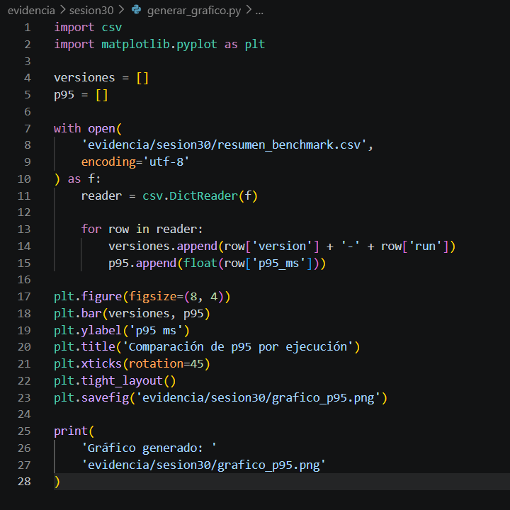

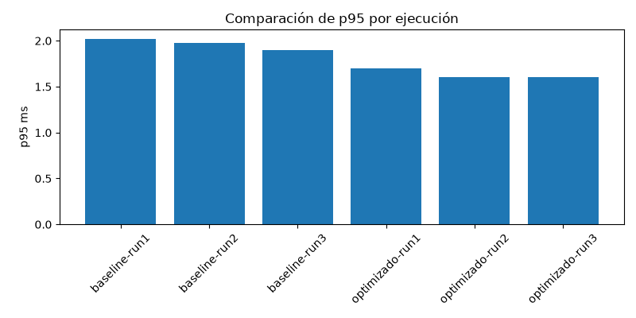

## 4. Resultados resumidos
| Versión | p95 promedio | p99 promedio | RPS promedio | Error rate |
|---|---:|---:|---:|---:|
| Baseline | 1.96 ms | 2.33 ms | 16.79 req/s | 0.00 % |
| Optimizado | 1.63 ms | 1.89 ms | 16.80 req/s | 0.00 % |

## 5. Análisis
- **Métrica que cambió más:** el p99 disminuyó de 2.33 ms a 1.89 ms. La reducción fue de 0.44 ms, equivalente aproximadamente a 18.88 %. El p95 disminuyó de 1.96 ms a 1.63 ms, con una mejora aproximada de 16.84 %.
- **Consistencia entre ejecuciones:** los resultados presentaron baja variabilidad. La desviación del p95 fue de 0.06 ms en baseline y 0.05 ms en optimizado. La desviación del p99 fue de 0.11 ms en baseline y 0.03 ms en optimizado. El RPS y el error rate no presentaron variación relevante.
- **Errores registrados:** no se registraron errores en ninguna de las dos versiones. El error rate promedio fue de 0.00 % tanto en baseline como en optimizado.
- **¿Existe evidencia suficiente para recomendar el cambio?**

## 6. Conclusión técnica
La versión optimizada presentó una reducción estable de la latencia, mantuvo el throughput y no generó errores. No obstante, la mejora del p95 fue de 16.84 %, por lo que no alcanzó el criterio mínimo del 20 % establecido para aceptar la optimización.

Según la matriz de decisión, corresponde revisar la hipótesis de optimización antes de recomendar el cambio como una mejora significativa. No es necesario repetir el benchmark por variabilidad, debido a que las desviaciones observadas fueron bajas; se requiere evaluar si el cambio aplicado ataca realmente el factor que limita el rendimiento.

## 7. Evidencias
- ejecucion del spring boot: 

- Capturas de ejecución k6:

**base_line:**
## run1:

## run2:

## run3:

**optimizado:**
## run1:

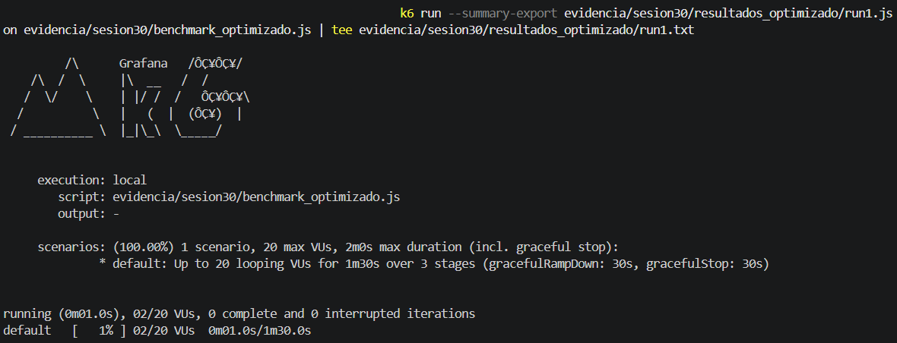

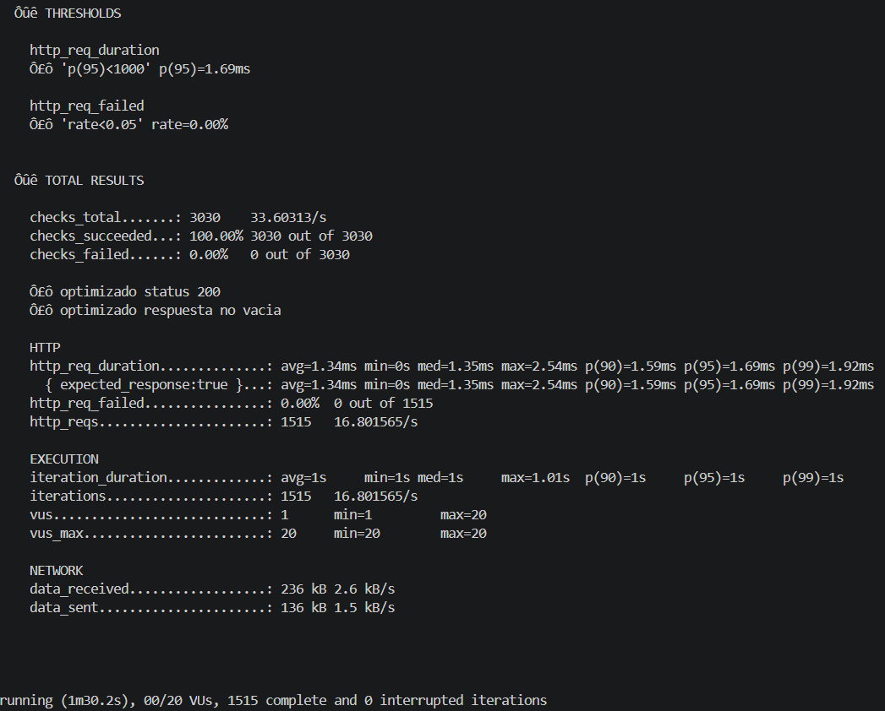

## run2:

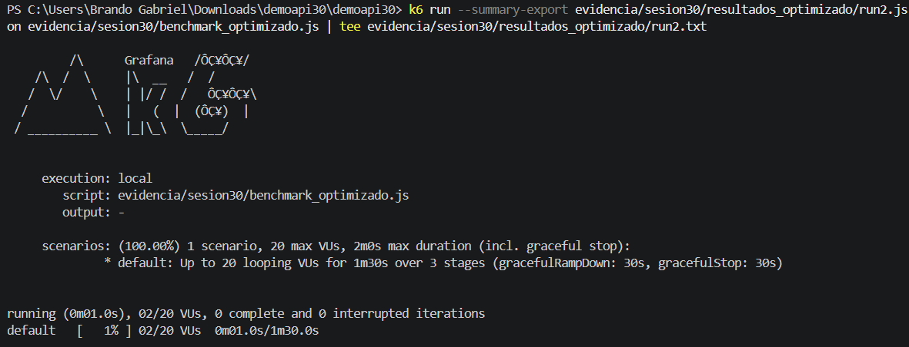

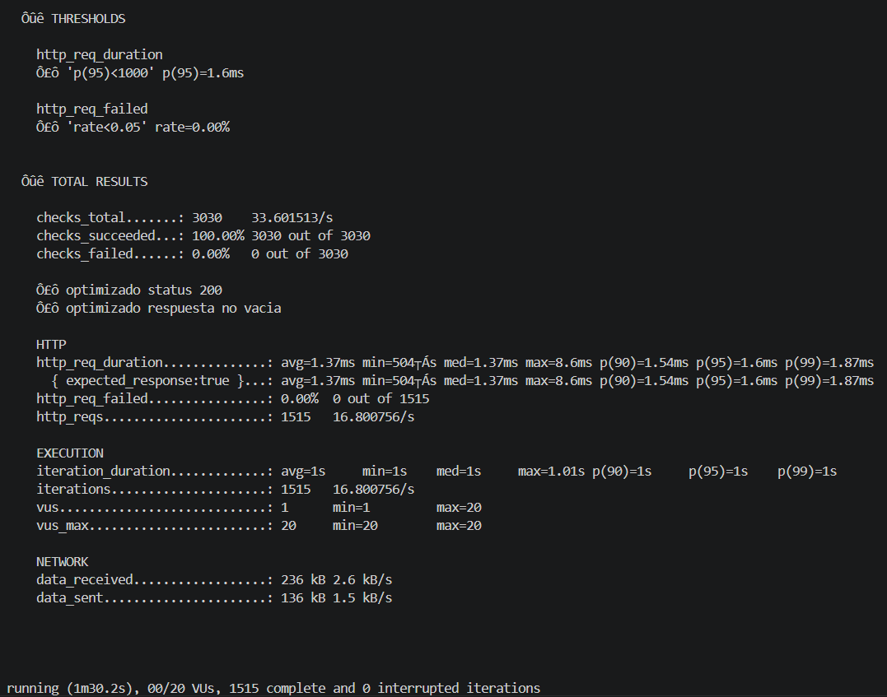

## run3:

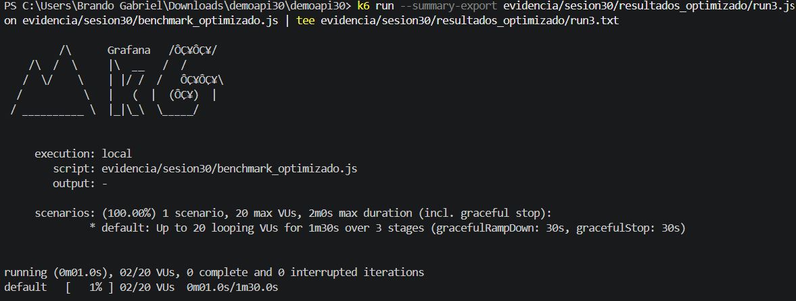

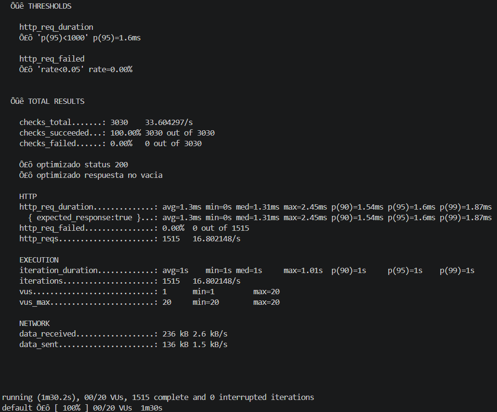

