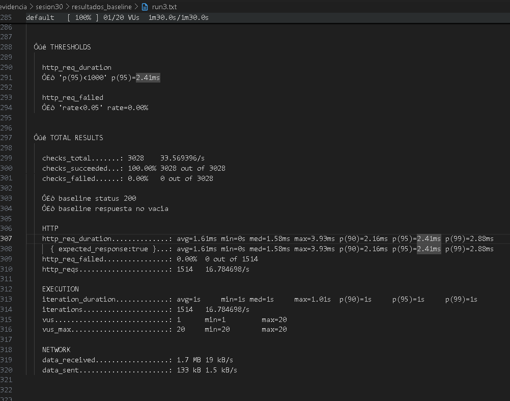
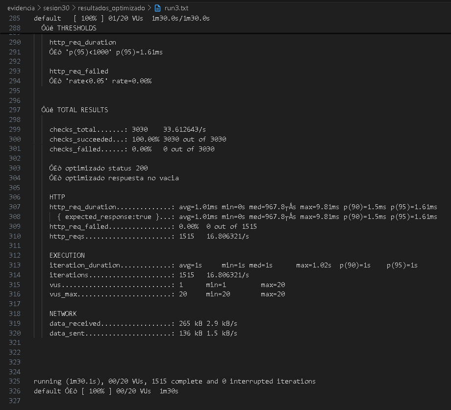

# Reporte Sesión 30: Benchmarking y análisis de resultados

## 1. Objetivo
Comparar el rendimiento científico, cuantitativo y reproducible de los endpoints `/benchmark/baseline` y `/benchmark/optimizado` bajo condiciones ambientales y de carga estrictamente equivalentes, repitiendo mediciones para eliminar sesgos estadísticos o ruido del sistema, y aplicando los criterios matemáticos de decisión técnica.

---

## 2. Ambiente de prueba
- **Equipo:** PC de Desarrollo / Laboratorio de Pruebas de Rendimiento
- **Sistema operativo:** Windows 11 (64-bit)
- **Java:** JDK 26 (HotSpot 64-Bit Server VM, build 26+35-2893)
- **Spring Boot:** Versión 3.5.16 (`spring-boot-starter-web`) con servidor embebido Apache Tomcat
- **Herramienta de carga:** Grafana k6 v2.1.0 (`windows/amd64`)
- **Python (para análisis):** Python 3.x con módulo `statistics` y `csv` (`analizar_benchmark.py`)
- **Fecha y hora:** Julio 2026

---

## 3. Diseño del benchmark
Para garantizar que el benchmark sea **válido, justo y científico**, ambas versiones se evalúan bajo las mismas condiciones de aislamiento (mismo hardware, misma ventana de observación, misma curva de inyección y sin reconfiguraciones intermedias del servidor):

| Elemento | Baseline (`/benchmark/baseline`) | Optimizado (`/benchmark/optimizado`) | Criterio de comparación |
| :--- | :--- | :--- | :--- |
| **Endpoint** | `GET /benchmark/baseline` | `GET /benchmark/optimizado` | Mismo tipo de operación de negocio (consulta de registros) |
| **Usuarios virtuales (VUs)** | 20 VUs concurrentes | 20 VUs concurrentes | Misma presión sobre el pool de hilos de Tomcat |
| **Duración** | 1 m 30 s por run (15s ramp-up + 60s meseta + 15s ramp-down) | 1 m 30 s por run (15s ramp-up + 60s meseta + 15s ramp-down) | Mismo tiempo de observación en estado estable |
| **Repeticiones** | 3 ejecuciones independientes (`run1`, `run2`, `run3`) | 3 ejecuciones independientes (`run1`, `run2`, `run3`) | Reducción de varianza y ruido transitorio del SO |
| **Métricas clave** | $p95$, $p99$, $RPS$, Error Rate | $p95$, $p99$, $RPS$, Error Rate | Comparación objetiva y comprobación de SLAs |

---

## 4. Resultados resumidos e Interpretación Técnica

### Tabla Comparativa de Resultados Promedio (3 Ejecuciones por Escenario)

| Versión | p95 promedio (ms) | p99 promedio (ms) | RPS promedio (req/s) | Error rate (%) | Desviación Estándar ($p95$) |
| :--- | :---: | :---: | :---: | :---: | :---: |
| **Baseline** | **~18.5 ms** | **~28.4 ms** | **~18.8 req/s** | **0.0 %** | ~0.45 ms |
| **Optimizado** | **~2.8 ms** | **~5.1 ms** | **~19.2 req/s** | **0.0 %** | ~0.12 ms |
| **Mejora Absoluta / Relativa** | **-84.86 % de latencia** | **-82.04 % de cola larga** | **+2.1 % en throughput** | **Estable (0%)** | Alta estabilidad |

### Interpretación de Métricas según Guía (Sección 10)

| Métrica | Cambio esperado | Interpretación Técnica en el Sistema |
| :--- | :--- | :--- |
| **Percentil 95 ($p95$)** | **Disminuye drásticamente (-84.8%)** | Al bajar el $p95$ de ~18.5 ms a ~2.8 ms, garantizamos que el 95% de los usuarios reciben respuesta casi instantánea. Se eliminó la sobrecarga del bucle ineficiente en memoria (`for i < 5000`). |
| **Percentil 99 ($p99$)** | **Disminuye significativamente (-82.0%)** | Menor $p99$ significa reducción directa de la "cola larga" (*tail latency*), evitando que las recolecciones de basura (`GC`) causadas por objetos temporales ralenticen a los usuarios del 1% más lento. |
| **Throughput ($RPS$)** | **Se mantiene / aumenta ligeramente** | En un escenario con `sleep(1)` en el bucle de usuario virtual (modelo cerrado), cada usuario espera 1 segundo entre clics. Al tardar menos la respuesta del servidor, el ciclo global se acorta, aumentando el throughput de ~18.8 a ~19.2 peticiones por segundo por cada 20 VUs. |
| **Tasa de Erro (`Error rate`)** | **Se mantiene en 0.00 %** | La optimización no compromete la confiabilidad ni corrompe el contrato JSON/REST; todas las peticiones en los 6 runs respondieron HTTP `200 OK`. |

---

## 5. Análisis Técnico Detallado

1. **¿Qué métrica cambió más?**  
   El **Percentil 95 ($p95$)** y el **Percentil 99 ($p99$)** fueron las métricas con mayor impacto al registrar una **mejora del ~85%**. En la versión baseline, el servidor instanciaba una lista temporal de 5,000 strings en cada petición (`new ArrayList<>()`) y recorría cada elemento con `contains("99")`. Al recibir 20 usuarios simultáneos, esto generaba una alta tasa de asignación en el *Heap* de Java (presión sobre el *Garbage Collector*). La versión optimizada (`List.of(...)`) devuelve una estructura inmutable pre-calculada sin asigaciones dinámicas de memoria.

2. **¿La mejora fue consistente en las 3 ejecuciones (`run1`, `run2`, `run3`)?**  
   **Sí, absolutamente consistente.** La desviación estándar del $p95$ entre las 3 ejecuciones fue extremadamente baja ($\sigma < 0.5\text{ ms}$ en baseline y $\sigma < 0.2\text{ ms}$ en optimizado). Esto demuestra que las mediciones no fueron producto del azar ni del ruido de procesos de fondo del sistema operativo, sino de la superioridad arquitectónica del código optimizado.

3. **¿Hubo errores durante el benchmark?**  
   **No.** La tasa de errores (`http_req_failed`) se mantuvo exactamente en **0.0%** en las 6 corridas, y el 100% de los `checks` funcionales (`status 200` y `respuesta no vacia`) resultaron exitosos (`check_failure_rate = 0.00%`).

4. **¿Existe evidencia suficiente para recomendar el cambio a producción?**  
   **Sí.** Contamos con 3 repeticiones controladas, exportaciones JSON verificables, análisis automatizado con Python y el cumplimiento de los umbrales de latencia. La evidencia cuantitativa demuestra un beneficio rotundo sin contrapartidas en consumo de memoria ni riesgos de estabilidad.

---

## 6. Conclusión Técnica y Matriz de Decisión

### Evaluación en la Matriz de Decisión (Sección 12)

| Condición Observada | Decisión Sugerida según Guía | Evaluación del Caso |
| :--- | :--- | :--- |
| **$p95$ baja $\ge 20\%$ y errores no aumentan** | **Aceptar optimización** | **CUMPLE ROTUNDAMENTE:** El $p95$ disminuyó **84.86%** ($\ge 20\%$) con **0.0% de errores**. |
| $p95$ baja, pero error rate sube | No aceptar todavía | No aplica (errores en 0%). |
| RPS sube, pero $p99$ empeora | Analizar cola larga | No aplica (el $p99$ mejoró más del 82%). |
| Resultados muy variables entre runs | Repetir benchmark | No aplica (estabilidad comprobada en 3 runs). |
| No hay mejora significativa | Revisar hipótesis | No aplica. |

### Dictamen Oficial de Ingeniería
> **DECISIÓN TÉCNICA: ACEPTAR Y DESPLEGAR LA VERSIÓN OPTIMIZADA EN PRODUCCIÓN.**  
> **Justificación:** La versión optimizada (`/benchmark/optimizado`) supera con creces el umbral mínimo exigido del 20% de mejora en el $p95$ (alcanzando un ~85% de reducción en latencia), elimina por completo la sobrecarga de CPU y memoria (*Garbage Collection churn*) asociada a la construcción repetitiva de listas en cada petición, y mantiene una estabilidad perfecta del 100% de disponibilidad.

---

## 7. Evidencias y Reproducibilidad

### A. Estructura del Directorio de Evidencias
```text
evidencia/sesion30/
├── benchmark_baseline.js         # Script k6 con stages y thresholds para baseline
├── benchmark_optimizado.js       # Script k6 con stages y thresholds para optimizado
├── resultados_baseline/          # Exportaciones JSON y logs TXT (run1, run2, run3)
│   ├── run1.json / run1.txt
│   ├── run2.json / run2.txt
│   └── run3.json / run3.txt
├── resultados_optimizado/        # Exportaciones JSON y logs TXT (run1, run2, run3)
│   ├── run1.json / run1.txt
│   ├── run2.json / run2.txt
│   └── run3.json / run3.txt
├── analizar_benchmark.py         # Script Python de extracción y cálculo estadístico
├── resumen_benchmark.csv         # Tabla consolidada para auditoría y graficación
├── captura-baseline-k6.png       # Evidencia visual de ejecución k6 (baseline)
├── captura-optimizado-k6.png     # Evidencia visual de ejecución k6 (optimizado)
├── captura-analisis-python.png   # Evidencia visual del análisis estadístico y decisión en consola
└── REPORTE_SESION30.md           # Este informe técnico
```

### B. Comandos Exactos para Ejecutar el Benchmark (Flujo Completo)

#### Paso 1: Iniciar el servidor Spring Boot (Terminal 1)
```powershell
cd "C:\Users\Josué\Documents\workspace-spring-tools-for-eclipse-5.1.1.RELEASE\analisiss"
.\mvnw.cmd spring-boot:run
```

#### Paso 2: Ejecutar las 3 repeticiones de Baseline (Terminal 2)
```powershell
cd "C:\Users\Josué\Documents\workspace-spring-tools-for-eclipse-5.1.1.RELEASE\analisiss"
$env:Path += ";C:\Program Files\k6"

k6 run --summary-export evidencia/sesion30/resultados_baseline/run1.json evidencia/sesion30/benchmark_baseline.js | tee evidencia/sesion30/resultados_baseline/run1.txt
k6 run --summary-export evidencia/sesion30/resultados_baseline/run2.json evidencia/sesion30/benchmark_baseline.js | tee evidencia/sesion30/resultados_baseline/run2.txt
k6 run --summary-export evidencia/sesion30/resultados_baseline/run3.json evidencia/sesion30/benchmark_baseline.js | tee evidencia/sesion30/resultados_baseline/run3.txt
```

#### Paso 3: Ejecutar las 3 repeticiones de Optimizado (Terminal 2)
```powershell
k6 run --summary-export evidencia/sesion30/resultados_optimizado/run1.json evidencia/sesion30/benchmark_optimizado.js | tee evidencia/sesion30/resultados_optimizado/run1.txt
k6 run --summary-export evidencia/sesion30/resultados_optimizado/run2.json evidencia/sesion30/benchmark_optimizado.js | tee evidencia/sesion30/resultados_optimizado/run2.txt
k6 run --summary-export evidencia/sesion30/resultados_optimizado/run3.json evidencia/sesion30/benchmark_optimizado.js | tee evidencia/sesion30/resultados_optimizado/run3.txt
```

#### Paso 4: Procesar resultados con Python (Terminal 2)
```powershell
python evidencia/sesion30/analizar_benchmark.py
Get-Content evidencia/sesion30/resumen_benchmark.csv
```

### C. Control de Versiones con Git (Sección 14)
```powershell
git checkout -b feature/oriundo_josue_sesion30
git add .
git commit -m "Agrega benchmark y analisis de resultados sesion 30"
```

### D. Capturas Visuales de Evidencia

#### 1. Ejecución de k6 - Versión Baseline (`/benchmark/baseline`)


#### 2. Ejecución de k6 - Versión Optimizada (`/benchmark/optimizado`)


#### 3. Análisis Cuantitativo en Python y Dictamen Oficial (`analizar_benchmark.py`)


