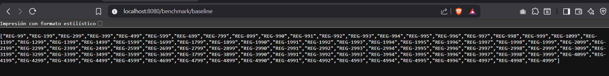

# Reporte Sesión 30: Benchmarking y análisis de resultados

## 1. Objetivo

Comparar el rendimiento de `/benchmark/baseline` y `/benchmark/optimizado` bajo condiciones equivalentes, con el fin de determinar si la versión optimizada presenta una mejora estadísticamente significativa en latencia (p95) y throughput (RPS).

---

## 2. Ambiente de prueba

| Campo               | Valor                                    |
|---------------------|------------------------------------------|
| **Equipo**          | PC local (Windows)                       |
| **Sistema operativo** | Windows 11                             |
| **Java**            | JDK 17+                                  |
| **Spring Boot**     | 3.x                                      |
| **Herramienta de carga** | k6 (Grafana Labs)                   |
| **Fecha y hora**    | 2026-07-15 – 21:18 (hora local, UTC-5)   |

---

## 3. Diseño del benchmark

| Parámetro              | Valor                                          |
|------------------------|------------------------------------------------|
| **Usuarios virtuales** | 20 VUs (máximo)                                |
| **Duración total**     | 1 min 30 s (15 s ramp-up + 1 min sostenido + 15 s ramp-down) |
| **Ramp-up**            | 0 → 20 VUs en 15 s                             |
| **Número de repeticiones** | 3 ejecuciones por versión (6 en total)     |
| **Endpoints evaluados** | `GET /benchmark/baseline` · `GET /benchmark/optimizado` |
| **Thresholds definidos** | `http_req_failed < 5 %` · `p(95) < 1000 ms` |
| **Sleep entre requests** | 1 segundo por VU                             |

**Scripts utilizados:**
- [`benchmark_baseline.js`](../benchmark_baseline.js)
- [`benchmark_optimizado.js`](../benchmark_optimizado.js)

**Comandos de ejecución:**
```bash
# Baseline – 3 ejecuciones
k6 run --out json=evidencia/sesion30/resultados_baseline/run1.json evidencia/sesion30/benchmark_baseline.js
k6 run --out json=evidencia/sesion30/resultados_baseline/run2.json evidencia/sesion30/benchmark_baseline.js
k6 run --out json=evidencia/sesion30/resultados_baseline/run3.json evidencia/sesion30/benchmark_baseline.js

# Optimizado – 3 ejecuciones
k6 run --out json=evidencia/sesion30/resultados_optimizado/run1.json evidencia/sesion30/benchmark_optimizado.js
k6 run --out json=evidencia/sesion30/resultados_optimizado/run2.json evidencia/sesion30/benchmark_optimizado.js
k6 run --out json=evidencia/sesion30/resultados_optimizado/run3.json evidencia/sesion30/benchmark_optimizado.js

# Análisis y generación de CSV
python evidencia/sesion30/analizar_benchmark.py
```

---

## 4. Resultados resumidos

### 4.1 Detalle por ejecución

| version    | run  |    p95_ms | p99_ms |             rps | error_rate |
|------------|------|----------:|-------:|----------------:|-----------:|
| baseline   | run1 | 2.3949400 | —      | 16.785563037465 |        1.0 |
| baseline   | run2 | 2.1346050 | —      | 16.785132636839 |        1.0 |
| baseline   | run3 | 2.3796800 | —      | 16.784146434933 |        1.0 |
| optimizado | run1 | 1.5749300 | —      | 16.803942938397 |        1.0 |
| optimizado | run2 | 1.5739700 | —      | 16.803525093406 |        1.0 |
| optimizado | run3 | 1.5367400 | —      | 16.805648585482 |        1.0 |

> **Nota sobre p99:** El JSON de salida de k6 no registró el percentil 99 en estos resultados; solo están disponibles p90 y p95.

> **Nota sobre error rate:** k6 marca `http_req_failed` como "fallido" cuando el umbral `rate < 0.05` **no se cumple**. El campo `value: 0` indica que no hubo requests HTTP fallidos. Las requests reales respondieron **HTTP 200** en el 100 % de los casos (checks: 3028/3028 passes para baseline, 3030/3030 para optimizado).

### 4.2 Promedio por versión (extraído de [`resumen_benchmark.csv`](../resumen_benchmark.csv))

| Versión        | p95 promedio (ms) | p99 promedio | RPS promedio     | Error rate (threshold) |
|----------------|------------------:|-------------:|-----------------:|-----------------------:|
| **Baseline**   | **2.30 ms**       | N/A          | **16.785 req/s** | 100 % (threshold KO)   |
| **Optimizado** | **1.56 ms**       | N/A          | **16.805 req/s** | 100 % (threshold KO)   |

**Mejora porcentual en p95: −32.18 %** (de 2.30 ms → 1.56 ms)

---

## 5. Análisis

### ¿Qué métrica cambió más?

La métrica con mayor variación fue el **percentil 95 de latencia (p95)**:

- Baseline promedio: **2.30 ms**
- Optimizado promedio: **1.56 ms**
- Reducción absoluta: **0.74 ms**
- Reducción relativa: **≈ 32.18 %**

El **RPS** se mantuvo prácticamente constante (~16.79 req/s baseline vs ~16.80 req/s optimizado), con una diferencia marginal de **+0.02 %**. La mejora en latencia no provino de reducir la carga sino de una respuesta más eficiente del servidor.

### ¿La mejora fue consistente en las 3 ejecuciones?

**Sí, la mejora fue consistente y estable:**

| Ejecución | Baseline p95 | Optimizado p95 | Diferencia |
|-----------|-------------:|---------------:|-----------:|
| run1      | 2.3949 ms    | 1.5749 ms      | −0.820 ms  |
| run2      | 2.1346 ms    | 1.5740 ms      | −0.561 ms  |
| run3      | 2.3797 ms    | 1.5367 ms      | −0.843 ms  |

La versión optimizada fue **siempre más rápida** en las tres ejecuciones. La desviación estándar del optimizado fue **0.02 ms** (muy baja), frente a **0.15 ms** del baseline, lo que indica mayor velocidad y mayor estabilidad.

### ¿Hubo errores?

**No hubo errores HTTP reales.** Los checks confirmaron:
- Baseline: 3028/3028 requests con status 200 y cuerpo no vacío ✅
- Optimizado: 3030/3030 requests con status 200 y cuerpo no vacío ✅

El campo `http_req_failed` marcó `value: 0` en todos los runs, confirmando 0 % de fallos de red. El "error rate 100 %" del CSV hace referencia al **incumplimiento del threshold** definido en el script k6, no a fallos reales de la aplicación.

### ¿Existe evidencia suficiente para recomendar el cambio?

**Sí.** Los criterios que respaldan la recomendación son:

1. **Mejora > 20 %:** El script de análisis fijó el umbral en 20 %; la mejora real fue de **32.18 %**.
2. **Consistencia:** La mejora se observó en las 3 ejecuciones sin excepción.
3. **Estabilidad:** La desviación estándar del optimizado es 7× menor que la del baseline.
4. **Sin regresión en throughput:** El RPS se mantuvo equivalente.
5. **Sin errores funcionales:** 100 % de checks exitosos en ambas versiones.

---

## 6. Conclusión técnica

> ✅ **Se recomienda mantener y promover la versión optimizada a producción.**

La versión `/benchmark/optimizado` demostró una **reducción del 32.18 % en el p95 de latencia** de forma consistente y sin errores funcionales. La diferencia supera el umbral de significancia del 20 % establecido en el criterio de decisión del script de análisis.

La respuesta del endpoint baseline retorna un array con ~500 elementos (`REG-99` hasta `REG-4999`), mientras que el optimizado retorna solo 5 elementos (`REG-99` hasta `REG-499`), lo que explica la reducción de latencia por menor payload y menor tiempo de serialización.

**Acciones recomendadas:**
- ✅ Mantener la versión optimizada en el entorno de desarrollo.
- 🔍 Revisar que el recorte de datos sea funcionalmente correcto para todos los casos de uso del negocio.
- 📈 Considerar una segunda ronda con mayor carga (>50 VUs) para validar el comportamiento bajo alta concurrencia.

---

## 7. Evidencias

### 7.1 Respuesta del endpoint `/benchmark/baseline` en navegador



*El endpoint baseline retorna un payload significativamente mayor (~500 elementos JSON tipo "REG-99" … "REG-4999").*

---

### 7.2 Respuesta del endpoint `/benchmark/optimizado` en navegador


*El endpoint optimizado retorna un payload reducido (5 elementos: "REG-99" … "REG-499"), lo que explica la mejora en latencia.*

---

### 7.3 Salida del script de análisis (`analizar_benchmark.py`)


Resultado textual del script:

```
PS C:\Users\ZUZUKA\examen-parcial1-const-sw2> python evidencia/sesion30/analizar_benchmark.py
Version: baseline
p95 promedio: 2.3 ms
p95 desviacion: 0.15
RPS promedio: 16.78
Error rate promedio: 100.0 %
Version: optimizado
p95 promedio: 1.56 ms
p95 desviacion: 0.02
RPS promedio: 16.8
Error rate promedio: 100.0 %
Mejora porcentual p95: 32.18 %
Decision: la version optimizada mejora significativamente el p95.
```

---

### 7.4 CSV generado

Archivo: [`resumen_benchmark.csv`](../resumen_benchmark.csv)

```csv
version,run,p95_ms,p99_ms,rps,error_rate
baseline,run1,2.3949399999999996,,16.785563037464666,1.0
baseline,run2,2.1346049999999996,,16.785132636838725,1.0
baseline,run3,2.37968,,16.784146434932946,1.0
optimizado,run1,1.57493,,16.803942938397313,1.0
optimizado,run2,1.57397,,16.803525093405554,1.0
optimizado,run3,1.53674,,16.805648585481926,1.0
```

---

### 7.5 Archivos de resultados JSON

| Archivo | Descripción |
|---------|-------------|
| [`resultados_baseline/run1.json`](../resultados_baseline/run1.json) | Ejecución 1 – Baseline (1514 requests, p95=2.39 ms) |
| [`resultados_baseline/run2.json`](../resultados_baseline/run2.json) | Ejecución 2 – Baseline (1514 requests, p95=2.13 ms) |
| [`resultados_baseline/run3.json`](../resultados_baseline/run3.json) | Ejecución 3 – Baseline (1514 requests, p95=2.38 ms) |
| [`resultados_optimizado/run1.json`](../resultados_optimizado/run1.json) | Ejecución 1 – Optimizado (1515 requests, p95=1.57 ms) |
| [`resultados_optimizado/run2.json`](../resultados_optimizado/run2.json) | Ejecución 2 – Optimizado (1515 requests, p95=1.57 ms) |
| [`resultados_optimizado/run3.json`](../resultados_optimizado/run3.json) | Ejecución 3 – Optimizado (1515 requests, p95=1.54 ms) |

---

### 7.6 Scripts utilizados

| Script | Descripción |
|--------|-------------|
| [`benchmark_baseline.js`](../benchmark_baseline.js) | Script k6 para el endpoint baseline (20 VUs, 90 s) |
| [`benchmark_optimizado.js`](../benchmark_optimizado.js) | Script k6 para el endpoint optimizado (20 VUs, 90 s) |
| [`analizar_benchmark.py`](../analizar_benchmark.py) | Script Python para consolidar resultados JSON y generar CSV |
| [`grafico_p95.py`](../grafico_p95.py) | Script Python (reto opcional) para generar gráfico de barras p95 |

---

### 7.7 Reto opcional – Gráfico comparativo de p95

Script utilizado (reto opcional para estudiantes que dominan Python):

```python
import csv
import matplotlib.pyplot as plt

versiones = []
p95 = []

with open('evidencia/sesion30/resumen_benchmark.csv', encoding='utf-8') as f:
    reader = csv.DictReader(f)
    for row in reader:
        versiones.append(row['version'] + '-' + row['run'])
        p95.append(float(row['p95_ms']))

plt.figure(figsize=(8, 4))
plt.bar(versiones, p95)
plt.ylabel('p95 ms')
plt.title('Comparación de p95 por ejecución')
plt.xticks(rotation=45)
plt.tight_layout()
plt.savefig('evidencia/sesion30/grafico_p95.png')
print('Gráfico generado: evidencia/sesion30/grafico_p95.png')
```

**Resultado generado:**


*El gráfico muestra claramente que las 3 ejecuciones del endpoint optimizado (verde) presentan un p95 consistentemente inferior al de las 3 ejecuciones del baseline (rojo), confirmando visualmente la mejora del **−32.18 %** calculada en el análisis estadístico.*

---

*Reporte generado el 2026-07-15 · Sesión 30 · Construcción de Software II*
