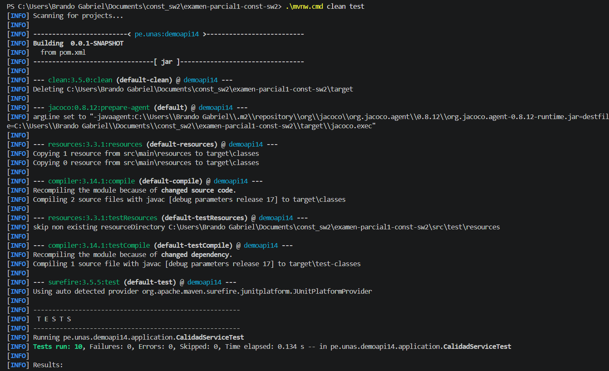
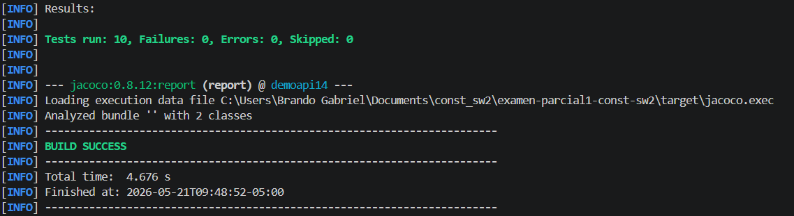
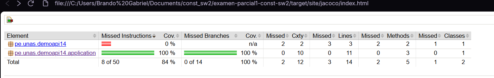
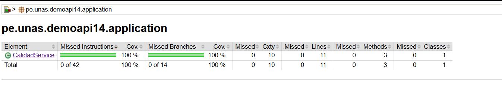
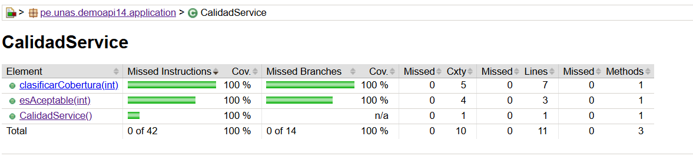
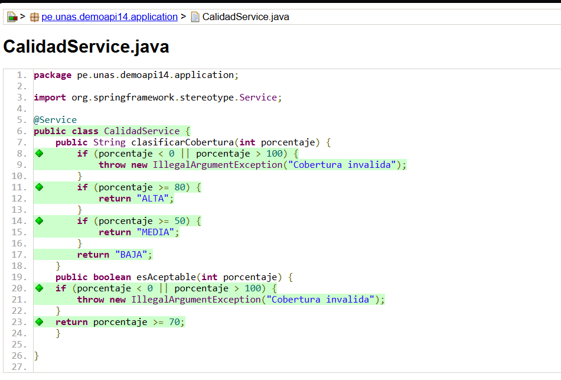
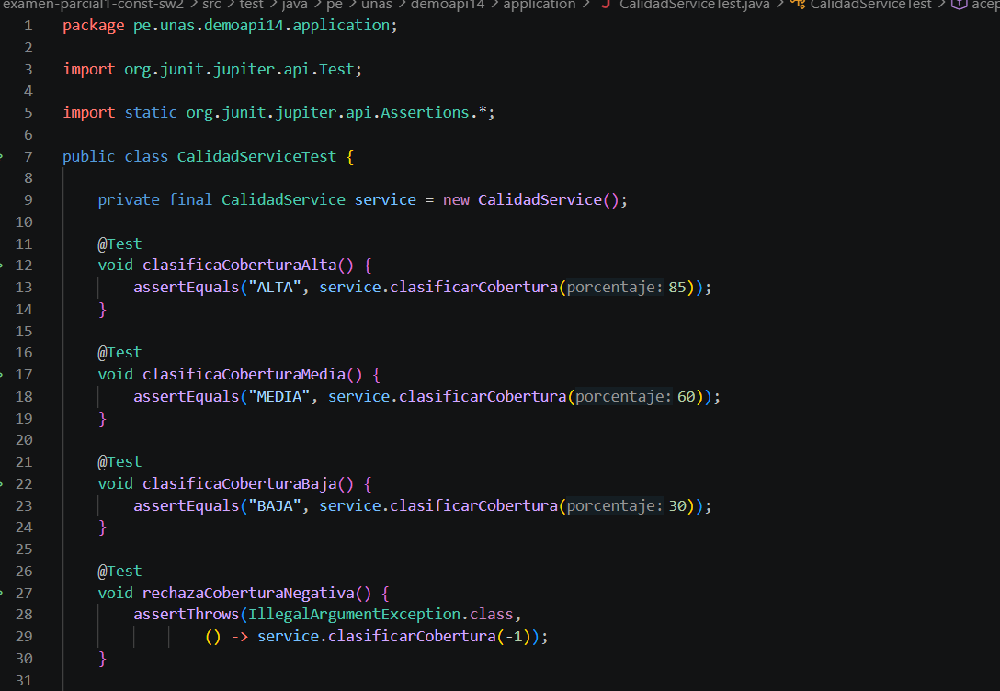
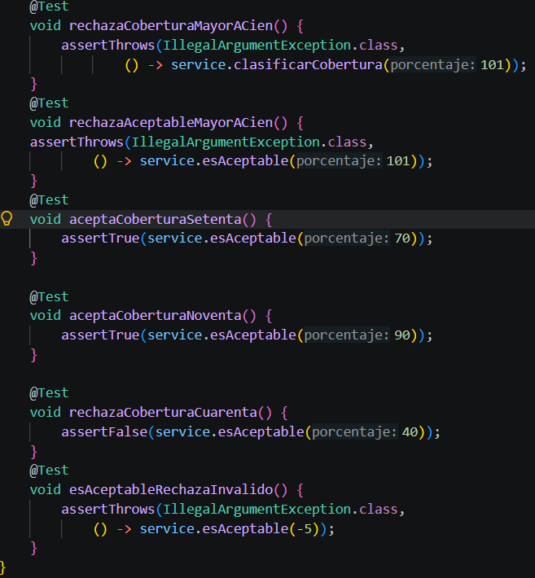

•	Captura de terminal con BUILD SUCCESS.
    
    
•	Captura de target/site/jacoco/index.html.
    
    
    
    
•	Captura de pruebas agregadas en el editor.
    
    
•	Commit en GitHub o Pull Request.
•	Breve interpretación: qué método tenía menor cobertura y cómo se mejoró.
