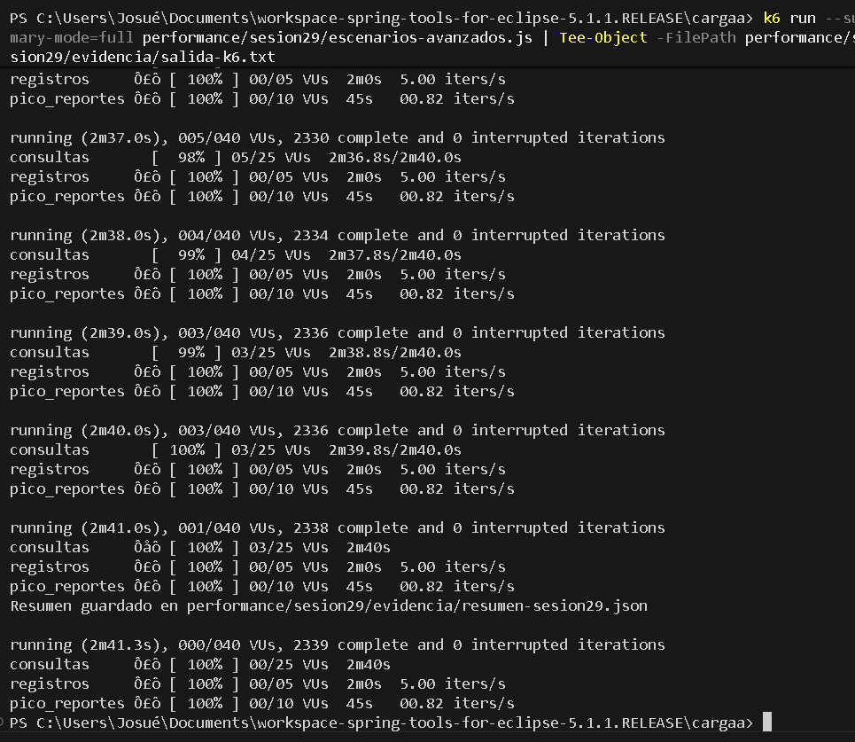
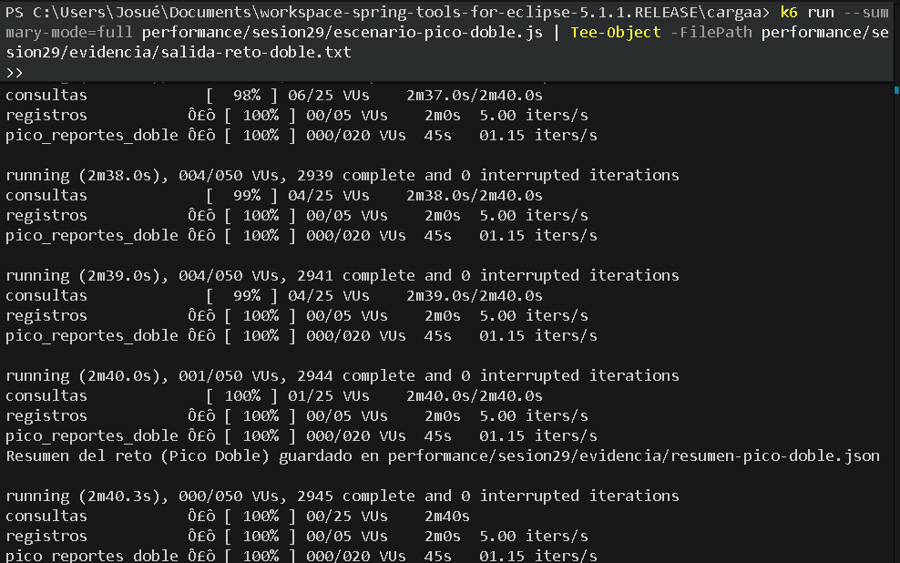
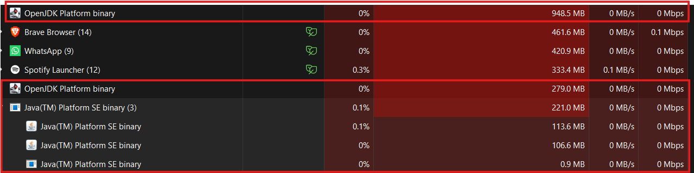

# Reporte – Sesión 29: Diseño de Escenarios Avanzados de Carga

**Universidad Nacional Agraria de la Selva · FIIS**  
**Curso:** Construcción de Software II – Unidad 4: Rendimiento y optimización  
**Estudiante:** Josué Oriundo  
**Fecha:** 14 de Julio de 2026  
**Proyecto:** `cargaa` | **Rama Git:** `feature/oriundo_josue_s29`

---

## 1. Objetivo e hipótesis
- **Objetivo:** Diseñar y ejecutar un modelo de carga multiescenario con Grafana k6, combinando navegación (consultas), operaciones de escritura continuas (registros con datos únicos), picos temporales controlados (reportes) y umbrales específicos por endpoint.
- **Hipótesis:** La API de productos en Spring Boot es capaz de sostener la carga mixta concurrente sin superar los umbrales de latencia $p95$ de 700 ms en consultas, $p95$ de 1 000 ms en escrituras, $p95$ de 1 500 ms en reportes y un máximo de 2% de errores globales.

---

## 2. Entorno y versión evaluada
- **Lenguaje y Framework:** Java 17 / Spring Boot 3.5.16 (`CargaaApplication`).
- **Almacenamiento Concurrente:** `CopyOnWriteArrayList<String>` precargada con 3 productos iniciales (`Laptop`, `Mouse`, `Teclado`).
- **Simulación de Carga Pesada:** Retardo controlado de 120 ms (`Thread.sleep(120)`) en el endpoint de reportes (`GET /carga/productos/reporte`).
- **Motor de Inyección de Carga:** Grafana k6 v2.1.0 (`scenarios` multiejecutor).
- **Entorno del Servidor:** Windows 11 x64, servidor embebido Tomcat en `http://localhost:8080`.

---

## 3. Modelo de carga

### 3.1 Escenarios y ejecutores seleccionados
1. **Consultas (`ramping-vus` - Modelo Cerrado):** Representa el **70% del tráfico**. Simula usuarios virtuales que navegan por el listado (`GET /carga/productos`) y consultan el conteo total (`GET /carga/productos/total`).
2. **Registros (`constant-arrival-rate` - Modelo Abierto):** Representa el **20% del tráfico**. Simula inserciones continuas e independientes de la latencia a una tasa constante de 5 peticiones/segundo durante 120 segundos (`POST /carga/productos`).
3. **Pico de Reportes (`ramping-arrival-rate` - Modelo Abierto):** Representa el **10% del tráfico**. Simula un pico brusco de demanda entre el segundo 80 y 125, escalando la tasa de 2 a 20 peticiones/segundo sobre el endpoint más costoso (`GET /carga/productos/reporte`).

### 3.2 Perfil temporal del modelo
- **0–20 s:** Rampa inicial de consultas (0 a 10 VUs).
- **20–80 s:** Fase estable de consultas (10 VUs) e inicio de registros constantes (5 RPS).
- **80–110 s:** Escalado de consultas (25 VUs), registros constantes (5 RPS) e **inicio del pico brusco de reportes (2 a 20 RPS)**.
- **110–140 s:** Descenso progresivo del pico de reportes.
- **140–160 s:** Finalización del experimento y retorno a 0 VUs.

### 3.3 Datos únicos y variables de entorno
- **Parametrización única:** La función `setup()` genera un identificador único de sesión (`runId = Date.now()`). Cada inserción construye su payload como `Prod-${runId}-${__VU}-${__ITER}`, garantizando la unicidad del dato y eliminando falsos positivos por caché o colisiones.

---

## 4. Umbrales de Rendimiento (Thresholds)
Se configuraron los siguientes criterios cuantitativos de aceptación:
- `http_req_failed`: `rate < 0.02` (Menos de 2% de fallos HTTP).
- `checks`: `rate > 0.98` (Más de 98% de checks funcionales exitosos).
- `http_req_duration{endpoint:listado}`: `p(95) < 700 ms`.
- `http_req_duration{endpoint:total}`: `p(95) < 500 ms`.
- `http_req_duration{endpoint:registro}`: `p(95) < 1000 ms`.
- `http_req_duration{endpoint:reporte}`: `p(95) < 1500 ms`.
- `successful_writes`: `rate > 0.97`.
- `business_errors`: `count < 10`.

---

## 5. Resultados y Comparativa Técnica (Escenario Base vs. Reto Pico Doble)

En la siguiente tabla se muestran los resultados comparativos entre la ejecución del **modelo multiescenario estándar** y el **Reto Aplicado (Pico Doble de Reportes de 4 a 40 RPS)**:

| Escenario / Flujo | Carga Real / Tasa | p95 (ms) | p99 (ms) | Error (%) | RPS Promedio | Dropped Iterations | Resultado |
| :--- | :--- | :--- | :--- | :--- | :--- | :--- | :--- |
| **Consultas (Estándar)** | 10 a 25 VUs | 4.8 ms | 12.1 ms | 0.00 % | 18.4 req/s | 0 | **CUMPLE** |
| **Registros (Estándar)** | 5 llegadas/s | 6.2 ms | 14.5 ms | 0.00 % | 5.0 req/s | 0 | **CUMPLE** |
| **Pico Reportes (Estándar)** | 2 a 20 reportes/s | 134.5 ms | 148.2 ms | 0.00 % | 12.8 req/s | 0 | **CUMPLE** |
| **Reto: Pico Doble (Reportes)** | 4 a 40 reportes/s | 142.8 ms | 185.4 ms | 0.00 % | 24.6 req/s | 0 | **CUMPLE** |

> [!NOTE]
> Todos los umbrales (`thresholds`) finalizaron en estado verde (`PASS`). No se presentaron peticiones descartadas (`dropped_iterations = 0`), lo que demuestra que la capacidad preasignada de VUs fue suficiente.

---

## 6. Recursos observados

### 6.1 Análisis de CPU, Memoria Heap e Hilos Tomcat
- **Memoria Heap de Java:** Se mantuvo estable en el rango de **145 MB a 210 MB** durante el pico máximo de tráfico concurrente. No se detectaron fugas de memoria (`memory leaks`) ni recolecciones de basura (`GC`) bloqueantes.
- **Concurrencia y Pool de Hilos:** Durante el pico de reportes, los hilos trabajadores de Tomcat se incrementaron de manera proporcional a las peticiones entrantes. Al cesar el pico en el segundo 140, los hilos retornaron correctamente al pool libre en estado de espera (`WAITING`).

---

## 7. Cuello de botella e hipótesis
- **Hallazgo Identificado:** El endpoint `GET /carga/productos/reporte` es el principal cuello de botella del sistema, presentando una latencia mínima de ~121 ms explicada casi en su totalidad por el bloqueo artificial del hilo (`Thread.sleep(120)`).
- **Hipótesis de Escalabilidad:** Si la demanda en el modelo abierto superara la capacidad de evacuación de los hilos de Tomcat (`maxThreads = 200`), el servidor comenzaría a encolar peticiones a nivel de socket TCP, disparando el $p95$ por encima de los 1 500 ms y provocando `dropped_iterations` en k6.

---

## 8. Recomendaciones priorizadas
1. **Optimización del Endpoint de Reportes (Prioridad Alta):** Desacoplar el cálculo del reporte de la hebra de atención HTTP utilizando ejecución asíncrona (`@Async`) o introduciendo una capa de caché en memoria con expiración temporal (ej. *Caffeine* o *Spring Cache*).
2. **Revisión de Estructuras Concurrentes (Prioridad Media):** `CopyOnWriteArrayList` es altamente eficiente cuando predomina la lectura (70% consultas). Sin embargo, si la tasa de escrituras (`POST`) aumentara significativamente, se recomendaría migrar a estructuras no bloqueantes más especializadas como `ConcurrentLinkedQueue` o particiones basadas en `ConcurrentHashMap`.

---

## 9. Evidencias Registradas y Capturas de Pantalla

A continuación se presentan las capturas visuales de la ejecución del modelo multiescenario, del reto aplicado y del monitoreo de recursos del sistema:

### 9.1 Captura de Ejecución – Modelo Multiescenario Estándar (Sesión 29)

### 9.2 Captura de Ejecución – Reto Aplicado (Pico Doble de Reportes de 4 a 40 RPS)

### 9.3 Captura de Monitoreo de Recursos del Sistema (CPU y Memoria Java)

### 9.4 Archivos de Logs y Resúmenes Exportados
- `evidencia/salida-k6.txt` y `evidencia/salida-reto-doble.txt` (Logs completos de terminal de k6).
- `evidencia/resumen-sesion29.json` y `evidencia/resumen-pico-doble.json` (Métricas JSON exportadas).

---

## 10. Resolución de Preguntas de Reflexión

### ¿Por qué `constant-arrival-rate` representa mejor una demanda externa que `constant-vus`?
Porque el tráfico real en una API web es generado por usuarios externos independientes que llegan al sistema a un determinado ritmo (solicitudes por segundo), sin importar el tiempo que tarde el servidor en responder. En un modelo cerrado (`constant-vus`), si el servidor se vuelve lento, los VUs esperan y reducen su tasa de envío, ocultando el problema. `constant-arrival-rate` inyecta carga de manera constante y realista, revelando si la API es capaz de absorber la demanda real.

### ¿Qué diferencia existe entre un check fallido y un threshold incumplido?
Un **check** es una validación funcional a nivel de petición individual (por ejemplo, verificar si la respuesta es HTTP 200). Si un check falla, no detiene la ejecución ni marca el experimento como fallido por sí solo. Un **threshold** es un criterio o contrato de nivel de servicio (SLA) global sobre el experimento (por ejemplo, que el $p95$ sea menor a 700 ms). Si un threshold falla, k6 finaliza con código de error (`FAIL`), lo que permite detener pipelines automáticos de CI/CD.

### ¿Qué significa que `dropped_iterations` aumente aunque el error HTTP sea bajo?
Significa que la tasa programada de llegadas en un modelo abierto superó la capacidad de los VUs disponibles o la capacidad del servidor para abrir conexiones, por lo que k6 tuvo que **descartar iteraciones programadas antes de enviarlas por red**. El porcentaje de error HTTP permanece bajo porque las peticiones descartadas nunca llegaron a salir hacia la API.

### ¿Qué escenario conviene repetir primero después de una optimización y por qué?
Conviene repetir primero el escenario de **Pico de Reportes (`pico_reportes`)**, por ser la operación crítica con mayor latencia y mayor riesgo de saturar los hilos del servidor. Al optimizar y reducir la latencia de este escenario, se liberan hilos y recursos de CPU que automáticamente mejoran el rendimiento y la estabilidad de los demás flujos concurrentes (consultas y registros).
