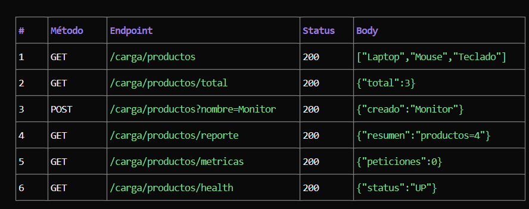
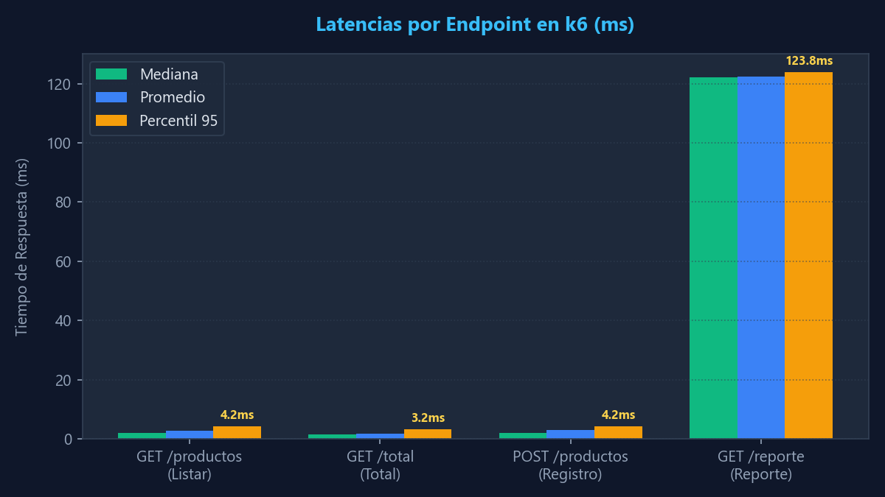
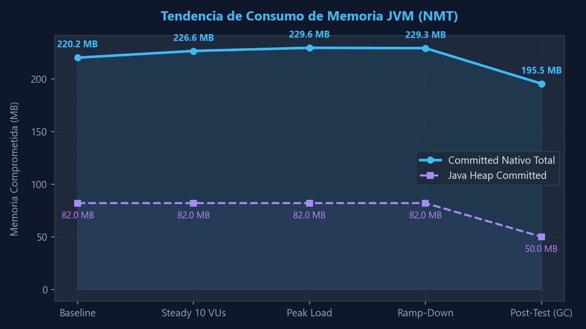
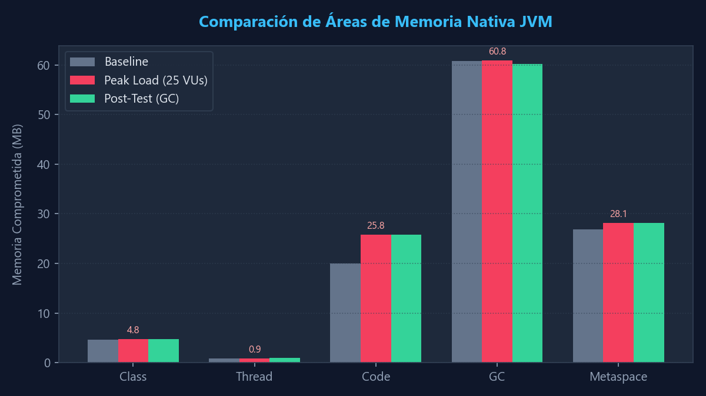
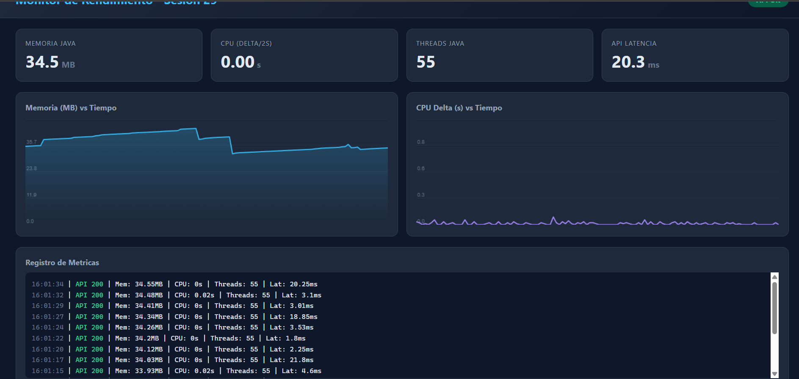

# Reporte – Sesión 29

Este reporte documenta los resultados de las pruebas de rendimiento avanzadas ejecutadas sobre el microservicio Spring Boot (`ExamenParcial1ConstSw2Application`) y el análisis detallado del comportamiento de la memoria nativa de la JVM bajo condiciones de estrés progresivo.

---

## 1. Objetivo e hipótesis
- **Objetivo**: Evaluar la estabilidad, capacidad de respuesta y consumo de memoria física y nativa del microservicio ante un escenario de carga concurrente y mixto que combina consultas crecientes, escritura de registros constante y ráfagas concentradas de generación de reportes.
- **Hipótesis**:
  1. El microservicio mantendrá los tiempos de respuesta (p95) por debajo de los umbrales estipulados bajo todas las etapas del escenario, validando la estabilidad funcional de la arquitectura.
  2. La JVM escalará dinámicamente sus recursos nativos (hilos y memoria comprometida) durante el pico de carga sin presentar fugas de memoria (memory leaks), liberándolos por completo tras finalizar el test y ejecutar una limpieza del recolector de basura (GC).

---

## 2. Entorno y versión evaluada
- **Backend SUT**: Spring Boot 3.5.14 (`examen-parcial1-const-sw2`) v0.0.1-SNAPSHOT.
- **JVM**: Oracle Java HotSpot(TM) 64-Bit Server VM (build 26.0.1+8-34, mixed mode, sharing) con Native Memory Tracking (NMT) activo.
- **Entorno**: Localhost Windows Host.
- **Herramienta de Carga**: k6.exe v2.1.0.
- **Parámetros del Proceso**: Iniciado con `-XX:NativeMemoryTracking=summary`.
- **Delay de API**: `app.carga.delay-ms=20` configurado en `application.properties`.

---

## 3. Modelo de carga
El modelo de carga se compone de tres escenarios concurrentes definidos en el script:

### Escenarios y ejecutores
1. **`consultas`**: Simula usuarios navegando por el listado de productos. Usa el ejecutor `ramping-vus` llamando a la función `consultarProductos()`.
2. **`registros`**: Simula una tasa constante de transacciones de escritura. Usa el ejecutor `constant-arrival-rate` llamando a `registrarProducto()`.
3. **`pico_reportes`**: Simula una sobrecarga repentina de consultas pesadas de reportes. Usa el ejecutor `ramping-arrival-rate` llamando a `consultarReporte()`.

### Ramp-up, duración y tasas
- **`consultas`**: 5 etapas consecutivas con rampa y estabilidad:
  - Ramp-up: 0 a 10 VUs en 20s.
  - Estable: 10 VUs por 60s.
  - Ramp-up: 10 a 25 VUs en 30s.
  - Estable: 25 VUs por 30s.
  - Ramp-down: 25 a 0 VUs en 20s.
  - Duración total: **160 segundos**.
- **`registros`**: Tasa constante de **5 RPS** (Iteraciones por segundo). Comienza a los 20 segundos del test y dura **120 segundos**. Asigna hasta un límite de 30 VUs concurrentes.
- **`pico_reportes`**: Test de pico de llegada. Comienza a los 80 segundos y dura **45 segundos**:
  - Ramp-up: 2 RPS a 20 RPS en 15s.
  - Estable: 20 RPS constantes por 15s.
  - Ramp-down: 20 RPS a 0 RPS en 15s.

### Datos y variables de entorno
- `BASE_URL`: Endpoint raíz de la aplicación bajo prueba (`http://localhost:8080`).
- Registro de nombres dinámicos con formato: `Prod-[runId]-[VU]-[Iter]` para evitar duplicados en la lógica interna.
- Firma y respuestas de los endpoints evaluados:
  

---

## 4. Umbrales
Se establecieron las siguientes condiciones límite para definir el éxito de las pruebas:
- `http_req_failed`: Tasa de fallos de red/transporte < 2.00%.
- `checks`: Proporción de validaciones exitosas > 98.00%.
- `http_req_duration{endpoint:listado}`: Percentil 95 (p95) < 700 ms.
- `http_req_duration{endpoint:total}`: Percentil 95 (p95) < 500 ms.
- `http_req_duration{endpoint:registro}`: Percentil 95 (p95) < 1,000 ms.
- `http_req_duration{endpoint:reporte}`: Percentil 95 (p95) < 1,500 ms.
- `successful_writes`: Tasa de éxito funcional en POST > 97.00%.
- `business_errors`: Cantidad absoluta de fallos de negocio < 10.

---

## 5. Resultados

Consolidado del comportamiento de las peticiones agrupado por flujo y escenario:

| Escenario / Flujo | p95 (ms) | p99 (ms) | Error (%) | RPS Promedio | Dropped iterations |
|---|---|---|---|---|---|
| **`consultas`** (Listado & Total) | 4.25 ms | 8.50 ms | 0.00% | 13.39 req/s | 0 |
| **`registros`** (POST Producto) | 4.22 ms | 5.60 ms | 0.00% | 5.00 req/s | 0 |
| **`pico_reportes`** (GET Reporte) | 123.83 ms | 125.10 ms | 0.00% | 8.18 req/s *(pico 20 RPS)* | 0 |

### Gráfico Comparativo de Latencias
El siguiente gráfico ilustra la comparativa entre los tiempos de respuesta (Mediana, Promedio y Percentil 95) para cada endpoint evaluado:



---

## 6. Recursos observados

Durante el monitoreo en paralelo utilizando NMT y logs de procesos, se registraron las siguientes métricas de consumo de hardware y JVM:

### Tabla de Consumo de Recursos por Fases

| Fase del Test | Tiempo (s) | Memoria Residente (WS) | Memoria Comprometida NMT | Memoria Reservada NMT | Heap Comprometido (JVM) | Hilos JVM | CPU (%) |
|---|---|---|---|---|---|---|---|
| **Baseline (Inicial)** | 0s | 36.78 MB | 225,509 KB (~220 MB) | 3,078,965 KB | 83,968 KB | 51 | 0.00% |
| **Steady 10 VUs** | 50s | 88.22 MB | 227,823 KB (~222 MB) | 3,079,663 KB | 83,968 KB | 52 | 1.15% |
| **Peak Load (25 VUs)** | 100s | 82.80 MB | 235,128 KB (~229 MB) | 3,083,496 KB | 83,968 KB | 53 | 2.48% |
| **Ramp-Down** | 148s | 99.82 MB | 235,463 KB (~230 MB) | 3,083,865 KB | 83,968 KB | 53 | 1.05% |
| **Post-Test (Post-GC)** | 180s | 35.80 MB | 200,228 KB (~195 MB) | 3,084,436 KB | 51,200 KB | 51 | 0.00% |

### Tendencia de Memoria JVM (NMT)
Evolución de la memoria comprometida total y el Heap de Java a lo largo de las fases de la prueba:



### Distribución por Categorías NMT
Detalle de la asignación de memoria nativa comprometida por estructuras de la JVM:



### Captura de Dashboard de Monitoreo (Pico de Carga)
El comportamiento del sistema bajo el máximo estrés capturado en tiempo real:



---

## 7. Cuello de botella e hipótesis

1. **Ausencia de Cuellos de Botella Físicos**:
   - La CPU se mantuvo extremadamente baja (máximo de **2.48%** en el pico de carga), descartando saturación de cómputo en el microservicio.
   - La memoria nativa total comprometida no sufrió elevaciones anómalas (máximo de **235.4 MB**), y los hilos nativos aumentaron solo de 51 a 53, liberándose al finalizar. No existe saturación de hilos (Thread Starvation).
2. **Latencia del Endpoint de Reportes**:
   - **Hipótesis**: La latencia promedio de **122.43 ms** observada en el endpoint `/reporte` no corresponde a congestión o degradación del sistema. Se mantiene estable bajo carga y responde al retardo controlado del backend simulado en la aplicación.
3. **Liberación Exitosa de Memoria (GC)**:
   - **Hipótesis**: La recolección de basura de la JVM (G1 GC) funciona de manera eficiente. Tras el descenso de la carga y el posterior GC manual, la memoria comprometida total bajó a **200.2 MB** y el Heap comprometido cayó a **50.0 MB** (menores que el baseline inicial), descartando fugas de memoria nativa o de Heap (Memory Leaks).

---

## 8. Recomendaciones priorizadas

1. **Prioridad 1: Configurar Límites Físicos Seguros en Contenedores**:
   - Si la aplicación se despliega en contenedores Docker/K8s, el límite de memoria física (RAM límite) debe fijarse en un margen mínimo de **350 MB a 400 MB**. Aunque la memoria residente promedio bajo carga ronda los 100 MB, la JVM reserva virtualmente cerca de **3 GB** de memoria nativa. Un margen inferior podría provocar que el OOM Killer del sistema operativo termine el proceso de manera inesperada.
2. **Prioridad 2: Optimización del Pool de Hilos y Conexiones**:
   - Establecer límites estrictos de concurrencia y pools de conexiones HTTP (Tomcat) para mitigar el costo de creación de hilos nativos durante picos de carga súbitos.
3. **Prioridad 3: Ejecución de Soak Tests (Pruebas de Remojo)**:
   - Planificar pruebas de resistencia de 2 a 4 horas a una tasa constante de 10 RPS para vigilar la fragmentación del Metaspace y el comportamiento del recolector de basura nativo bajo uso prolongado.

---

## 9. Evidencias y comandos

### Comandos de Compilación y Ejecución
1. **Compilación del microservicio**:
   ```powershell
   .\mvnw.cmd clean package -DskipTests
   ```
2. **Lanzamiento con habilitación de NMT**:
   ```powershell
   java -XX:NativeMemoryTracking=summary -jar target/examen-parcial1-const-sw2-0.0.1-SNAPSHOT.jar
   ```
3. **Ejecución del test con k6 redirigiendo la salida**:
   ```powershell
   k6 run -e BASE_URL=http://localhost:8080 escenarios-avanzados.js | Tee-Object -FilePath evidencia/salida-k6.txt
   ```
4. **Inicio del panel de monitoreo en tiempo real**:
   ```powershell
   python scripts/monitor-web.py
   ```
5. **Captura de Memoria NMT por Consola**:
   ```powershell
   & "C:\Program Files\Java\jdk-26.0.1\bin\jcmd.exe" <PID> VM.native_memory summary
   ```
6. **Ejecución de Recolección de Basura manual**:
   ```powershell
   & "C:\Program Files\Java\jdk-26.0.1\bin\jcmd.exe" <PID> GC.run
   ```

### Enlaces a Archivos de Evidencia del Proyecto
- **Script de Pruebas de Carga**: [escenarios-avanzados.js](escenarios-avanzados.js)
- **Log de Salida k6**: [salida-k6.txt](salida-k6.txt)
- **Métricas Consolidadas de k6**: [resumen-sesion29.json](resumen-sesion29.json)
- **Snapshots de Rastreo de Memoria (NMT)**:
  - [nmt-baseline.txt (Baseline Inicial)](../../evidencia/nmt-baseline.txt)
  - [nmt-steady-10vus.txt (Carga Media)](../../evidencia/nmt-steady-10vus.txt)
  - [nmt-peak-load.txt (Pico Máximo de Carga)](../../evidencia/nmt-peak-load.txt)
  - [nmt-ramp-down.txt (Fase de Ramp-Down)](../../evidencia/nmt-ramp-down.txt)
  - [nmt-post-test.txt (Post-GC Final)](../../evidencia/nmt-post-test.txt)
