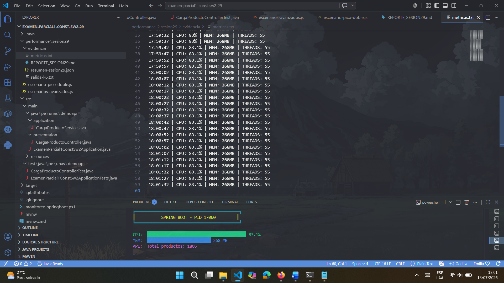
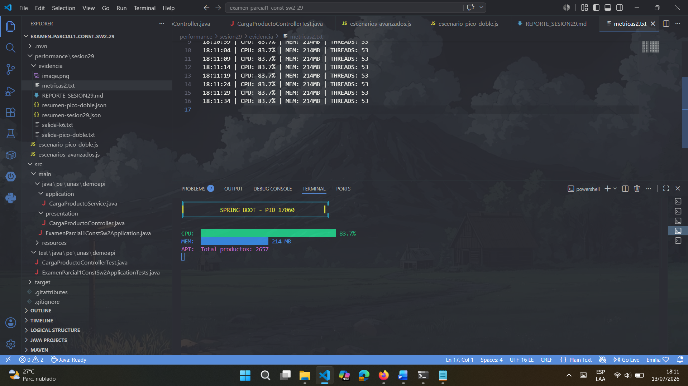
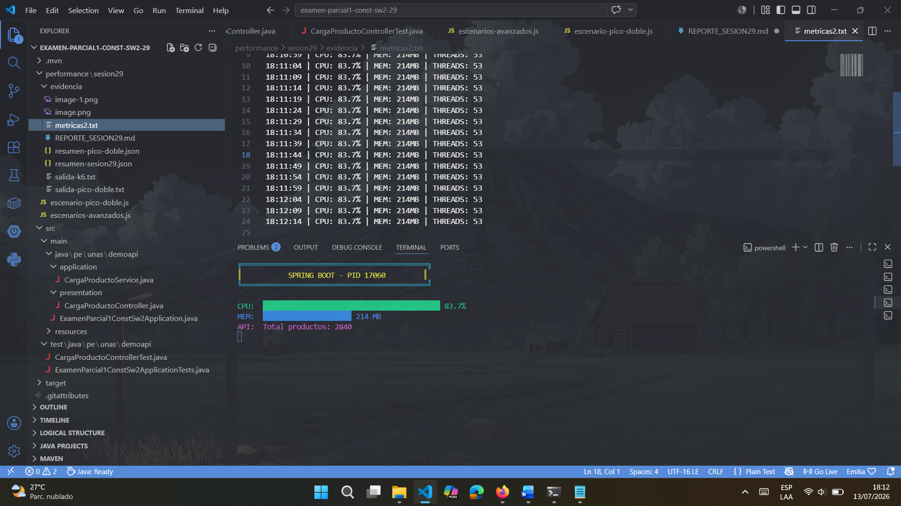

# Reporte Técnico - Sesión 29
## Escenarios Avanzados de Carga

## 1. Objetivo e Hipótesis

**Objetivo:** Evaluar el comportamiento de la API de productos bajo un modelo de carga mixta que simula tráfico real con tres perfiles de usuario diferentes.

**Hipótesis:** La API debe sostener la carga mixta sin superar:
- p95 de 700 ms en consultas
- p95 de 1 000 ms en escrituras
- 2% de errores globales

## 2. Entorno y Versión Evaluada

| Componente | Versión/Configuración |
|------------|----------------------|
| Sistema Operativo | Windows 10/11 |
| Java | 17 |
| Spring Boot | [Versión del proyecto] |
| k6 | [Versión] |
| Endpoint Base | http://localhost:8080 |
| Commit | [Hash del commit] |

## 3. Modelo de Carga

### Escenarios y Ejecutores

| Escenario | Ejecutor | Peso | Duración | Descripción |
|-----------|----------|------|----------|-------------|
| Consultas | ramping-vus | 70% | 0-160s | Navegación de productos |
| Registros | constant-arrival-rate | 20% | 20-140s | Creación de productos |
| Pico Reportes | ramping-arrival-rate | 10% | 80-125s | Consulta de reportes |

### Perfil Temporal

| Tiempo | Consultas | Registros | Pico Reportes |
|--------|-----------|-----------|---------------|
| 0-20s | Ramp-up 0→10 | No inicia | No inicia |
| 20-80s | Mantiene 10 | 5/s | No inicia |
| 80-110s | Sube 10→25 | 5/s | Sube 2→20/s |
| 110-140s | Mantiene 25 | 5/s | Baja 20→0/s |
| 140-160s | Baja a 0 | Finaliza | Finaliza |

## 4. Umbrales de Rendimiento

| Métrica | Umbral |
|---------|--------|
| Errores HTTP | < 2% |
| Checks exitosos | > 98% |
| P95 Listado | < 700 ms |
| P95 Total | < 500 ms |
| P95 Registro | < 1000 ms |
| P95 Reporte | < 1500 ms |
| Escrituras exitosas | > 97% |
| Errores de negocio | < 10 |

## 5. Resultados

### Tabla de Resultados

| Escenario | Carga Real | p95 | p99 | Errores | RPS | Dropped | Resultado |
|-----------|------------|-----|-----|---------|-----|---------|-----------|
| Consultas | ___ VUs | ___ ms | ___ ms | ___ % | ___ | ___ | ✅/❌ |
| Registros | ___ VUs | ___ ms | ___ ms | ___ % | ___ | ___ | ✅/❌ |
| Pico Reportes | ___ VUs | ___ ms | ___ ms | ___ % | ___ | ___ | ✅/❌ |

### Comparativa con Pico Doble

| Escenario | Configuración | p95 Reporte | Errores | CPU Pico | Conclusión |
|-----------|---------------|-------------|---------|----------|------------|
| Base | 20/s | ___ ms | ___ % | ___ % | ✅/❌ |
| Pico Doble | 40/s | ___ ms | ___ % | ___ % | ✅/❌ |

## 6. Recursos Observados

### Monitoreo de Recursos

| Momento | CPU (%) | Memoria (MB) | Threads | GC Actividad |
|---------|---------|--------------|---------|--------------|
| Inicio | ___ | ___ | ___ | ___ |
| 10 VUs | ___ | ___ | ___ | ___ |
| 25 VUs | ___ | ___ | ___ | ___ |
| Pico 20/s | ___ | ___ | ___ | ___ |
| Pico Doble | ___ | ___ | ___ | ___ |
| Fin | ___ | ___ | ___ | ___ |

## 7. Cuello de Botella e Hipótesis

### Síntomas Observados

1. **Síntoma principal:** [Describir]
2. **Hipótesis:** [Describir]
3. **Evidencia:** [Describir con datos]

### Análisis por Escenario

#### Consultas
- **Comportamiento:** [Describir]
- **Métricas clave:** [Datos]
- **Problemas identificados:** [Listar]

#### Registros
- **Comportamiento:** [Describir]
- **Métricas clave:** [Datos]
- **Problemas identificados:** [Listar]

#### Pico Reportes
- **Comportamiento:** [Describir]
- **Métricas clave:** [Datos]
- **Problemas identificados:** [Listar]

## 8. Recomendaciones Priorizadas

1. **[Recomendación 1]:** [Descripción y métrica esperada]
2. **[Recomendación 2]:** [Descripción y métrica esperada]
3. **[Recomendación 3]:** [Descripción y métrica esperada]

## 9. Conclusiones

**Conclusión Principal:**
Bajo el modelo de carga mixta, el sistema [cumple/no cumple] los umbrales establecidos. El escenario más afectado fue [escenario] con p95 de [valor] ms y error de [valor]%.

**Lecciones Aprendidas:**
1. [Lección 1]
2. [Lección 2]
3. [Lección 3]

## 10. Evidencias y Comandos

### Comandos de Ejecución
```bash
# Prueba base
k6 run -e BASE_URL=http://localhost:8080 escenarios-avanzados.js

# Prueba con pico doble
k6 run -e BASE_URL=http://localhost:8080 escenario-pico-doble.js


# Probar endpoints
curl http://localhost:8080/carga/productos
curl http://localhost:8080/carga/productos/total
curl -X POST "http://localhost:8080/carga/productos?nombre=Monitor"
curl http://localhost:8080/carga/productos/reporte

# Navegar al directorio
cd performance/sesion29

# Ejecutar prueba con redirección de salida
k6 run -e BASE_URL=http://localhost:8080 escenarios-avanzados.js | Tee-Object -FilePath evidencia/salida-k6.txt







# Monitoreo con barras de progreso
while ($true) {
    Clear-Host
    $proc = Get-Process -Id 17060
    if ($proc) {
        $cpu = [math]::Round($proc.CPU, 1)
        $mem = [math]::Round($proc.WorkingSet/1MB, 0)
        
        $cpuBar = "█" * [math]::Min([math]::Round($cpu/2), 50)
        $memBar = "█" * [math]::Min([math]::Round($mem/10), 50)
        
        Write-Host "╔════════════════════════════════════════════╗" -ForegroundColor Cyan
        Write-Host "║           SPRING BOOT - PID 17060         ║" -ForegroundColor Yellow
        Write-Host "╚════════════════════════════════════════════╝" -ForegroundColor Cyan
        Write-Host ""
        Write-Host "CPU:  $cpuBar $cpu%" -ForegroundColor Green
        Write-Host "MEM:  $memBar $mem MB" -ForegroundColor Blue
        
        try {
            $total = (Invoke-RestMethod "http://localhost:8080/carga/productos/total" -TimeoutSec 1).total
            Write-Host "API:  Total productos: $total" -ForegroundColor Magenta
        } catch {
            Write-Host "API:  ⚠️ No disponible" -ForegroundColor Red
        }
    }
    Start-Sleep -Seconds 2
}


# Guardar métricas en un archivo de texto con formato
while ($true) {
    $time = Get-Date -Format "HH:mm:ss"
    $proc = Get-Process -Id 17060 -ErrorAction SilentlyContinue
    if ($proc) {
        $line = "$time | CPU: $([math]::Round($proc.CPU,1))% | MEM: $([math]::Round($proc.WorkingSet/1MB,0))MB | THREADS: $($proc.Threads.Count)"
        $line
        $line | Out-File "evidencia/metricas.txt" -Append
    }
    Start-Sleep -Seconds 5
}