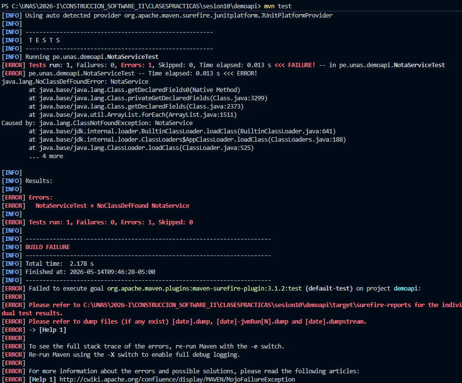
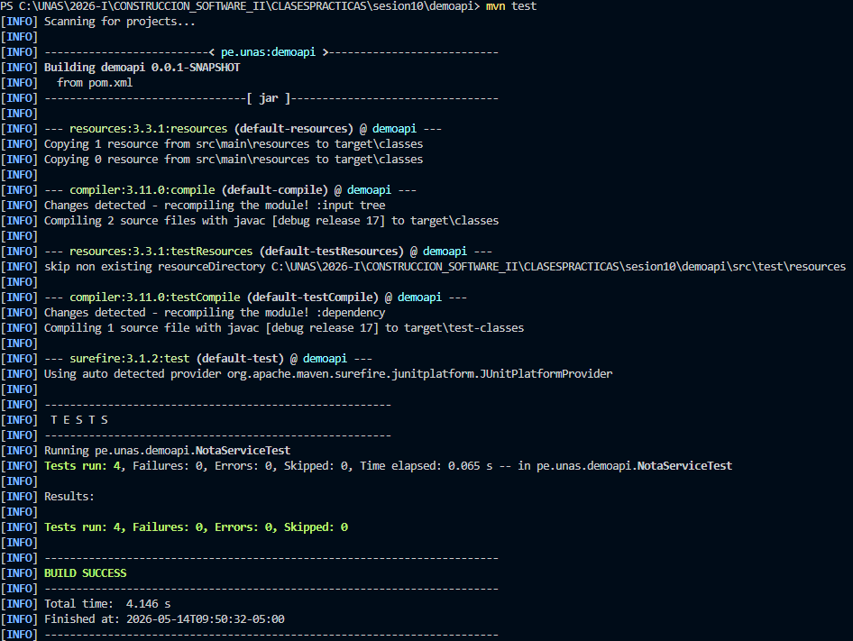
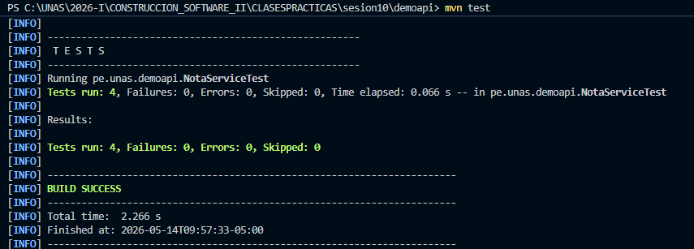
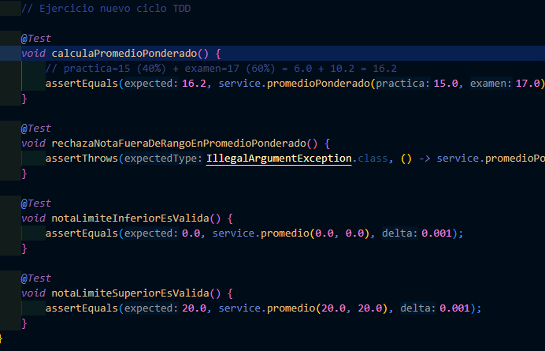
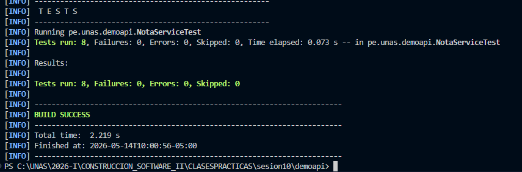

## Tabla de Casos de Prueba

| # | Caso de prueba | Entrada | Resultado esperado | Prioridad |
|---|---|---|---|---|
| 1 | Promedio simple válido | 14.0, 16.0 | 15.0 |  Alta |
| 2 | Nota límite aprobatoria exacta | 10.5 | `true` |  Alta |
| 3 | Nota fuera de rango | 21.0, 15.0 | Excepción |  Alta |
| 4 | Promedio ponderado | 15.0, 17.0 | 16.2 |  Alta |
| 5 | Nota desaprobatoria | 10.4 | `false` |  Media |
| 6 | Nota negativa en ponderado | -1.0, 17.0 | Excepción |  Media |
| 7 | Límite inferior válido | 0.0, 0.0 | 0.0 |  Media |
| 8 | Límite superior válido | 20.0, 20.0 | 20.0 |  Media |


---

## Fase RED – Prueba antes que el código

Se escribió `NotaServiceTest.java` con los 4 casos iniciales. Al ejecutar `./mvnw test` sin que `NotaService` exista, el proyecto falla por error de compilación.


---

## Fase GREEN – Implementación mínima

Se creó `NotaService.java` con el código mínimo. Todas las pruebas pasan.



---

## Fase REFACTOR – Mejora sin romper pruebas

Se reemplazaron los números literales por constantes con nombre y se extrajo el cálculo a un método privado. Las pruebas siguieron pasando sin cambios.



---

## Fase Ejercicio aplicado
Se agregó un nuevo ciclo TDD completo para el método promedioPonderado(): primero se escribió la prueba esperando que práctica valga 40% y examen 60%, luego se implementó el método, y finalmente se verificó que todo siguiera en verde. Entrada: 15.0 y 17.0 → resultado: 16.2.



```
Tests run: 8, Failures: 0, Errors: 0
BUILD SUCCESS
```