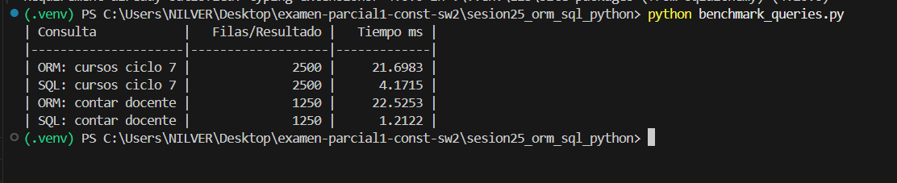

# Reporte Sesión 25 – ORM vs SQL directo en Python

## 1. Objetivo
Comparar la eficiencia, el rendimiento y el comportamiento de las consultas realizadas a través de un ORM (SQLAlchemy) versus consultas SQL directas en Python, analizando además el impacto de los índices en la base de datos.

## 2. Consultas evaluadas
- **Cursos por ciclo**: Filtrar los cursos pertenecientes al ciclo 7 (retorna 2500 registros de un total de 5000).
- **Conteo por docente**: Contar la cantidad de cursos asignados al docente "Mg. Yanac" (retorna un conteo de 1250 registros).

## 3. Resultados

A continuación se detallan los tiempos de ejecución obtenidos en las pruebas antes y después de crear el índice en el campo `docente`:

| Consulta | Resultado | Tiempo Sin Índice | Tiempo Con Índice | Observación |
|---|---:|---:|---:|---|
| **ORM ciclo 7** | 2500 | 21.6983 ms | 23.5301 ms | Utiliza el índice implícito `ix_cursos_ciclo`. El tiempo es superior al de SQL debido al overhead de la hidratación de objetos ORM en Python. |
| **SQL ciclo 7** | 2500 | 4.1715 ms | 4.5972 ms | Utiliza el índice implícito `ix_cursos_ciclo`. Retorna tuplas crudas de forma directa y sumamente veloz. |
| **ORM docente** | 1250 | 22.5253 ms | 8.4859 ms | Realiza la consulta de todos los registros para luego medirlos en Python. Se beneficia enormemente del índice `idx_cursos_docente`. |
| **SQL docente** | 1250 | 1.2122 ms | 0.4683 ms | La consulta más eficiente. Realiza el `COUNT(*)` directamente en el motor SQLite y con el índice tarda menos de 0.5 ms. |

## 4. Interpretación
¿Cuándo conviene usar cada aproximación?

- **Conviene ORM (Object-Relational Mapping)**:
  - Para aplicaciones CRUD estándar donde la rapidez de desarrollo y la facilidad de mantenimiento son prioritarios.
  - Cuando se desea independencia de la base de datos (facilidad para cambiar de motor como SQLite a PostgreSQL/MySQL).
  - Cuando se requiere seguridad por defecto, ya que los ORM sanitizan y parametrizan las consultas automáticamente.
  - Para mantener la consistencia de la lógica de negocio usando programación orientada a objetos (OOP).

- **Conviene SQL directo**:
  - Para procesos críticos y operaciones masivas (Bulk Operations) donde el rendimiento y el bajo consumo de CPU/memoria son esenciales.
  - Para realizar consultas complejas, reportes analíticos con Window Functions, agrupaciones avanzadas o características específicas de un motor SQL que el ORM no exprese eficientemente.
  - En microservicios ligeros o consultas puntuales de muy alta frecuencia.

## 5. Evidencias

### Captura de benchmark_queries.py (Antes de crear el índice)

### Creación del índice y ejecución del Benchmark (Después de crear el índice)

### Captura de explain_query.py (Plan de ejecución de ciclo 7)

---

## 6. Preguntas de reflexión técnica

1. **¿Qué ventaja ofrece ORM frente a SQL directo en mantenibilidad?**
   El ORM permite interactuar con la base de datos a través de clases y objetos del lenguaje de programación (Python), abstrayendo la sintaxis SQL. Esto hace que el código sea más legible, facilita el autocompletado en el IDE, permite detectar errores en tiempo de compilación/diseño, y automatiza la parametrización de variables para prevenir inyecciones SQL. Además, permite portar el sistema a otro motor de base de datos con mínimos cambios de código.

2. **¿En qué casos SQL directo puede ser más conveniente?**
   Es más conveniente cuando se necesita exprimir al máximo el rendimiento del motor de base de datos o en consultas analíticas muy complejas (como reportes masivos con múltiples `JOIN`s, subconsultas complejas y agregaciones). SQL directo evita la penalización de rendimiento (overhead) del ORM causada por la instanciación e hidratación de objetos en memoria de Python.

3. **¿Qué impacto tuvo el índice en las consultas filtradas?**
   El índice redujo de forma drástica el tiempo de ejecución en la consulta del docente (de **1.21 ms** a **0.46 ms** en SQL, y de **22.52 ms** a **8.48 ms** en ORM). Esto ocurre porque en lugar de hacer un escaneo completo de la tabla (Full Table Scan) fila por fila, SQLite realiza una búsqueda binaria B-Tree directamente sobre el índice, lo cual es de complejidad algorítmica $O(\log N)$ frente a $O(N)$.

4. **¿Por qué una consulta agregada con COUNT puede ser más eficiente que traer todos los registros y contarlos en Python?**
   Porque con `COUNT(*)` el conteo lo realiza el propio motor de base de datos a bajo nivel (usando índices si están disponibles) y solo transmite un único número entero al cliente Python. En cambio, traer todos los registros con el ORM para contarlos en Python requiere transferir 1250 filas completas de datos por red/memoria y construir (hidratar) 1250 instancias de la clase `Curso` en Python, consumiendo CPU, memoria y ancho de banda innecesariamente.

5. **¿Qué riesgo existe si se construyen consultas SQL concatenando texto del usuario?**
   Existe el grave peligro de sufrir ataques de **Inyección SQL (SQL Injection)**. Un usuario malintencionado podría ingresar código SQL ejecutable dentro de los campos de entrada (ej. `; DROP TABLE cursos; --`), lo que permitiría alterar la lógica del query original, extraer información confidencial, omitir mecanismos de autenticación o destruir la base de datos. Para evitar esto, siempre se deben usar consultas preparadas o parametrizadas.
