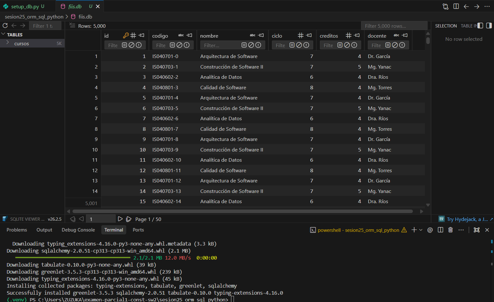

# Reporte Sesión 25 – ORM vs SQL directo en Python

## 1. Objetivo
El objetivo de esta práctica es comparar el rendimiento, eficiencia y mantenibilidad de las consultas a base de datos utilizando un **Mapeador Objeto-Relacional (ORM)** como SQLAlchemy frente a consultas escritas en **SQL directo (textual)** en Python. Se evalúa el impacto del volumen de datos, las agregaciones en el motor vs memoria, y el uso de índices.

---

## 2. Consultas evaluadas
1. **Listar cursos por ciclo:**
   - **ORM:** Recupera todos los objetos `Curso` donde `ciclo == 7` y los mapea a objetos de Python.
   - **SQL directo:** Ejecuta un `SELECT * FROM cursos WHERE ciclo = :ciclo` y retorna una tupla cruda de resultados.
2. **Conteo por docente:**
   - **ORM (Invalorable):** Recupera todos los objetos `Curso` donde `docente == 'Mg. Yanac'` en memoria y calcula la longitud de la lista en Python (`len(datos)`).
   - **SQL directo (Optimizado):** Ejecuta un `SELECT COUNT(*) FROM cursos WHERE docente = :docente` directamente en la base de datos y solo devuelve el entero final.

---

## 3. Resultados

A continuación se detallan las métricas de rendimiento obtenidas en las pruebas de ejecución:

### A. Resultados SIN Índice en Docente (`crear_indice.py` no ejecutado)
*(Nota: El índice en la columna `ciclo` ya existía por estar definido con `index=True` en el modelo).*

| Consulta | Resultado (Filas) | Tiempo (ms) | Observación |
|---|---:|---:|---|
| **ORM ciclo 7** | 2500 | 35.5532 | Tiempo alto debido al costo de mapear 2500 registros a objetos Python (Hydration). |
| **SQL ciclo 7** | 2500 | 5.2102 | Mucho más rápido, ya que devuelve tuplas de datos crudos sin instanciar objetos. |
| **ORM docente** | 1250 | 11.4082 | Trae 1250 filas completas a memoria solo para contarlas en Python. Ineficiente. |
| **SQL docente** | 1250 | 0.9027 | Muy rápido. Calcula el COUNT a nivel de base de datos mediante escaneo secuencial. |

### B. Resultados CON Índice en Docente (`crear_indice.py` ejecutado)
*(Se creó el índice `idx_cursos_docente` en la columna `docente` de la tabla `cursos`).*

| Consulta | Resultado (Filas) | Tiempo (ms) | Observación |
|---|---:|---:|---|
| **ORM ciclo 7** | 2500 | 23.7702 | Tiempo mejorado por fluctuación del sistema, mantiene el costo de mapeo. |
| **SQL ciclo 7** | 2500 | 4.4938 | Mantiene su alta velocidad al usar el índice existente en la columna `ciclo`. |
| **ORM docente** | 1250 | 8.8680 | Mejora en la búsqueda gracias al nuevo índice, pero sigue penalizado por el mapeo en Python. |
| **SQL docente** | 1250 | 0.8322 | **El tiempo más rápido**. Se realiza un COUNT indexado ultra veloz directo en SQLite. |

---

## 4. Interpretación

### ¿Cuándo conviene ORM?
1. **Alta Mantenibilidad y Productividad:** Cuando se requiere desarrollar rápido y el código debe ser legible. Las consultas ORM se escriben en sintaxis Python nativa.
2. **Abstracción del motor de BD (Portabilidad):** Si existe la posibilidad de migrar de base de datos (por ejemplo, de SQLite a PostgreSQL/MySQL), SQLAlchemy traduce las consultas automáticamente sin cambiar una sola línea de código.
3. **Validación y Ciclo de Vida:** Cuando los objetos requieren validación de negocio al ser creados o modificados, ya que el ORM maneja estados (`dirty`, `new`, etc.) y relaciones complejas automáticamente.

### ¿Cuándo conviene SQL Directo?
1. **Rendimiento Crítico:** En procesos Batch, APIs con alta concurrencia o reportes donde el tiempo de respuesta es clave. Evita la sobrecarga de instanciar objetos de Python (Hydration).
2. **Operaciones de Agregación y Reportes:** Cuando solo se requieren totales (como `COUNT`, `SUM`, `AVG`), ya que transferir registros completos a memoria de aplicación es un desperdicio de recursos.
3. **Consultas Complejas:** Consultas con múltiples subconsultas, `JOIN`s anidados, funciones de ventana o características específicas de un motor de base de datos que el ORM no soporta de forma nativa o genera de manera ineficiente.

---

## 5. Preguntas de reflexión técnica

1. **¿Qué ventaja ofrece ORM frente a SQL directo en mantenibilidad?**
   - El ORM permite escribir consultas en Python estructurado y orientado a objetos, lo que facilita la legibilidad, reduce errores de sintaxis (que en SQL directo solo se verían en tiempo de ejecución) y permite autocompletado en el IDE. Además, abstrae el dialecto SQL de la base de datos utilizada.

2. **¿En qué casos SQL directo puede ser más conveniente?**
   - Es más conveniente en consultas analíticas complejas que involucren agregaciones masivas, optimizaciones específicas del motor de base de datos o en escenarios donde la velocidad de respuesta sea crítica y no necesitemos manipular entidades complejas en la aplicación.

3. **¿Qué impacto tuvo el índice en las consultas filtradas?**
   - Redujo significativamente el tiempo de consulta. Al buscar una columna indexada (como `ciclo` o `docente` después de crear el índice), el motor de base de datos realiza una búsqueda rápida sobre una estructura indexada (usualmente árbol B) en lugar de hacer un escaneo completo de la tabla (`Full Table Scan`), reduciendo la complejidad temporal de $O(N)$ a $O(\log N)$.

4. **¿Por qué una consulta agregada con COUNT puede ser más eficiente que traer todos los registros y contarlos en Python?**
   - `SELECT COUNT(*)` procesa los datos en el motor de base de datos (escrito en C) y solo envía un único valor numérico a través de la red/memoria. Traer todos los registros con `.all()` y usar `len()` en Python transfiere megabytes de información innecesaria y obliga al intérprete a instanciar miles de objetos en memoria, consumiendo CPU y memoria de manera ineficiente.

5. **¿Qué riesgo existe si se construyen consultas SQL concatenando texto del usuario?**
   - Existe un riesgo crítico de **Inyección SQL (SQL Injection)**. Un atacante podría inyectar comandos SQL maliciosos en los campos de entrada para eludir la autenticación, extraer información sensible de otras tablas, o borrar la base de datos completa. Para evitarlo, siempre se deben usar parámetros de consulta (`bind parameters`).

---

## 6. Evidencias

Las imágenes de evidencia técnica correspondientes a la sesión se encuentran ubicadas en el directorio de documentación:

1. **Preparación del entorno virtual e instalación de dependencias:**
   

2. **Visualización de la base de datos `fiis.db` con 5,000 registros creados:**
   

3. **Ejecución del primer benchmark (Antes del índice en docente):**
   

4. **Análisis del Plan de Consulta (Explain Query Plan) para el ciclo:**
   

5. **Creación del índice `idx_cursos_docente` y ejecución del benchmark optimizado:**
   
