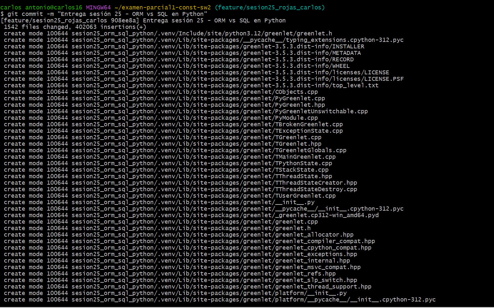

# Reporte Sesión 25 – ORM vs SQL directo en Python

## 1. Objetivo
Comparar consultas ORM y SQL directo.

## 2. Consultas evaluadas
- Cursos por ciclo
- Conteo por docente

## 3. Resultados

## 4. Interpretación
Responder: ¿cuándo conviene ORM y cuándo SQL directo?

El **ORM** conviene cuando se busca desarrollar aplicaciones de forma rápida, con un código más organizado y fácil de mantener. El **SQL directo** conviene cuando se necesita un mayor rendimiento o realizar consultas complejas que requieren una optimización específica.

## 5. Evidencias
- Captura de benchmark_queries.py

- Captura de explain_query.py

- Commit de Git

SQL directo envía la consulta directamente a la base de datos.
ORM primero genera la consulta SQL y, cuando recibe los resultados, los convierte en objetos de Python. Esa conversión agrega un pequeño tiempo adicional (sobrecarga).