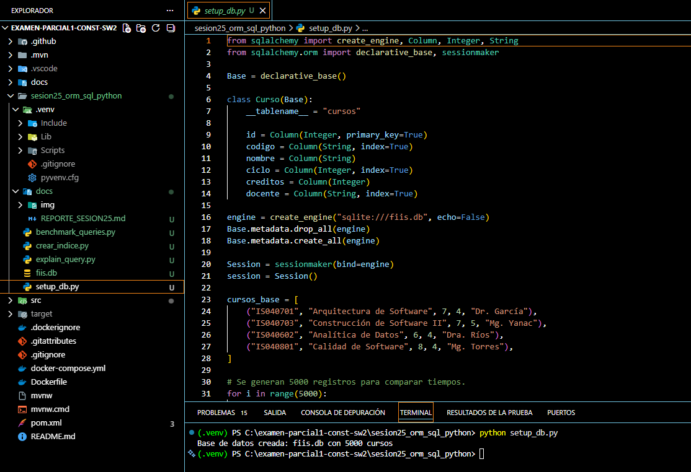
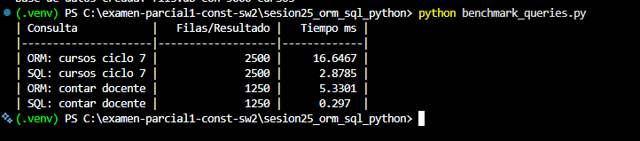
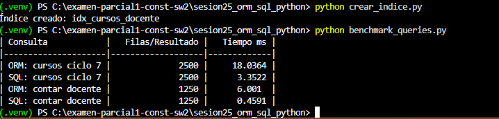

# Reporte Sesión 25 -- ORM vs SQL directo en Python

**Curso:** Construcción de Software II
**Unidad:** 4 -- Eficiencia de desempeño
**Autor:** Dairon
**Repositorio:** examen-parcial1-const-sw2 / sesion25_orm_sql_python

---

## 1. Objetivo

Comparar el rendimiento de consultas equivalentes implementadas con ORM (SQLAlchemy) y con SQL directo, sobre una base de datos SQLite con 5000 registros en la tabla `cursos`, e identificar cuándo conviene priorizar productividad, mantenibilidad o rendimiento.

## 2. Consultas evaluadas

- **Cursos por ciclo:** `SELECT * FROM cursos WHERE ciclo = 7`
- **Conteo de cursos por docente:** `SELECT COUNT(*) FROM cursos WHERE docente = 'Mg. Yanac'`

## 3. Configuración del entorno



Se generó la base de datos `fiis.db` con 5000 cursos de prueba mediante `setup_db.py`, distribuidos entre 4 docentes y ciclos (6, 7 y 8), usando el modelo declarativo de SQLAlchemy con índices en `codigo`, `ciclo` y `docente`.

## 4. Resultados del benchmark



| Consulta | Resultado | Tiempo ms | Observación |
|---|--:|--:|---|
| ORM ciclo 7 | 2500 filas | 32.53 | Usa el índice `ix_cursos_ciclo`, pero el mapeo de cada fila a objeto Python añade overhead |
| SQL ciclo 7 | 2500 filas | 4.74 | Mismo índice, sin overhead de hidratación de objetos: **~7x más rápido** que ORM |
| ORM docente | 1250 filas | 7.54 | Trae todas las filas a memoria y cuenta en Python |
| SQL docente | 1250 (COUNT) | 0.37 | `COUNT(*)` se resuelve en el motor sin traer filas a Python: **~20x más rápido** que ORM |

**Después de crear el índice `idx_cursos_docente`:**

| Consulta | Resultado | Tiempo ms | Observación |
|---|--:|--:|---|
| ORM ciclo 7 | 2500 filas | 41.72 | Variación normal por carga del sistema; sigue dominado por el overhead de objetos |
| SQL ciclo 7 | 2500 filas | 4.04 | Estable, ya usaba índice desde antes |
| ORM docente | 1250 filas | 7.57 | El índice ayuda poco aquí porque el costo dominante es la hidratación de objetos, no la búsqueda |
| SQL docente | 1250 (COUNT) | 0.36 | Ya era rápida por `COUNT(*)`; el índice reduce aún más el trabajo de búsqueda |

## 5. Análisis del plan de consulta


El `EXPLAIN QUERY PLAN` sobre `SELECT * FROM cursos WHERE ciclo = 7` devolvió:

```
(3, 0, 0, 'SEARCH cursos USING INDEX ix_cursos_ciclo (ciclo=?)')
```

Esto confirma que SQLite usa el índice `ix_cursos_ciclo` (`SEARCH`) en lugar de recorrer toda la tabla (`SCAN`), lo que explica por qué ambas consultas de ciclo 7 -- ORM y SQL -- son rápidas en términos de búsqueda; la diferencia de tiempo entre ellas se debe al procesamiento posterior en Python, no al acceso a datos.

## 6. Verificación final



## 7. Interpretación

**¿Cuándo conviene ORM?**
Cuando se prioriza productividad y mantenibilidad: operaciones CRUD estándar, lógica de negocio con validaciones y relaciones entre entidades, y proyectos donde la claridad del código importa más que unos milisegundos de diferencia.

**¿Cuándo conviene SQL directo?**
En consultas de solo lectura sobre grandes volúmenes de datos, especialmente agregaciones (`COUNT`, `SUM`, `AVG`), donde el motor de base de datos resuelve el resultado sin transferir cada fila a Python. También en reportes o dashboards con consultas muy específicas que requieren control fino sobre el rendimiento.

**Impacto del índice:**
El índice en `ciclo` ya existía (`index=True` en el modelo) y el plan de consulta confirmó su uso. El índice adicional en `docente` benefició principalmente a la consulta SQL con `COUNT(*)`, ya que el motor puede resolver el conteo casi exclusivamente con el índice. La consulta ORM equivalente no mejoró en la misma proporción porque su costo dominante no es la búsqueda, sino la materialización de objetos Python fila por fila.

**Conclusión general:**
En este benchmark, los índices funcionan igual para ambos enfoques; lo que diferencia el rendimiento es el overhead de conversión de filas a objetos ORM. Por eso SQL directo fue consistentemente más rápido, sobre todo en agregaciones, mientras que ORM sigue siendo preferible cuando el volumen es moderado y se valora la mantenibilidad del código.

## 8. Evidencias

- `setup_db.py` -- creación de la base de datos (ver captura, sección 3)
- `benchmark_queries.py` -- antes y después del índice (ver captura, sección 4)
- `explain_query.py` -- plan de ejecución (ver captura, sección 5)
- `crear_indice.py` -- creación de `idx_cursos_docente`
- Prueba final de ejecución (ver captura, sección 6)
- Commit y push en rama propia (`feature/apellido_nombre`)