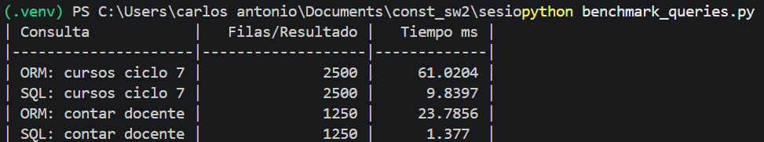
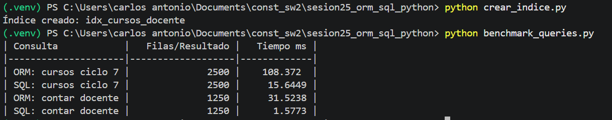
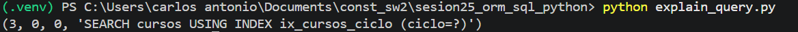

# Reporte Sesión 25 – ORM vs SQL directo en Python

## 1. Objetivo
Comparar consultas ORM y SQL directo.

## 2. Consultas evaluadas
- Cursos por ciclo
- Conteo por docente

## 3. Resultados

con  crear_indice.py

## 4. Interpretación
Responder: ¿cuándo conviene ORM y cuándo SQL directo?

## 5. Evidencias
- Captura de benchmark_queries.py

- Captura de explain_query.py

- Commit de Git
