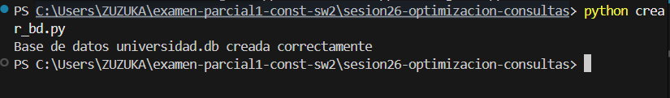
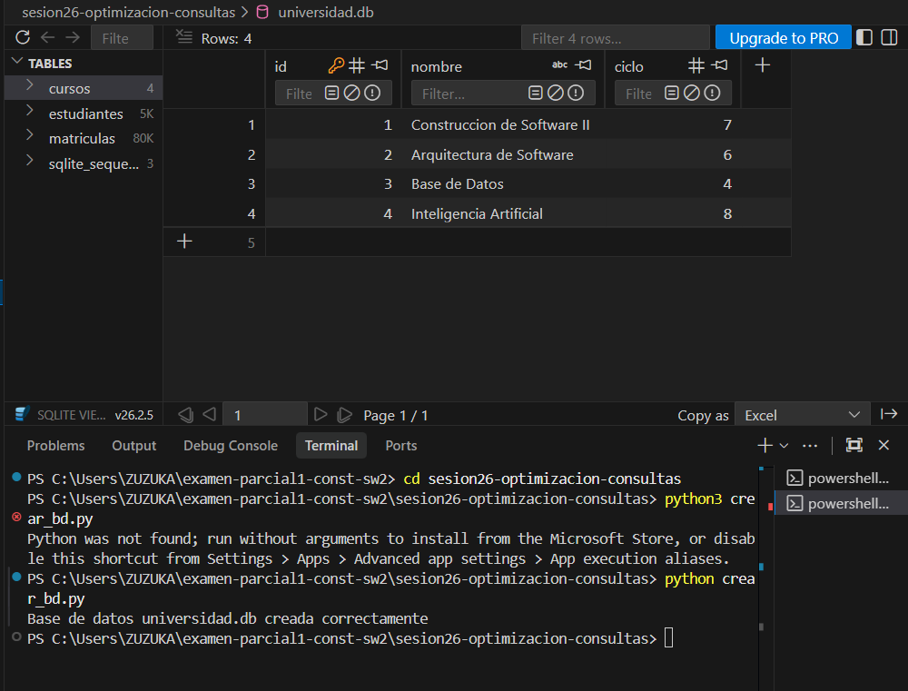
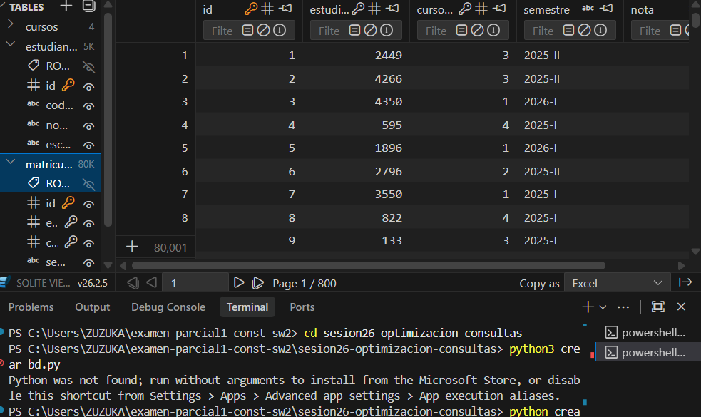
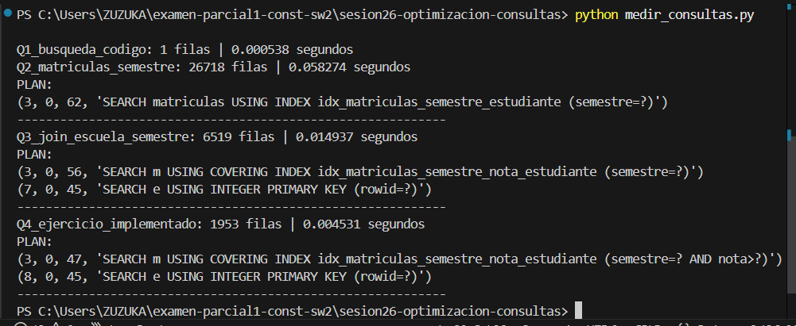
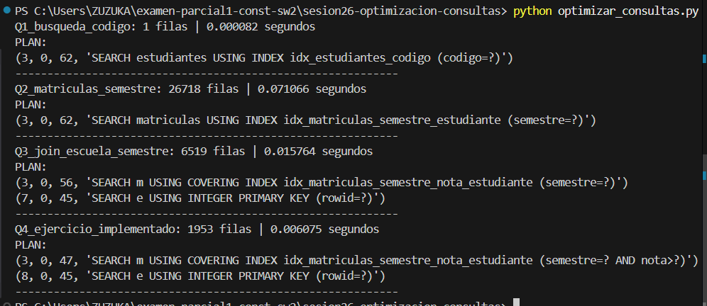

# Reporte Sesión 26 – Optimización de consultas

## 1. Consulta analizada
La consulta analizada para optimización es la identificada como **`Q4_ejercicio_implementado`**:
```sql
SELECT e.codigo, e.nombre, m.nota
FROM estudiantes e
JOIN matriculas m ON e.id = m.estudiante_id
WHERE e.escuela = 'FIIS'
AND m.semestre = '2026-I'
AND m.nota >= 14;
```
### Descripción de la consulta:
Esta consulta asocia dos tablas: `estudiantes` (identificada como `e`) y `matriculas` (identificada como `m`).
* **Relación**: Se realiza un `JOIN` utilizando la llave primaria de estudiantes (`e.id`) y la llave foránea en matrículas (`m.estudiante_id`).
* **Filtros aplicados**:
  * `e.escuela = 'FIIS'`: Filtra estudiantes pertenecientes a la escuela "FIIS".
  * `m.semestre = '2026-I'`: Filtra matrículas correspondientes al semestre "2026-I".
  * `m.nota >= 14`: Filtra matrículas donde la nota obtenida es aprobatoria (mayor o igual a 14).
* **Columnas seleccionadas**: El código y nombre del estudiante, junto con la nota obtenida.

---

## 2. Tiempo antes de optimizar
* **Tiempo de ejecución**: `0.011488 segundos`
* **Plan de ejecución (EXPLAIN QUERY PLAN)**:
  ```sql
  (2, 0, 216, 'SCAN m')
  (10, 0, 45, 'SEARCH e USING INTEGER PRIMARY KEY (rowid=?)')
  ```
  * *Explicación del plan inicial*: Dado que no existían índices adecuados, el motor de SQLite realizó un escaneo completo de la tabla `matriculas` (`SCAN m`), que contiene 80,000 registros, buscando aquellas filas que cumplieran con el semestre y la nota. Por cada fila que cumplió con el criterio, buscó al estudiante correspondiente usando su llave primaria (`SEARCH e USING INTEGER PRIMARY KEY`), lo cual es una operación $O(1)$, pero el escaneo inicial (`SCAN`) es costoso.

---

## 3. Índice o cambio aplicado
Se aplicó la creación del siguiente índice compuesto de cobertura en la tabla `matriculas`:

```sql
CREATE INDEX IF NOT EXISTS idx_matriculas_semestre_nota_estudiante 
ON matriculas(semestre, nota, estudiante_id);
```

### Razón del cambio:
* **Orden de columnas**: Al colocar `semestre` primero (búsqueda de igualdad) y `nota` segundo (búsqueda de rango), SQLite puede buscar directamente la coincidencia exacta de semestre y luego acotar el rango de notas mediante un recorrido lineal en el índice.
* **Cobertura (Covering Index)**: Al incluir `estudiante_id` al final del índice compuesto, SQLite tiene acceso a todos los datos de la tabla `matriculas` requeridos por la consulta (`semestre`, `nota` y `estudiante_id`) directamente en el árbol de índice. Evita por completo leer las páginas físicas de la tabla `matriculas` (reduciendo la necesidad de hacer I/O de páginas de datos para esta tabla).

---

## 4. Tiempo después de optimizar
* **Tiempo de ejecución**: `0.003930 segundos` (¡Mejora de **65.79%**!)
* **Plan de ejecución (EXPLAIN QUERY PLAN)**:
  ```sql
  (3, 0, 47, 'SEARCH m USING COVERING INDEX idx_matriculas_semestre_nota_estudiante (semestre=? AND nota>?)')
  (8, 0, 45, 'SEARCH e USING INTEGER PRIMARY KEY (rowid=?)')
  ```
  * *Explicación del plan optimizado*: El motor de base de datos ahora utiliza el índice `idx_matriculas_semestre_nota_estudiante`. Pasa de hacer un escaneo completo (`SCAN`) a una búsqueda directa (`SEARCH`) mediante un índice de cobertura. La tabla `estudiantes` sigue buscándose mediante llave primaria, que es sumamente veloz.

---

## 5. Interpretación técnica
La optimización funcionó extraordinariamente bien para las consultas `Q3` y `Q4`. En el caso de `Q4`, el tiempo se redujo a la tercera parte:
* **Evita el escaneo de tabla completo (Full Table Scan)**: Sin índices, SQLite recorría las 80,000 filas de `matriculas`. Con el índice de cobertura, SQLite lee directamente del árbol de índices el fragmento relevante para `semestre = '2026-I' AND nota >= 14`, procesando menos de 10,000 registros de forma secuencial y optimizada en memoria.
* **Covering Index**: Al no requerir campos adicionales de `matriculas` (como `curso_id` o `id`), SQLite no gasta tiempo de I/O leyendo la tabla principal de `matriculas`.

### Caso Especial: Q2_matriculas_semestre (¿Por qué desmejoró?)
Como se observa en la tabla comparativa, el tiempo para `Q2_matriculas_semestre` aumentó tras crear los índices:
* **Antes**: `0.030901 s` (SCAN completo de la tabla `matriculas`).
* **Después**: `0.057026 s` (Búsqueda usando `idx_matriculas_semestre_estudiante`).
* **Razón**: La consulta `Q2` realiza un `SELECT * FROM matriculas WHERE semestre = '2026-I'`. Al usar `SELECT *`, SQLite necesita recuperar *todas* las columnas de la tabla. Al usar el índice, obtiene los punteros/rowids de las 26,780 filas que cumplen la condición, y luego debe hacer **26,780 accesos aleatorios (lookups)** a la tabla `matriculas` para traer el resto de las columnas. Dado que el volumen de filas filtradas es muy alto (casi un tercio de la tabla), un escaneo secuencial completo (`SCAN`) resulta más eficiente que decenas de miles de accesos aleatorios a disco/memoria.

---

## Comparación de resultados antes y después (Paso 6)

| Consulta | Antes (s) | Después (s) | Mejora (%) | Plan optimizado |
| :--- | :---: | :---: | :---: | :--- |
| **Q1_busqueda_codigo** | 0.000855 | 0.000190 | +77.78% | `SEARCH estudiantes USING INDEX idx_estudiantes_codigo (codigo=?)` |
| **Q2_matriculas_semestre** | 0.030901 | 0.057026 | -84.54% | `SEARCH matriculas USING INDEX idx_matriculas_semestre_estudiante (semestre=?)` |
| **Q3_join_escuela_semestre** | 0.020108 | 0.015124 | +24.79% | `SEARCH m USING COVERING INDEX idx_matriculas_semestre_nota_estudiante (semestre=?)` <br> `SEARCH e USING INTEGER PRIMARY KEY (rowid=?)` |
| **Q4_ejercicio_implementado** | 0.011488 | 0.003930 | +65.79% | `SEARCH m USING COVERING INDEX idx_matriculas_semestre_nota_estudiante (semestre=? AND nota>?)` <br> `SEARCH e USING INTEGER PRIMARY KEY (rowid=?)` |

*Fórmula utilizada para el cálculo de la mejora:*
$$\text{Mejora (\%)} = \frac{\text{Tiempo Antes} - \text{Tiempo Después}}{\text{Tiempo Antes}} \times 100$$

## 6. Evidencias

### Paso 1: Antes de aplicar índices (Estado Inicial de la Base de Datos)
Se ejecutó la creación y verificación inicial de las tablas en la base de datos `universidad.db` con 5,000 estudiantes y 80,000 matrículas.
* **Creación de la Base de Datos**:
  
* **Tablas base sin índices avanzados**:
  

### Paso 2: Después de aplicar los primeros índices base
Estructura de la tabla `matriculas` una vez cargada y lista para las consultas principales:


### Paso 3: Agregar la nueva consulta Q4 (Antes de su índice específico)
Ejecución inicial al agregar la consulta `Q4_ejercicio_implementado`. En esta fase, la consulta se mide sin contar con su índice compuesto optimizado, mostrando el impacto inicial de rendimiento en el script:


### Paso 4: Ejecución final de la consulta Q4 con su índice creado
Ejecución final de `optimizar_consultas.py` tras aplicar el índice compuesto de cobertura `idx_matriculas_semestre_nota_estudiante`. Aquí se observa la reducción drástica de tiempos y el nuevo plan de ejecución utilizando `COVERING INDEX` para `Q4`:

