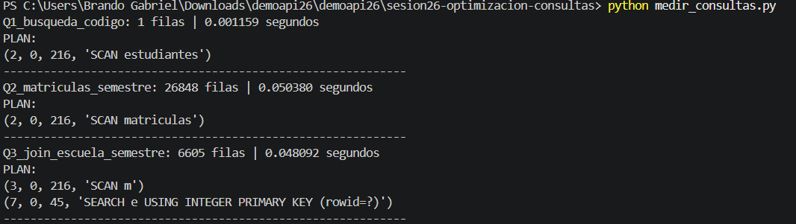
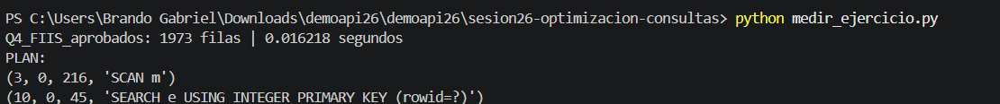
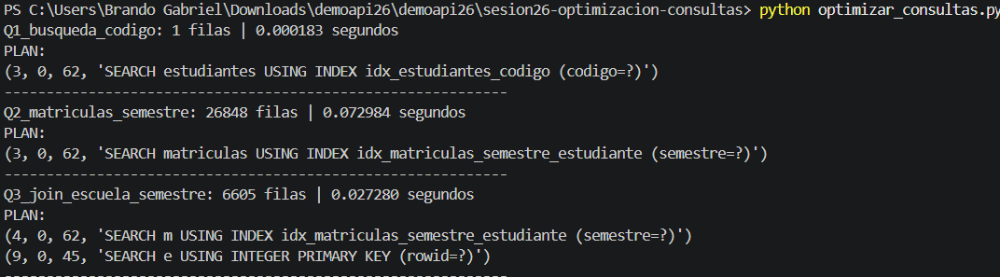
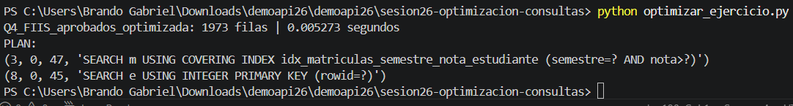

# Reporte Sesión 26 – Optimización de consultas

## 1. Consulta analizada

En esta práctica se analizaron cuatro consultas ejecutadas sobre la base de datos `universidad.db`, la cual contiene 5000 estudiantes, 4 cursos y 80 000 matrículas.

Las consultas evaluadas fueron:

- **Q1:** búsqueda de un estudiante mediante su código.
- **Q2:** búsqueda de matrículas correspondientes al semestre `2026-I`.
- **Q3:** estudiantes de FIIS matriculados durante el semestre `2026-I`.
- **Q4:** estudiantes de FIIS con nota mayor o igual a 14 durante el semestre `2026-I`.

El objetivo fue identificar consultas que realizaban recorridos sobre las tablas, medir sus tiempos, aplicar índices y comprobar su efecto mediante una nueva medición.

---

## 2. Tiempo antes de optimizar

Primero se creó una base de datos limpia mediante:

```powershell
python crear_bd.py
```


Posteriormente se ejecutaron:

```powershell
python medir_consultas.py
```


y:

```powershell
python medir_ejercicio.py
```



Los planes de ejecución iniciales fueron:

### Q1

```text
SCAN estudiantes
```

### Q2

```text
SCAN matriculas
```

### Q3

```text
SCAN m
SEARCH e USING INTEGER PRIMARY KEY (rowid=?)
```

### Q4

```text
SCAN m
SEARCH e USING INTEGER PRIMARY KEY (rowid=?)
```

Los planes mostraron que SQLite realizaba operaciones `SCAN` sobre las tablas principales antes de la optimización.

---

## 3. Índice o cambio aplicado


Para la consulta Q4 se creó el siguiente índice compuesto:

```sql
CREATE INDEX IF NOT EXISTS idx_matriculas_semestre_nota_estudiante
ON matriculas(semestre, nota, estudiante_id);
```

Este índice compuesto fue diseñado para apoyar:

- el filtro por semestre;
- la condición de nota mayor o igual a 14;
- la relación con la tabla `estudiantes` mediante `estudiante_id`.

---

## 4. Tiempo después de optimizar

Después de crear los índices se ejecutaron:

```powershell
python optimizar_consultas.py
```


y:

```powershell
python optimizar_ejercicio.py
```




Los nuevos planes de ejecución fueron:

### Q1

```text
SEARCH estudiantes USING INDEX idx_estudiantes_codigo (codigo=?)
```

### Q2

```text
SEARCH matriculas USING INDEX
idx_matriculas_semestre_estudiante (semestre=?)
```

### Q3

```text
SEARCH m USING INDEX
idx_matriculas_semestre_estudiante (semestre=?)

SEARCH e USING INTEGER PRIMARY KEY (rowid=?)
```

### Q4

```text
SEARCH m USING COVERING INDEX
idx_matriculas_semestre_nota_estudiante
(semestre=? AND nota>?)

SEARCH e USING INTEGER PRIMARY KEY (rowid=?)
```

---

## 5. Interpretación técnica

La consulta **Q1** mejoró . Antes realizaba `SCAN estudiantes`, mientras que después utilizó el índice `idx_estudiantes_codigo`. La mejora fue considerable porque la consulta busca solamente un estudiante mediante un código específico.

La consulta **Q2** no presentó una mejora. El tiempo aumentó de `0.050380` a `0.072984` segundos. Aunque SQLite utilizó el índice, la consulta devuelve 26 848 filas de un total de 80 000 matrículas. Debido a la gran cantidad de registros recuperados, el uso del índice no produjo una mejora en esta ejecución.

La consulta **Q3** mejoró . El índice compuesto permitió buscar primero las matrículas del semestre solicitado antes de realizar la relación con la tabla de estudiantes.

La consulta **Q4** mejoró . El índice compuesto sobre `semestre`, `nota` y `estudiante_id` permitió aplicar los filtros antes de completar el `JOIN`. El plan mostró el uso de `COVERING INDEX`, reduciendo el trabajo necesario para encontrar las matrículas que cumplían las condiciones.

Los resultados demuestran que crear un índice no garantiza automáticamente una mejora. El rendimiento depende del tipo de consulta, la cantidad de filas obtenidas y la selectividad de las condiciones utilizadas.

---

