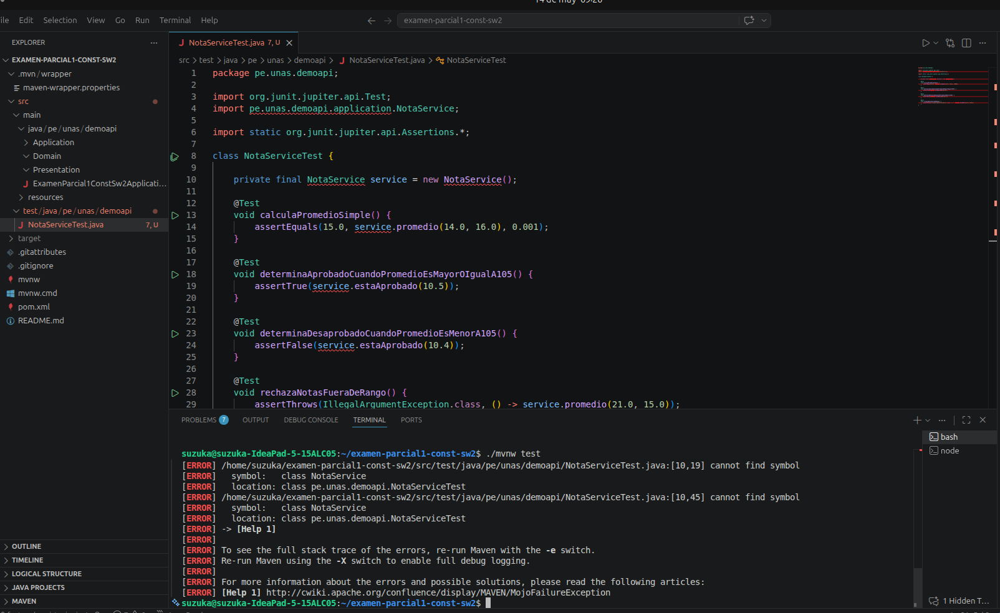
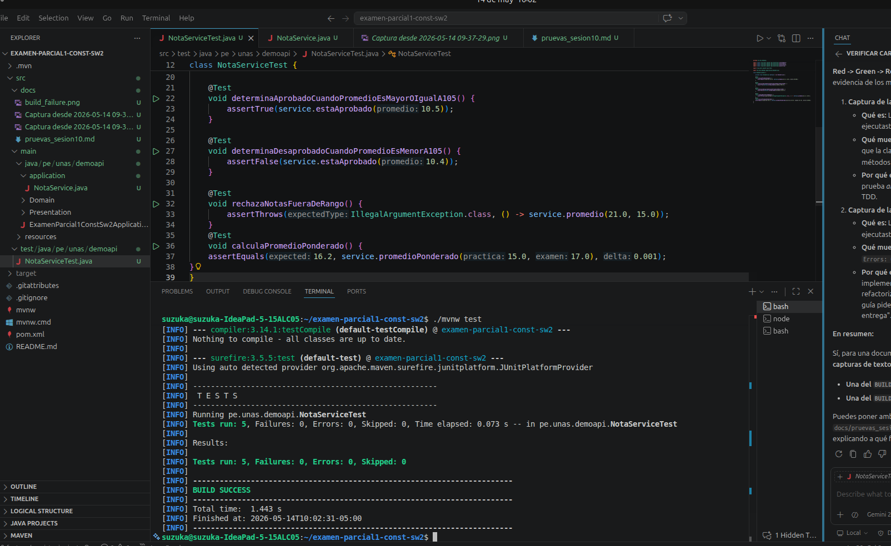

# Priorización y Evidencias de Pruebas - Sesión 10

## 1. Priorización de Casos de Prueba

| Caso de prueba          | Riesgo                       | Prioridad | Entrada  | Resultado esperado |
| ----------------------- | ---------------------------- | --------- | -------- | ------------------ |
| Promedio válido         | Cálculo incorrecto de notas  | Alta      | 14, 16   | 15.0               |
| Nota límite aprobatoria | Error de regla académica    | Alta      | 10.5     | true               |
| Nota menor a aprobatoria| Clasificación incorrecta     | Media     | 10.4     | false              |
| Nota fuera de rango     | Dato inválido no controlado  | Alta      | 21, 15   | Excepción          |

---

## 2. Evidencias del Ciclo TDD

A continuación se presentan las evidencias de la ejecución de pruebas en cada fase del ciclo TDD.

### Fase RED: Prueba Fallida

Se ejecuta `./mvnw test` por primera vez, después de crear el archivo de pruebas `NotaServiceTest.java` pero antes de implementar la clase `NotaService`. La compilación falla como se esperaba, lo que demuestra que las pruebas se escribieron primero.



### Fase GREEN: Pruebas Exitosas

Después de implementar la lógica mínima necesaria en `NotaService.java` y realizar la refactorización, se vuelve a ejecutar `./mvnw test`. El resultado es `BUILD SUCCESS`, lo que confirma que la implementación es correcta y cumple con todos los casos de prueba definidos.



### Reporte de Surefire

El reporte de texto generado por Maven también confirma que las 5 pruebas se ejecutaron sin fallos ni errores.

```text
-------------------------------------------------------
 T E S T S
-------------------------------------------------------
Running pe.unas.demoapi.NotaServiceTest
Tests run: 5, Failures: 0, Errors: 0, Skipped: 0, Time elapsed: 0.073 s -- in pe.unas.demoapi.NotaServiceTest

Results:

Tests run: 5, Failures: 0, Errors: 0, Skipped: 0
------------------------------------------------------------------------
```

