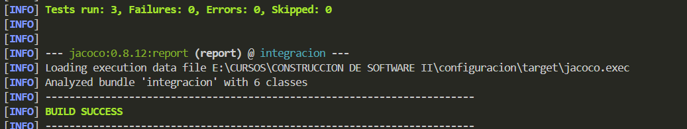

# Configuración y Parametrización

#### Configurar páramentros externos

#### Crear el Service y los servicios

#### Crear el Controller y los controladores de los parámetros

### Prueba de configuración con envio de mensaje

#### Creamos la interfaz de notificador

#### Crear el Service para enviar y notificar por Email a los proveedores

#### Crear un Mock para prueba y simulación del notificador por Email

#### Crear Controller del notificador

#### Ejecutar y validar

#### Cambiamos el parametro de Email a Mock

 Y comprobamos que se cambio correctamente
 

 #### Crear Test unitarios de proveedor email y de los parámetros

Notificador:

Parametro institucion:

comprobamos:

#### EXTRA - Ejecicio aplicado agregar un nuevo parámetro

>Agregamos en application.properties:

>Modificamos Serive:

>Modificamos Controller:

Y comprobamos:

Ahora creamos su prueba de integración:

>Modificamos ParametroControllerTest.java:

Y ejecutamos:
