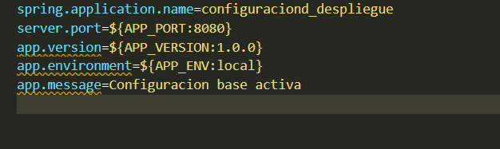
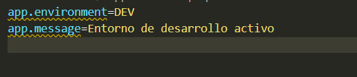
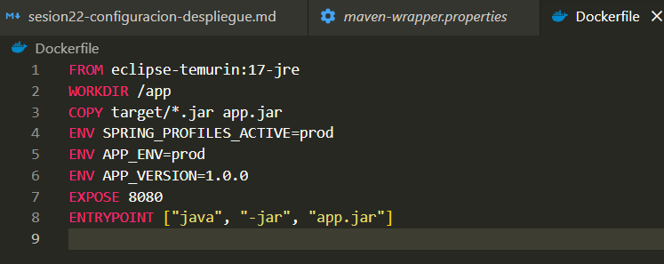
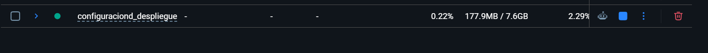
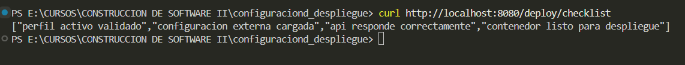

# VALIDACIÓN DE CONFIGURACIÓN Y DESPLIEGUE 

*La FIIS-UNAS cuenta con una API Spring Boot que debe pasar de un entorno de desarrollo a un entorno de despliegue. Antes de liberar la version, el equipo debe comprobar que la configuracion activa sea correcta, que el servicio responda, que el contenedor se ejecute y que exista evidencia tecnica del despliegue.*

#### Creamos configuracion de perfiles por entorno (dev,test,prod)

>application.properties:

>application-dev.properties:

>application-test.properties:

>applicaton-prod.properties:

#### Implementamos servicos de validación de despliegue

#### Implementamos Controller REST de validación

#### Ejecutamos y validamos por los perfiles creados

>Perfil Dev:

>Perfil Test:

>Perfil Prod:

#### Creamos prueba de integración y verificamos

# Creación del Docker:

#### Empaquetamos

#### Creamos .dockerignore

#### Creamos Dockerfile

#### Construimos y ejecutamos el contenedor Docker

#### Despliegue con Docker Compose
docker-compose.yml:

Ejecutamos y verificamos:

