# PRUEBAS DE CARGA Y MÉTRICAS

#### Instalamos k6
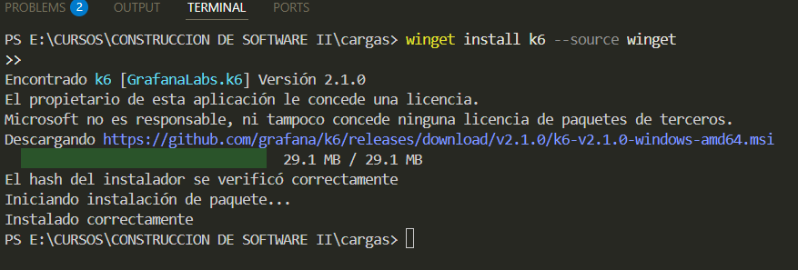

#### Creamos un servicio con retraso configurable
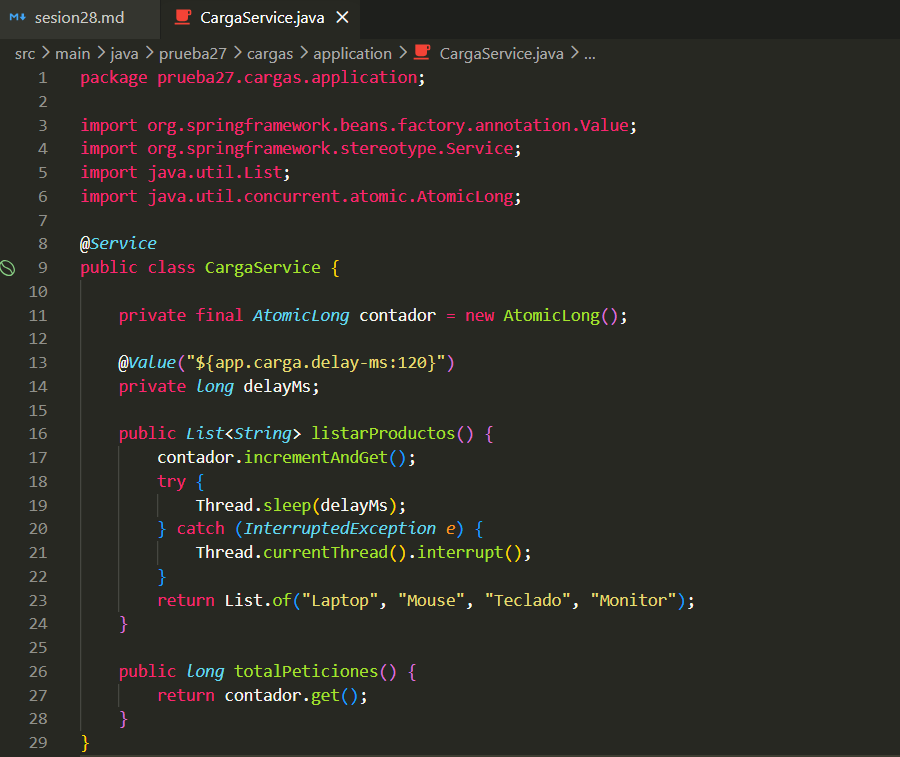

#### Creamos el controlador REST
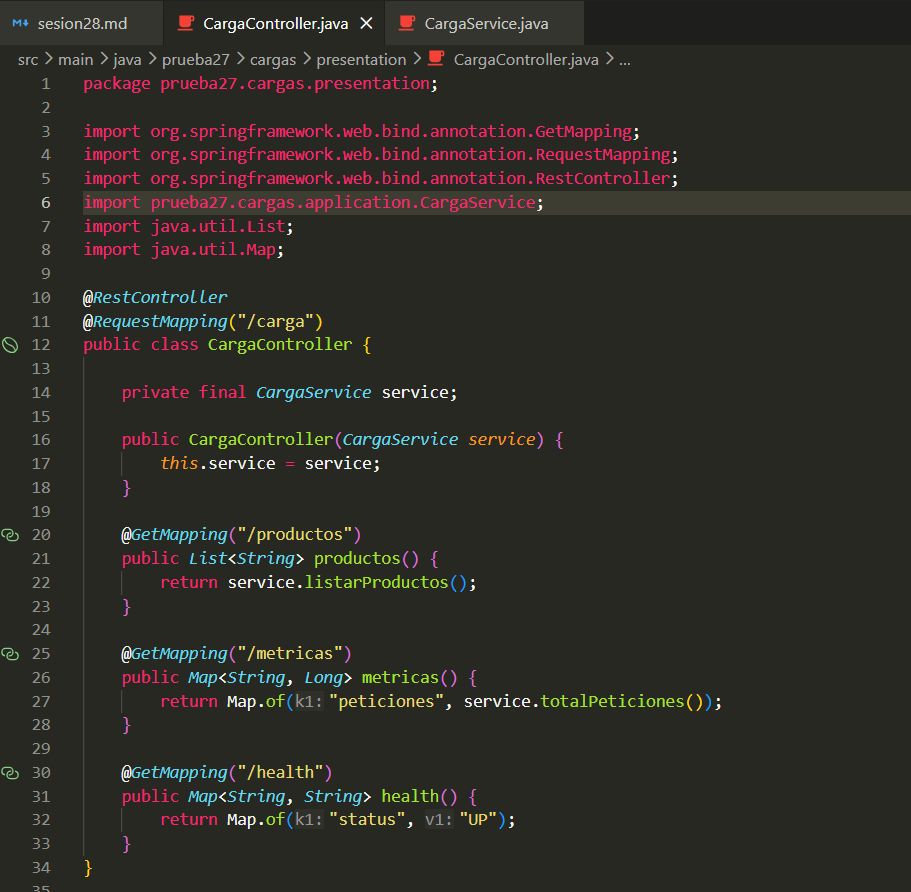

>Cambio en application.properties
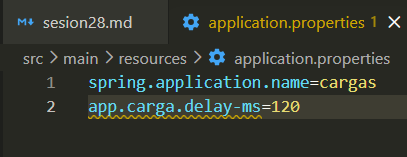

#### Ejecutamos y validamos
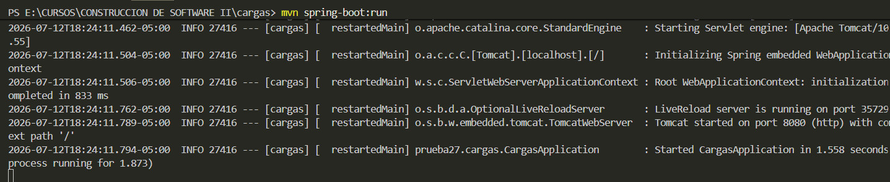

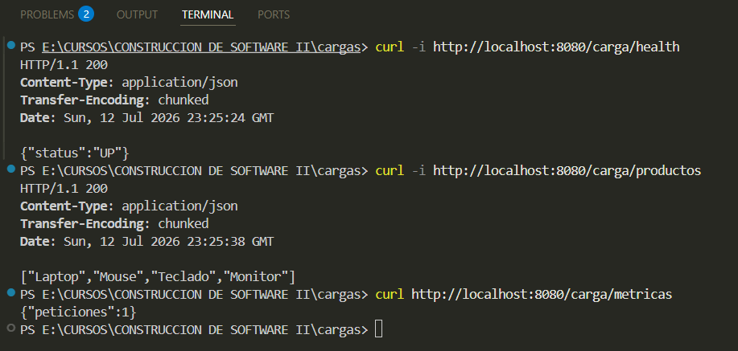

#### Creamos el smoke test
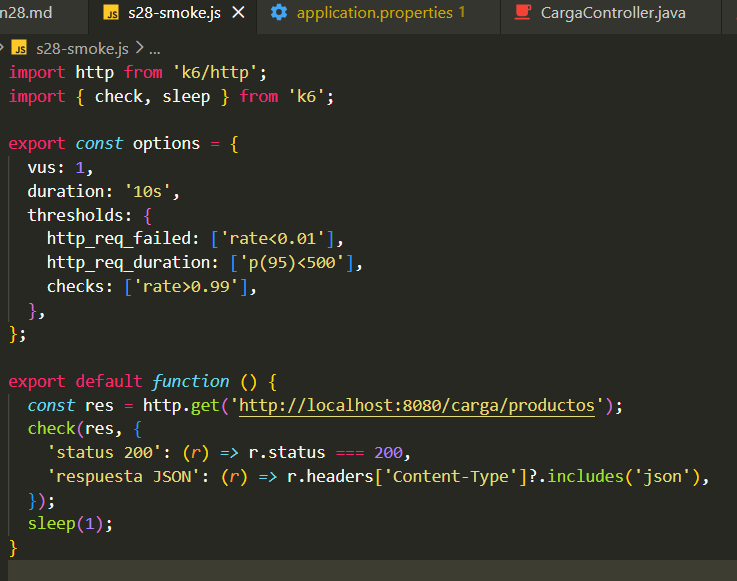
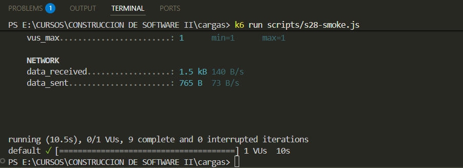

#### Creamos y ejecutar la prueba de carga
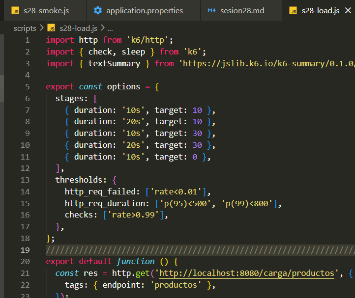
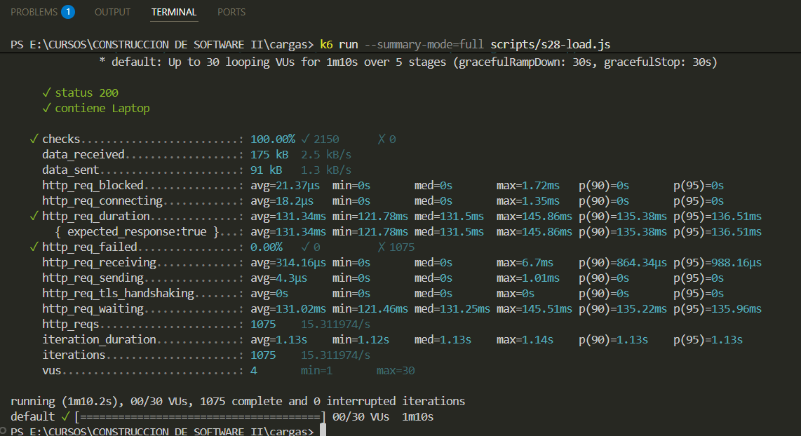

#### Observamos CPU y memoria durante la carga
>Versión con 120 de carga
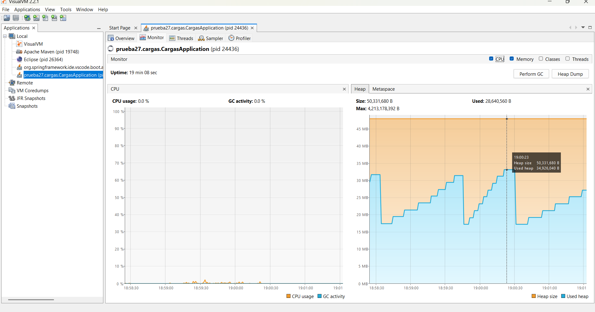

>Versión con 20 de carga
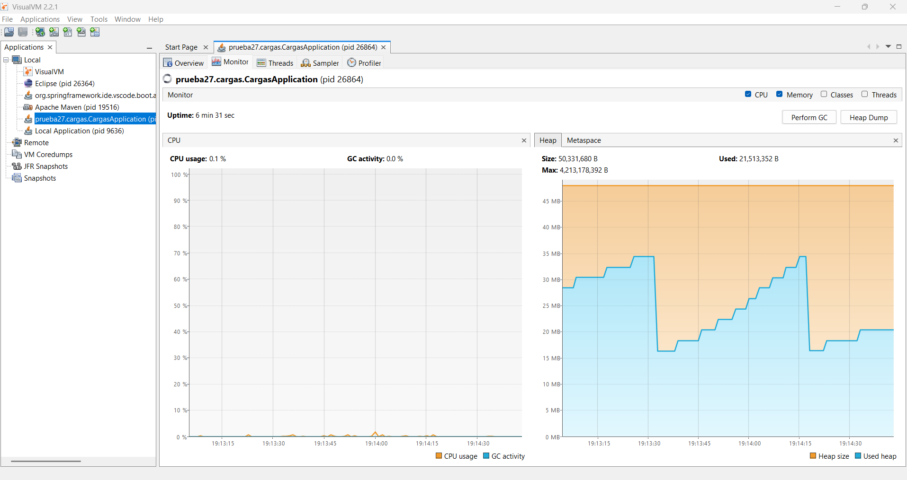

#### Comparación


# EXTRA - Ejercicio aplicado

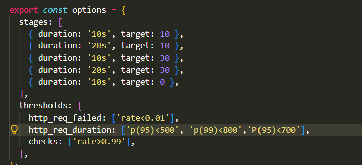


````````````````````````````````````````````````````````````````````````````````````````````````````````````````````````````````````
Se agregó el threshold p(95)<700ms manteniendo el mismo endpoint (/carga/productos) y la misma pausa de usuario (sleep(1)).
Con una rampa progresiva de 1 a 30 VUs durante 70 segundos, el sistema cumplió el threshold ampliamente (p95 real = 38.27ms, muy por debajo de los 700ms exigidos), sin errores (0.00%) y con 100% de checks exitosos sobre 1180 iteraciones.
El RPS se mantuvo estable en 16.79/s, valor casi idéntico al obtenido en la corrida optimizada anterior (16.63/s) con solo 10 VUs constantes. 
Esto demuestra que una mayor cantidad de VUs no produce mayor throughput una vez que el sistema alcanza su capacidad de procesamiento sostenible: los usuarios virtuales adicionales generan más peticiones concurrentes, pero el servidor las procesa al mismo ritmo máximo, por lo que el exceso de carga se traduce en peticiones en espera (reflejado en la latencia máxima aislada de 141.93ms) en lugar de en más peticiones completadas por segundo. 
El cuello de botella no está en CPU (que se mantuvo bajo según VisualVM), sino en la capacidad de concurrencia del pool de threads/conexiones del servidor embebido.
````````````````````````````````````````````````````````````````````````````````````````````````````````````````````````````````````