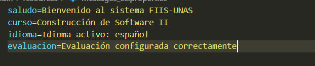

# INTERNACIONALIZACIÓN

#### Creamos y definimos los archivos de mensaje

Defecto:

Español:

Inglés:

#### Configuramos el archivo application.properties

#### Creamos el servicio de mensaje

#### Creamos el controller

#### Ejecutamos

#### Validamos los endpoints

#### Creamos prueba de integración con MockMvc

#### Ejecutamos prueba

### Reto: crear un cabecera Accept-Language

#### Crearmos el endpoint en el controller

#### Ejecutamos y probamos

### EJERCICIO APLICADO

#### Agregamos un nuevo mensaje en los archivos messages español e inglés:

#### Agregamos el endpoint en controller:

#### Ejecutamos y verificamos:
