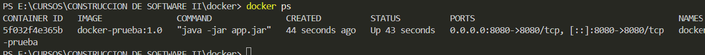
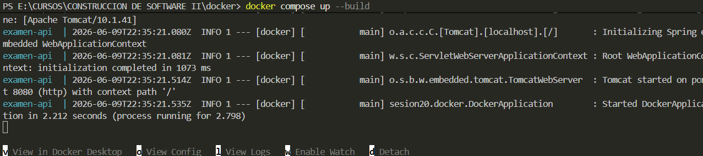
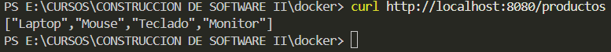
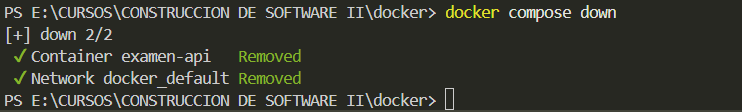
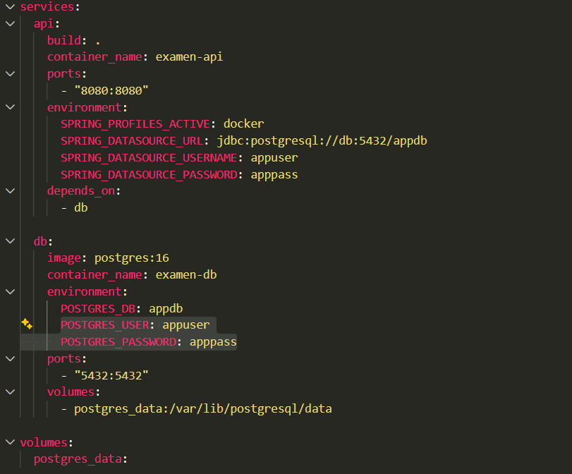
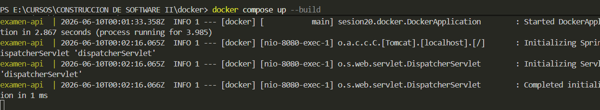
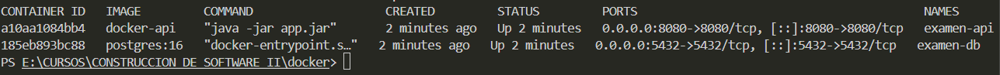
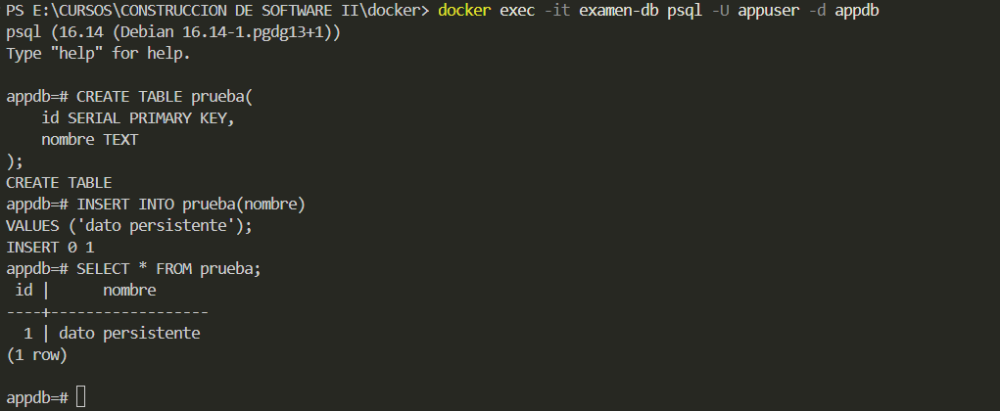
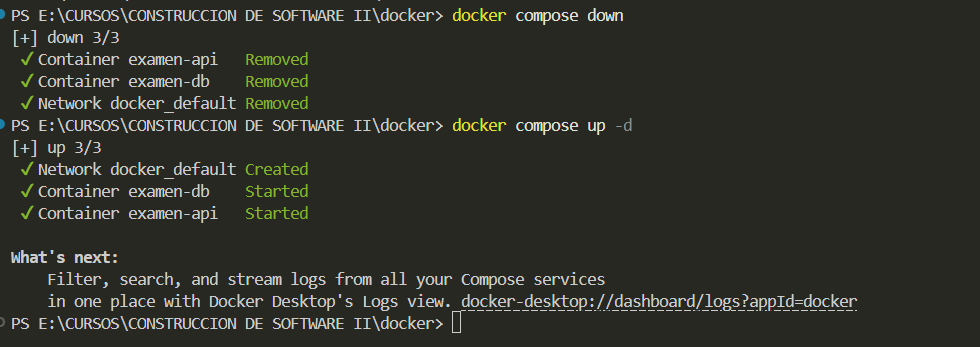
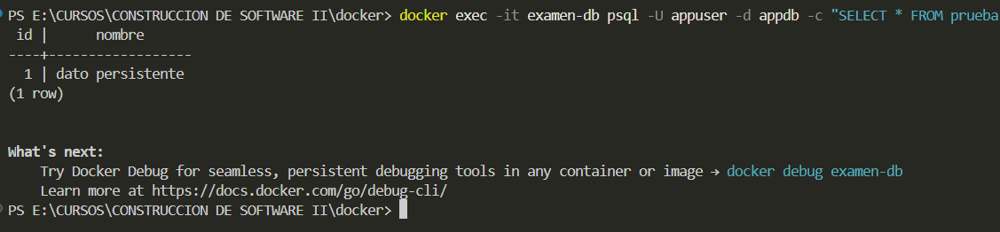

# CONTENEDORES Y DESPLIEGUE

#### Primero comprobamos que no haya error en la ejecución de pruebas

>Preparamos la aplicación para el empaquetado:

#### Creamos el archivo .dockerignore

>*Evita que se copie archivos innecesarios*

#### Creamos el archivo Dockfile

#### Contruimos la imagen Docker

#### Ejecutamos en contenedor

>*Ahora validamos:*

#### Ejecutamos en segundo plano

Primero eliminamos el contenedor:

Luego lo corremos en modo detached:

Verficamos:

Logs:

Ahora detemos y eliminamos:

#### Creamos Docker Compose
>Docker Compose sirve para definir y ejecutar varios contenedores con un solo archivo de configuración

Creamos archivo .yml:

Ejecutamos:

Verificamos:

Detemos todo:

#### Despliegue con PostgreSQL y volumen persistente

Reajustamos el archivo .yml:

Y lo ejecutamos:

Comprobamos:

Verificar persistencia de base de datos creando una tabla de prueba dentro del contenedor:

