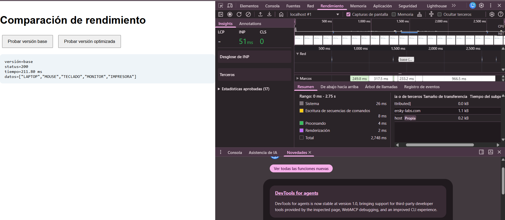
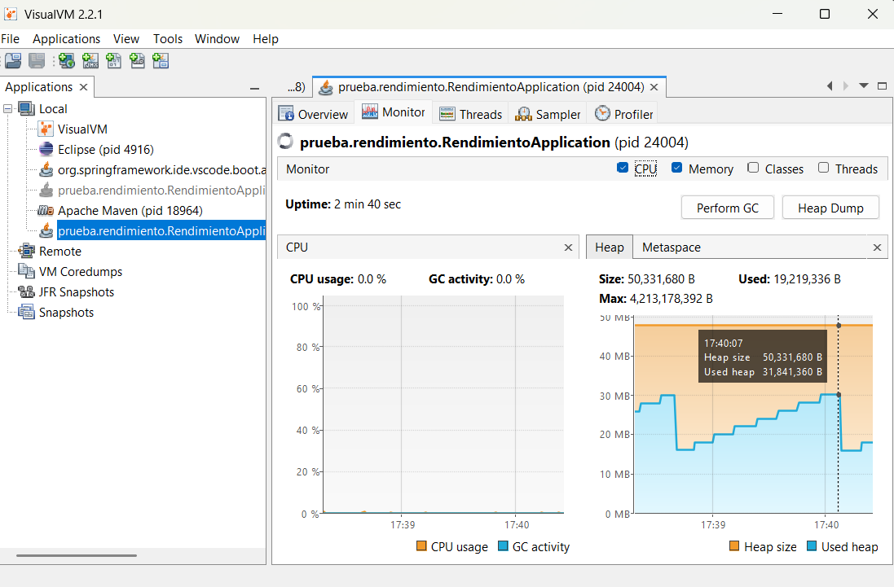
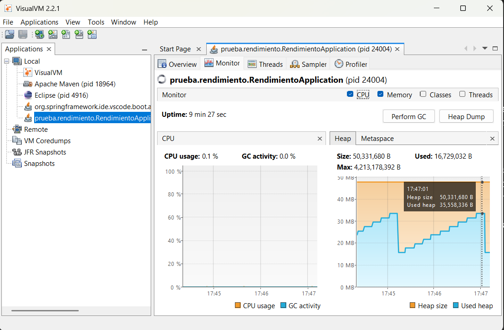
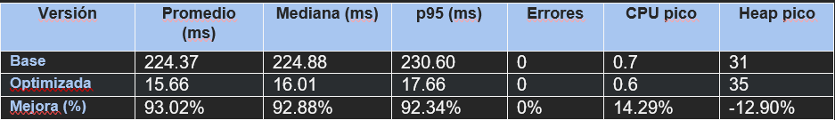
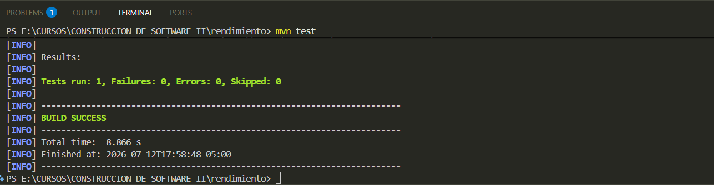

# PRUEBAS DE RENDIMIENTO EN FRONTEND Y BACKEND

#### Creamos el Servicio de Rendimiento


#### Creamos el Controller REST


#### Creamos un html para comprobar


#### Ejecutamos y evaluamos


# Automatizamos la medición y calcular p95

#### Creamos medir_rendimiento.py


#### Ejecutamos y evaluamos


# Medir el frontend con DevTools

#### RED

>Versión Base

>Versión Optimizada


#### Rendimiento
>Versión Base

>Versión Optimizada


# Observar CPU y memoria de la JVM
>versión base

`````````````````````````````````
CPU pico: 0.7%
Heap pico: 31 MB
``````````````````````````````````
>Versión optimizada


``````````````````````````````````
CPU pico: 0.6%
Heap pico: 35 MB
``````````````````````````````````
>Tabla de resultados


##### Prueba automatizada mínima


