# BENCHMARKING Y ANÁLISIS DE RESULTADOS

#### Creamos el benchmark service
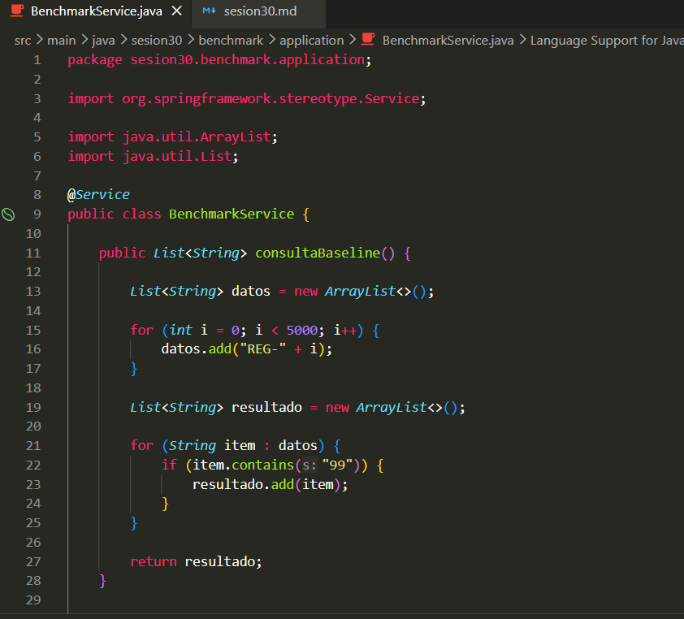

#### Creamos el Control REST
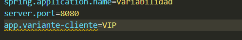

#### Ejecutamos y validamos
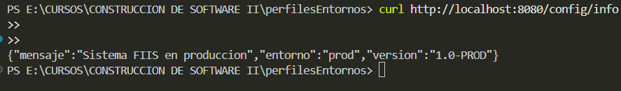

#### Script k6 para baseline
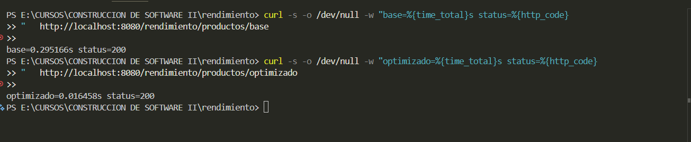

#### Script k6 para el optimizado
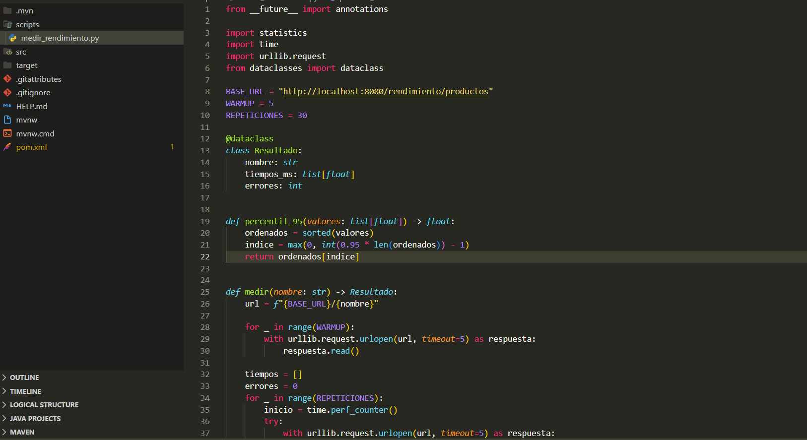

#### Ejecutamos y creemos los tres archivos evidencia del baseline
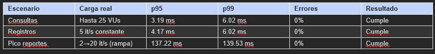

#### Ejecutamos y creemos los tres archivos evidencia del optimizado
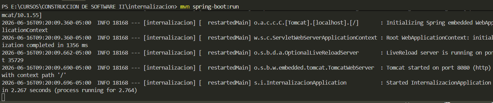

#### Creamos el script de análisis
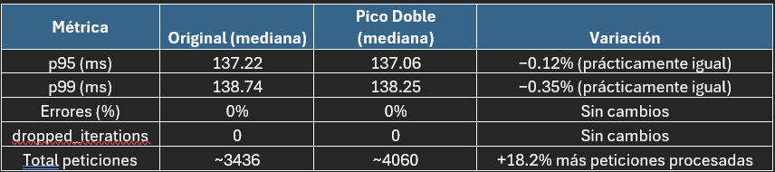

#### ejecutamos
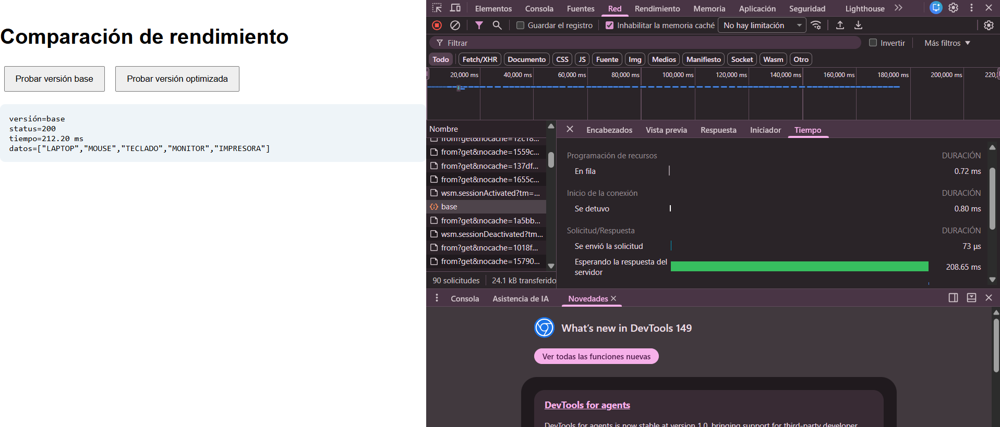

>Tabla
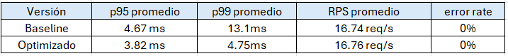

#### Reto opcional: gráfico comparativo
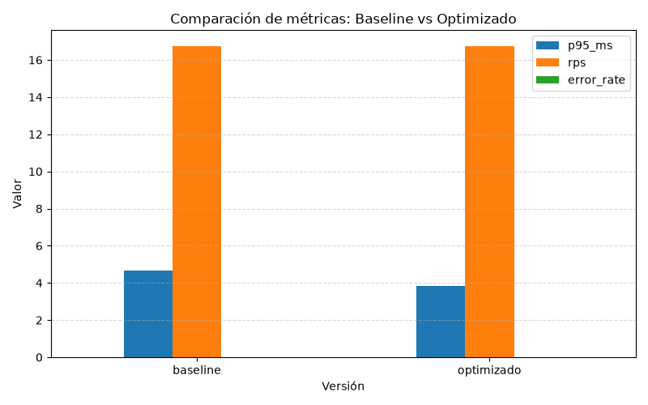
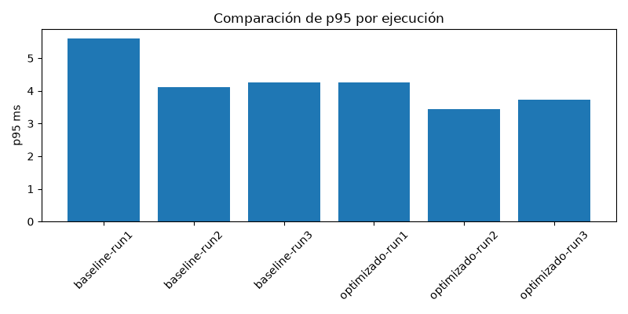